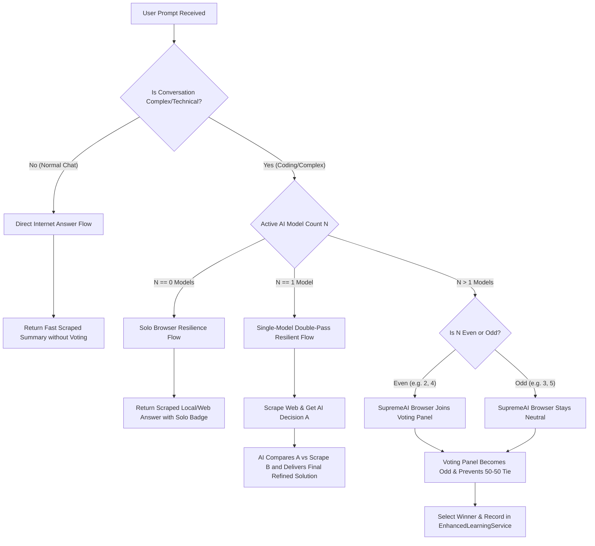

# SupremeAI Autonomous Voting & Consensus System — Master Plan 🗳️🤖

> [!IMPORTANT]
> এই ডকুমেন্টটি SupremeAI-এর নতুন স্বায়ত্তশাসিত **Voting & Consensus System**-এর গাণিতিক ও আর্কিটেকচারাল ফ্লো সংজ্ঞায়িত করে। এটি জটিল কোডিং বা টেকনিক্যাল আলোচনার সময় এআই প্যানেল পরিচালনা করার জন্য এবং সাধারণ কথপোকথনে লাইভ ইন্টারনেট রিসার্চ ব্যবহার করে অনাবশ্যক ভোটিং এড়ানোর জন্য ডিজাইন করা হয়েছে।

---

## 🏗️ ১. স্বয়ংক্রিয় ভোটিং ফ্লো (System Decision-Making Flowchart)



---

## ⚙️ ২. গাণিতিক ভোটিং মেকানিজম (The Mathematical Voting Pillars)

### 📌 পিলার ১: ডাইনামিক রাউটিং ও অনাবশ্যক ভোটিং বর্জন (Dynamic Routing)
* **মূল নীতি:** সাধারণ কথার জন্য কোনো ভোটিং হবে না।
* **কীভাবে কাজ করে:** প্রম্পট থেকে জটিল কিওয়ার্ড (যেমন `class`, `function`, `db`, `fix`, `deploy`) চেক করে `isComplexConversation(prompt)` মেথড রান করা হয়। সরল হাই-হ্যালো টাইপের প্রশ্নের ক্ষেত্রে সরাসরি ব্রাউজার রিসার্চ থেকে উত্তর প্রস্তুত করা হয়, ফলে এপিআই ওভারহেড ও ল্যাটেন্সি হ্রাস পায়।

---

### 📌 পিলার ২: ডাবল-পাস রেসিলিয়েন্ট ফ্লো (Single-Model Double-Pass Refinement)
* **মূল নীতি:** ১টি মাত্র এআই মডেল সক্রিয় থাকলে তা দিয়ে ডাবল-পাস চেকিংয়ের মাধ্যমে সেরা উত্তর তৈরি করা।
* **কীভাবে কাজ করে:**
  1. ব্রাউজার প্রথমে ইন্টারনেটের লাইভ সোর্স ও কোড স্যাম্পল স্ক্র্যাপ করে (The "Browser Weapon" output).
  2. সক্রিয় এআই মডেলটি এই সোর্সের ওপর ভিত্তি করে তার প্রথম সমাধান (Response A) প্রস্তুত করে।
  3. এরপর দ্বিতীয় পাসে এআই-কে পুনরায় বলা হয় তার নিজের উত্তর (Response A) এবং সরাসরি স্ক্র্যাপ করা সোর্স তথ্যের (Response B) মধ্যে নিখুঁত তুলনা করে চূড়ান্ত বাংলা রেসপন্স প্রস্তুত করতে।
  4. উত্তরটি `solo_resilient_winner` হিসেবে লার্নিং ডাটাবেসে সফলভাবে সংরক্ষিত হয়।

---

### 📌 পিলার ৩: জোড়-বেজোড় টাই-প্রিভেনশন (Odd-Number Tie Prevention)
* **মূল নীতি:** ভোটিং প্যানেলে যেন কখনও ৫০/৫০ সমতা (Tie) না ঘটে।
* **কীভাবে কাজ করে:**
  * **ইভেন সংখ্যক মডেল (Even, e.g., N=2, 4):** সিস্টেমের নিজস্ব ব্রাউজার এজেন্ট (`autonomous_browser`) প্যানেলে সংযুক্ত হয়ে মোট ভোটার সংখ্যাকে বেজোড় করে দেয় (`SupremeAI Browser joins to ensure odd number voting`).
  * **অড সংখ্যক মডেল (Odd, e.g., N=3, 5):** সিস্টেমের ব্রাউজার প্যানেল থেকে দূরে থাকে ও নিরপেক্ষ ভূমিকা পালন করে (`SupremeAI Browser stays neutral`)।

---

## 📊 ৩. ভোটিং সলিউশন তুলনামূলক বিশ্লেষণ (Consensus Options Comparison)

| উপলব্ধ মডেল সংখ্যা | অ্যাক্টিভেটেড ফ্লো | টাই-ব্রেকিং মেকানিজম | সেলফ-লার্নিং ক্যাটাগরি |
| :--- | :--- | :--- | :--- |
| **০ (Zero AI)** | Solo Browser Mode | সম্পূর্ণ ব্রাউজার ক্রলিং ও সোর্স জেনারেশন | `solo_fallback` |
| **১ (Single AI)** | Double-Pass Resilient Flow | এআই রি-কম্পারিজন ও কোড কম্বিনেশন | `solo_resilient_winner` |
| **জোড় (Even, e.g. ২)** | Multi-Model Voting Flow | ব্রাউজার যুক্ত হয়ে মোট ভোটার বেজোড় (৩) করে | `multi_model_voting` |
| **বেজোড় (Odd, e.g. ৩)** | Multi-Model Voting Flow | ব্রাউজার নিরপেক্ষ থাকে এবং স্বাভাবিক সংখ্যাগরিষ্ঠতা | `multi_model_voting` |

---

## 🛠️ ৪. ব্যাকএন্ড ইমপ্লিমেন্টেশন স্ট্রাকচার (Core Method Structure)

```java
// MultiAIVotingService-এর মূল ভোটিং ব্র্যাঞ্চিং লজিক:
if (!complex) {
    logger.info("Normal communication detected. Executing Direct Internet Answer Flow without voting.");
    return executeDirectInternetCommunication(prompt, issues, config, startTime, timeoutMs);
}

if (availableCount == 0) {
    return Mono.just(executeSoloFallback(prompt, issues, startTime));
} else if (availableCount == 1) {
    return executeSingleModelResilientFlow(activeModels.get(0), prompt, config, issues, startTime, timeoutMs);
} else {
    return executeMultiModelVotingFlow(prompt, activeModels, config, issues, startTime, timeoutMs);
}
```

> [!TIP]
> এই ইন্টেলিজেন্ট ভোটিং আর্কিটেকচারটি সুপ্রিমএআই-কে ক্লাউডের ওপর একক নির্ভরশীলতা থেকে মুক্ত করে একটি সম্পূর্ণ স্বাধীন এবং স্বাবলম্বী জাজমেন্ট সিস্টেমে উন্নীত করে!
