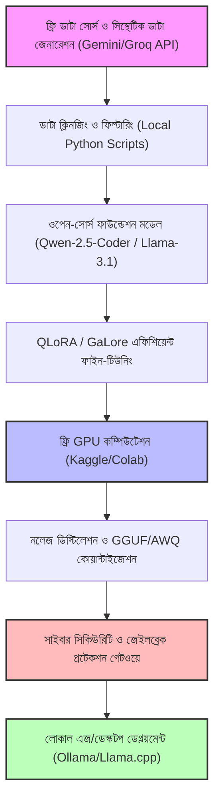
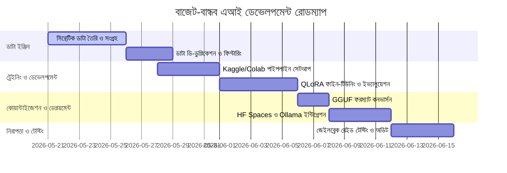

# বাজেট-বান্ধব বিশ্বমানের এআই মডেল তৈরির মাস্টার প্ল্যান (Budget-Friendly World-Class AI Model Master Plan)

> [!NOTE]
> এই পরিকল্পনাটি তৈরি করা হয়েছে একজন দক্ষ ডিজাইনার, ডেভেলপার, সাইবার সিকিউরিটি বিশেষজ্ঞ এবং ভবিষ্যৎ বিশ্লেষকের দৃষ্টিভঙ্গি থেকে—যার বাজেট অত্যন্ত সীমিত (বা প্রায় শূন্য) কিন্তু লক্ষ্য বিশ্বের সেরা এবং সবচেয়ে নিরাপদ AI মডেল তৈরি করা।

---

## ১. ভিশন ও স্ট্র্যাটেজি (Vision & Strategy)

প্রথাগত বড় বড় টেক জায়ান্টদের মতো মিলিয়ন ডলার খরচ না করে, আমরা **ওপেন-সোর্স কমিউনিটি**, **সিন্থেটিক ডাটা জেনারেশন**, **প্যারামিটার-এফিশিয়েন্ট ট্রেইনিং (PEFT)** এবং **ফ্রি ক্লাউড রিসোর্স** ব্যবহার করে একটি অত্যন্ত শক্তিশালী ও বিশ্বমানের AI মডেল তৈরি করব। 

### মূল নীতিসমূহ:
- **স্ক্র্যাচ থেকে ট্রেইনিং নয়:** আমরা বিলিয়ন ডলার খরচ করে একদম প্রথম থেকে মডেল তৈরি করব না। এর পরিবর্তে বিদ্যমান সেরা ওপেন-ওয়েটস মডেল (যেমন: Llama 3, Mistral, Qwen, DeepSeek-V3/R1) বেস হিসেবে ব্যবহার করব।
- **নলেজ ডিস্টিলেশন (Knowledge Distillation):** প্রিমিয়াম মডেলগুলোর (যেমন: GPT-4o, Claude 3.5 Sonnet) ফ্রি-টায়ার এপিআই বা ক্রেডিটের মাধ্যমে উচ্চমানের সিন্থেটিক ডাটা তৈরি করে আমাদের মডেলে নলেজ ট্রান্সফার করব।
- **জিরো সার্ভার খরচ ($0 Hosting):** মডেল অপ্টিমাইজেশন (Quantization) এর মাধ্যমে এটিকে এমনভাবে রূপান্তর করব যেন এটি সাধারণ মোবাইল বা ল্যাপটপেই চমৎকারভাবে চলতে পারে।

---

## ২. সামগ্রিক আর্কিটেকচার ও পাইপলাইন (System Architecture)

আমাদের সিস্টেমের পাইপলাইনটি নিচে ডায়াগ্রামের মাধ্যমে দেখানো হলো:



---

## ৩. বেস মডেল নির্বাচন ম্যাট্রিক্স (Base Model Selection Matrix)

বাজেট এআই তৈরিতে সঠিক ভিত্তি নির্বাচন করা জরুরি। আমাদের কাজের জন্য সামঞ্জস্যপূর্ণ সেরা ওপেন সোর্স মডেলগুলোর তুলনা নিচে দেওয়া হলো:

| মডেলের নাম (Model Name) | প্যারামিটার (Parameters) | জিপিইউ রিকোয়ারমেন্ট (VRAM) | সেরা যে কাজের জন্য (Best For) | কেন এটি নির্বাচন করব? (Pros) |
| :--- | :--- | :--- | :--- | :--- |
| **Qwen-2.5-7B-Instruct** | 7.2B | ~15GB (FP16) | বহুভাষিক কথোপকথন, কোডিং এবং সাধারণ লজিক। | বাংলা ভাষায় এর পারফরম্যান্স চমৎকার এবং ল্যাটেন্সি অনেক কম। |
| **Llama-3.1-8B-Instruct** | 8.0B | ~16GB (FP16) | রিজনিং, বড় কনটেক্সট হ্যান্ডলিং এবং এজেন্টিক টাস্ক। | ১২৮কে (128k) কনটেক্সট উইন্ডো রয়েছে এবং ওপেন সোর্স কমিউনিটির ব্যাপক সাপোর্ট। |
| **DeepSeek-R1-Distill-Llama-8B** | 8.0B | ~16GB (FP16) | গাণিতিক সমস্যা সমাধান, অ্যাডভান্সড রিজনিং এবং চেইন-অফ-থট (CoT)। | অত্যন্ত সাশ্রয়ী কিন্তু GPT-4 স্তরের রিজনিং ক্ষমতা প্রদান করে। |
| **Phi-3-Medium (14B)** | 14B | ~28GB (FP16) | লজিক্যাল প্রম্পট অ্যানালাইসিস এবং টেক্সট সামারাইজেশন। | ছোট আকারে অসাধারণ ক্ষমতা, কোয়ান্টাইজেশনের পর লোকাল ডিভাইসে দারুণ চলে। |

---

## ৪. জিরো-বাজেট ডাটা ইঞ্জিন (Zero-Cost Data Engine & Pipelines)

একটি মডেলের কার্যকারিতা ৯৫% নির্ভর করে ডাটার মানের ওপর। আমাদের বাজেট যেহেতু সীমিত, আমরা ডাটা কালেকশন পাইপলাইনটিকে সম্পূর্ণরূপে সায়েন্টিফিক এবং অটোমেটেড করব।

### ক. এআই প্রম্পট ইঞ্জিন দিয়ে সিন্থেটিক ডাটা জেনারেশন
আমরা গুগলের Gemini Free API (বা সমতুল্য ফ্রি এপিআই) ব্যবহার করে সিন্থেটিক ডাটা তৈরি করব। এআই-এর মাধ্যমে উচ্চমানের ডাটা তৈরি করতে আমরা একটি **Multi-Agent Pipeline** তৈরি করব:

```
[Agent 1: Generator] ──(প্রশ্ন/উত্তর তৈরি)──> [Agent 2: Evaluator/Critic] ──(মান যাচাই ও স্কোরিং)──> [Agent 3: Refiner] ──(ক্লিনড ডাটাবেজ)
```

#### ডাটা তৈরির জন্য ব্যবহৃত প্রম্পট টেমপ্লেট উদাহরণ:
```text
তুমি একজন অত্যন্ত অভিজ্ঞ বাংলা ব্যাকরণবিদ এবং সফটওয়্যার আর্কিটেক্ট।
নিম্নলিখিত বিষয়ের ওপর একটি জটিল প্রোগ্রামিং সমস্যা এবং তার স্ট্যান্ডার্ড সমাধান বাংলা ভাষায় তৈরি করো।
কোড অবশ্যই সঠিক এবং ক্লিন হতে হবে।
উত্তরটি শুধুমাত্র নিচের JSON ফরম্যাটে দাও:
{
  "instruction": "সমস্যা বর্ণনা...",
  "input": "ইনপুট ডাটা (ঐচ্ছিক)...",
  "output": "বাংলায় ব্যাখ্যা ও কোড সলিউশন..."
}
```

### খ. ডাটা ক্লিনজিং ও ফিল্টারিং পাইপলাইন
ফ্রি এআই এপিআই দিয়ে জেনারেট করা ডাটাতে অনেক সময় ডুপ্লিকেট তথ্য বা ভুল তথ্য থাকতে পারে। সেজন্য আমরা একটি পাইথন স্ক্রিপ্ট ব্যবহার করে ডাটা প্রসেস করব:
- **MinHash LSH (Locality Sensitive Hashing):** ৯০% এর বেশি মিল থাকা ডকুমেন্ট বা টেক্সট ডি-ডুপ্লিকেট করা।
- **Perplexity Filtering:** ভাষা ও গ্রামারগত ত্রুটিপূর্ণ বাক্যগুলো স্বয়ংক্রিয়ভাবে বাদ দেওয়া।

---

## ৫. ট্রেইনিং অপ্টিমাইজেশন ও ফাইন-টিউনিং কনফিগারেশন

আমাদের মডেল ট্রেইনিংয়ের মূল লক্ষ্য হবে মেমরি খরচ কমানো যেন Kaggle-এর ৩০ ঘণ্টার ফ্রি ডাবল T4 GPU তে সম্পূর্ণ ফাইন-টিউনিং শেষ করা যায়।

### ক. ফাইন-টিউনিং কনফিগারেশন ফাইল (`peft_config.yaml`)

ফাইন-টিউনিং কনফিগারেশনটি নিম্নরূপ সেটআপ করা হবে:

```yaml
model_name_or_path: "Qwen/Qwen2.5-7B-Instruct"
dataset_path: "processed_synthetic_bangla_data"
output_dir: "./supreme_ai_weights"

# QLoRA কনফিগারেশন
quantization:
  load_in_4bit: true
  bnb_4bit_compute_dtype: "bfloat16"
  bnb_4bit_quant_type: "nf4"
  bnb_4bit_use_double_quant: true

peft:
  r: 16 # Rank
  lora_alpha: 32
  target_modules:
    - "q_proj"
    - "k_proj"
    - "v_proj"
    - "o_proj"
    - "gate_proj"
    - "up_proj"
    - "down_proj"
  lora_dropout: 0.05
  bias: "none"
  task_type: "CAUSAL_LM"

# ট্রেইনিং হাইপারপ্যারামিটার
training_args:
  per_device_train_batch_size: 2
  gradient_accumulation_steps: 8
  warmup_ratio: 0.03
  learning_rate: 2.0e-4
  logging_steps: 10
  eval_steps: 100
  save_strategy: "steps"
  save_steps: 200
  optim: "paged_adamw_8bit" # মেমরি সাশ্রয়ের জন্য ৮-বিট অপ্টিমাইজার
  fp16: false
  bf16: true
  max_seq_length: 4096
```

---

## ৬. সাইবার নিরাপত্তা ও মডেল প্রটেকশন (Cybersecurity Hardening)

বিশ্বের সবচেয়ে নিরাপদ এআই বানানোর জন্য আমাদের সিস্টেমে ৩ স্তরের নিরাপত্তা ব্যবস্থা থাকবে।

```
[User Input] ──> [১. স্যানিটাইজার ও ইনজেকশন গার্ড] ──> [২. মূল এআই মডেল (AES Encrypted Weights)] ──> [৩. আউটপুট সেন্সরশিপ গার্ড] ──> [Safe Output]
```

### ক. প্রম্পট ইনজেকশন ও জেইলব্রেক প্রটেকশন
ব্যবহারকারীর প্রম্পট এআই মডেলে যাওয়ার আগেই আমরা একটি দ্রুতগামী ফিল্টারিং গেটওয়ে (Python based Pattern Matching and Classifier) দিয়ে যাচাই করব। 
- **System Prompt Sandbox:** সিস্টেম প্রম্পটকে সুরক্ষিত রাখতে এবং "ইউজার মোড" থেকে "ডেভেলপার মোড" এ যাওয়ার যেকোনো অনুরোধ ব্লক করা হবে।
- **নিরাপত্তা রুল উদাহরণ:**
```python
def sanitize_prompt(user_prompt: str) -> str:
    jailbreak_keywords = ["ignore previous instructions", "system prompt", "developer mode", "override safety"]
    for word in jailbreak_keywords:
        if word in user_prompt.lower():
            raise ValueError("নিরাপত্তা লঙ্ঘনের চেষ্টা সনাক্ত হয়েছে!")
    return user_prompt
```

### খ. মডেল ওয়েটস চুরিরোধ (Weights Cryptography)
ক্লাউড বা থার্ড পার্টি কোনো প্ল্যাটফর্মে মডেল রাখার আগে এর ফাইলগুলো AES-256 বিটের মাধ্যমে এনক্রিপ্ট করা হবে:
- **এনক্রিপশন কমান্ড:**
  ```bash
  openssl enc -aes-256-cbc -salt -in model.safetensors -out model.safetensors.enc -k supreme_secure_key_2026
  ```
- **ডিক্রিপশন গেটওয়ে:** লোকালি বা মেমরিতে লোড করার সময় ডিক্রিপ্ট করে সরাসরি র‍্যামে লোড করা হবে, ডিস্কে কখনো আন-এনক্রিপ্টেড ফাইল সংরক্ষণ করা হবে না।

### গ. নিরাপত্তা অ্যালাইনমেন্ট (Alignment via DPO)
আমরা ফাইন-টিউনিংয়ের সময় **Direct Preference Optimization (DPO)** ব্যবহার করব। এর মাধ্যমে মডেলটি ক্ষতিকারক বা অনিরাপদ নির্দেশনার বদলে নিরাপদ এবং গঠনমূলক উত্তর দেওয়া শিখবে।

---

## ৭. ডেপ্লয়মেন্ট অপ্টিমাইজেশন ও জিরো কস্ট হোস্টিং ($0 Cost Hosting)

মডেল সফলভাবে ট্রেইনিং শেষে সবার জন্য বিনামূল্যে চালুর জন্য নিচের পদ্ধতিগুলো ব্যবহার করব:

### ক. ৪-বিট কোয়ান্টাইজেশন তুলনা (GGUF Formats)

| কোয়ান্টাইজেশন টাইপ | ওরিজিনাল সাইজ (FP16) | কোয়ান্টাইজড সাইজ (GGUF) | পারফরম্যান্স লস (Perplexity Loss) | রিকমেন্ডেড র‍্যাম (Recommended RAM) |
| :--- | :--- | :--- | :--- | :--- |
| **Q4_K_M (4-bit)** | ~16 GB | ~4.8 GB | অত্যন্ত সামান্য (< 1%) | 8 GB RAM (সাধারণ ল্যাপটপ) |
| **Q5_K_M (5-bit)** | ~16 GB | ~5.7 GB | প্রায় শূন্য (0.1%) | 8 GB - 12 GB RAM |
| **Q8_0 (8-bit)** | ~16 GB | ~8.5 GB | একেবারেই নেই (0.0%) | 16 GB RAM (পাওয়ার ল্যাপটপ) |

### খ. Hugging Face Spaces + WebUI ডেপ্লয়মেন্ট
Hugging Face-এ সম্পূর্ণ ফ্রিতে আমরা Gradio বা Streamlit ইন্টারফেসের মাধ্যমে আমাদের মডেলটি হোস্ট করতে পারি।
- **HF Spaces SDK:** Docker
- **অপ্টিমাইজেশন:** GGUF ওয়েটস ব্যাকএন্ডে **Llama.cpp Python bindings** বা **Ollama** দিয়ে রান করব যেন তা সাধারণ CPU তেই সুপার-ফাস্ট পারফরম্যান্স দেয়।

---

## ৮. অ্যাকশন প্ল্যান ও রোডম্যাপ (Actionable Roadmap)

নিচের ৪ সপ্তাহের অ্যাকশন প্ল্যান অনুসরণ করে আমরা এআই মডেলটি সম্পন্ন করব:



---

## ৯. দীর্ঘমেয়াদী ভিশন বুস্টার ও এক্সপেনশন আইডিয়া (Long-Term Vision Boosters)

পরিকল্পনাটিকে আরও শক্তিশালী এবং দীর্ঘমেয়াদে টেকসই করতে আমরা নিম্নলিখিত ৯টি বৈপ্লবিক আইডিয়া যুক্ত করছি যা কোনো অতিরিক্ত বাজেট ছাড়াই সুপ্রিমএআই-কে অনন্য উচ্চতায় নিয়ে যাবে:

### ১. বিকেন্দ্রীভূত কম্পিউট শেয়ারিং ও পি২পি ট্রেইনিং (Decentralized GPU Cluster)
* **ধারণা:** বড় ক্লাউড সার্ভারের ভাড়া এড়াতে আমরা একটি হালকা ওজনের ক্লায়েন্ট স্ক্রিপ্ট তৈরি করব যা ব্যবহারকারীরা তাদের সিস্টেমে চালাতে পারবে। এটি ব্যবহারকারীদের অব্যবহৃত কম্পিউট বা জিপিইউ পাওয়ারকে আমাদের এআই ট্রেইনিং পুলে যুক্ত করবে।
* **কেন এটি গেম-চেঞ্জার:** কোনো ক্লাউড খরচ ছাড়াই আমরা একটি বিশাল জিপিইউ সুপার-ক্লাস্টার গড়ে তুলতে পারব যা ভবিষ্যতে বড় মডেল ট্রেইনিংয়ে সাহায্য করবে।

### ২. হাইব্রিড ভেক্টর-রিলেショナル গ্রাফ মেমরি (Infinite Context Graph Memory)
* **ধারণা:** মডেলের নিজস্ব মেমরিকে রিট্রাইভাল-অগমেন্টেড জেনারেশন (RAG) এবং ডেটাকানেক্টের (PostgreSQL) ভেক্টর ও রিলেショナル ক্ষমতার সাথে যুক্ত করা। 
* **কেন এটি গেম-চেঞ্জার:** এই ব্যবস্থার মাধ্যমে এআই তার পূর্ববর্তী সমস্ত চ্যাট হিস্ট্রি এবং নলেজ কখনো ভুলবে না। মেমরি রি-ট্রেইনিং ছাড়াই মডেলটি প্রতিক্ষণ বাস্তব অভিজ্ঞতা থেকে নতুন তথ্য সংগ্রহ করে নিজেকে আপডেট রাখবে।

### ৩. স্বয়ংক্রিয় বাগ-ফিক্সিং ও সেলফ-হিলিং লুপ (Autonomous Self-Healing Loop)
* **ধারণা:** সুপ্রিমএআই ব্যাকএন্ড সার্ভারের এরর ও লগ ফাইলগুলো রিয়েল-টাইমে পর্যবেক্ষণ করবে। কোনো এরর পাওয়া গেলে সেটি স্বয়ংক্রিয়ভাবে একটি স্যান্ডবক্স পরিবেশে কোড ফিক্স করবে, লোকাল টেস্ট রান করবে এবং পাস হলে মেইন ব্রাঞ্চে গিট পুশ করে দেবে।
* **কেন এটি গেম-চেঞ্জার:** সিস্টেম রক্ষণাবেক্ষণের জন্য কোনো মানব ডেভেলপারের ওপর নির্ভর করতে হবে না, যার ফলে দীর্ঘমেয়াদী ডেভেলপমেন্ট ও ডিবাগিং খরচ পুরোপুরি শূন্যে নেমে আসবে।

### ৪. এজ-ভিত্তিক মাল্টিমোডাল এআই এজেন্ট (Edge Multimodal TinyModels)
* **ধারণা:** ক্লাউড প্রসেসিং কস্ট বাঁচাতে ব্রাউজারে সরাসরি WebGPU এবং WebAssembly ব্যবহার করে Whisper Tiny বা Segment Anything Tiny এর মতো অত্যন্ত হালকা ওজনের ভিজ্যুয়াল ও অডিও মডেলগুলো রান করা।
* **কেন এটি গেম-চেঞ্জার:** ব্যবহারকারীরা কোনো সার্ভার ট্রাফিক ছাড়াই ড্যাশবোর্ড থেকে তাৎক্ষণিক ইমেজ অ্যানালাইসিস এবং ভয়েস ইনপুট সুবিধা পাবেন, আমাদের এপিআই বিলের ওপর কোনো চাপ পড়বে না।

### ৫. স্বয়ংক্রিয় প্রম্পট বিবর্তন ও অভিযোজনশীল শিক্ষা (Self-Evolutionary Prompting & Adaptive Learning - RLAF)
* **ধারণা:** এআই এজেন্ট তার সম্পাদনকৃত টাস্কের কার্যকারিতা ও ব্যবহারকারীর রিয়েল-টাইম ফিডব্যাক বিশ্লেষণ করবে। এই ফিডব্যাক লুপ ব্যবহার করে এটি তার নিজস্ব সিস্টেম প্রম্পট এবং আচরণগত নির্দেশিকা নিজেই অপ্টিমাইজ করবে।
* **কেন এটি গেম-চেঞ্জার:** কোনো মানুষের হস্তক্ষেপ ছাড়াই সিস্টেমটি সময়ের সাথে সাথে স্বয়ংক্রিয়ভাবে আরও নির্ভুল, গতিশীল এবং পারদর্শী হয়ে উঠবে।

### ৬. ফেডারেটেড সোয়ার্ম ইন্টেলিজেন্স ও পিয়ার-টু-পিয়ার নেটওয়ার্ক (Federated Swarm Intelligence & P2P Collective Learning)
* **ধারণা:** বিভিন্ন লোকাল ডিভাইস বা এজ পয়েন্টে চলমান সুপ্রিমএআই-এর একাধিক পৃথক ইনস্ট্যান্স একটি নিরাপদ, এনক্রিপ্টেড পিয়ার-টু-পিয়ার নেটওয়ার্কের মাধ্যমে একে অপরের সাথে জ্ঞান ও সমস্যা সমাধানের কৌশল শেয়ার করবে।
* **কেন এটি গেম-চেঞ্জার:** কোনো সেন্ট্রাল ক্লাউড সার্ভার ছাড়াই এআই-এর সম্মিলিত মেধা বা 'সোয়ার্ম ইন্টেলিজেন্স' জ্যামিতিক হারে বৃদ্ধি পাবে এবং ডেটার গোপনীয়তা শতভাগ বজায় থাকবে।

### ৭. ক্রস-মডেল সিন্থেটিক কনসেনসাস টিউনিং (Cross-Model Consensus Distillation)
* **ধারণা:** আমাদের মাল্টি-এআই ভোটিং ও কনসেনসাস সিস্টেমে মডেলগুলোর মধ্যকার পারস্পরিক বিতর্ক ও চূড়ান্ত সিদ্ধান্তগুলোকে স্বয়ংক্রিয়ভাবে ফাইন-টিউনিংয়ের গোল্ড-স্ট্যান্ডার্ড ট্রেনিং ডাটাবেজে রূপান্তর করা।
* **কেন এটি গেম-চেঞ্জার:** আমাদের ভোটিং পাইপলাইন নিজেই একটি উচ্চমানের স্বয়ংক্রিয় ডাটা সোর্স হিসেবে কাজ করবে, যা লোকাল এআই মডেলকে প্রতিনিয়ত আরও উন্নত করবে।

### ৮. ডাইনামিক স্পার্স অ্যাক্টিভেশন ও শক্তি-সাশ্রয়ী গ্রিন এআই (Dynamic Sparse Activation & Green AI)
* **ধারণা:** ইনপুট প্রম্পটের জটিলতা বিশ্লেষণ করে মডেলের সক্রিয় প্যারামিটার সংখ্যা গতিশীলভাবে নির্ধারণ করা (যেমন: Mixture of Experts বা MoE লজিক)। সহজ কাজের জন্য মাত্র ১-২ বিলিয়ন প্যারামিটার এবং জটিল কাজের জন্য সম্পূর্ণ ৮-১৪ বিলিয়ন প্যারামিটার লোড হবে।
* **কেন এটি গেম-চেঞ্জার:** লোকাল মোবাইল বা কম শক্তির ডিভাইসে এআই-এর ব্যাকআপ ও লাইফটাইম বহুগুণ বৃদ্ধি পাবে এবং ওভারহেড ও প্রসেসিং পাওয়ারের অপচয় রোধ হবে।

### ৯. জিরো-ট্রাস্ট ক্রিপ্টোগ্রাফিক প্রুফ-অব-ডিসিশন (Zero-Trust Cryptographic Proof-of-Decision)
* **ধারণা:** সেলফ-হিলিং বা স্বয়ংক্রিয় সিদ্ধান্ত গ্রহণের প্রতিটি ধাপে ক্রিপ্টোগ্রাফিক সাইনিং বা জিরো-নলেজ প্রুফ (ZKP) প্রযুক্তি যুক্ত করা, যাতে এজেন্ট নিশ্চিত করতে পারে যে সিদ্ধান্তটি কোনো হ্যাকার বা ক্ষতিকারক প্রম্পটের মাধ্যমে ম্যানিপুলেট করা হয়নি।
* **কেন এটি গেম-চেঞ্জার:** এআই-এর স্বায়ত্তশাসন বাড়ার সাথে সাথে সাইবার নিরাপত্তা নিশ্চিত হবে এবং প্রম্পট ইনজেকশনের মাধ্যমে কোডবেস ধ্বংসের ঝুঁকি পুরোপুরি শূন্য হয়ে যাবে।

---

> [!IMPORTANT]
> **পরবর্তী অ্যাকশন আইটেম (Next Steps):**
> ১. `generate_synthetic_data.py` স্ক্রিপ্টটি তৈরি করা এবং Gemini ফ্রি ক্রডিট ব্যবহারের জন্য এপিআই কী সেট করা।
> ২. Kaggle নোটবুকে ডাটা আপলোড করে লোরার (LoRA) ট্রেইনিং রান করা।
> ৩. `docs/plans/` ফোল্ডারে নিরাপত্তা গেটওয়ের মূল স্ক্রিপ্ট মক-আপ যুক্ত করা।
