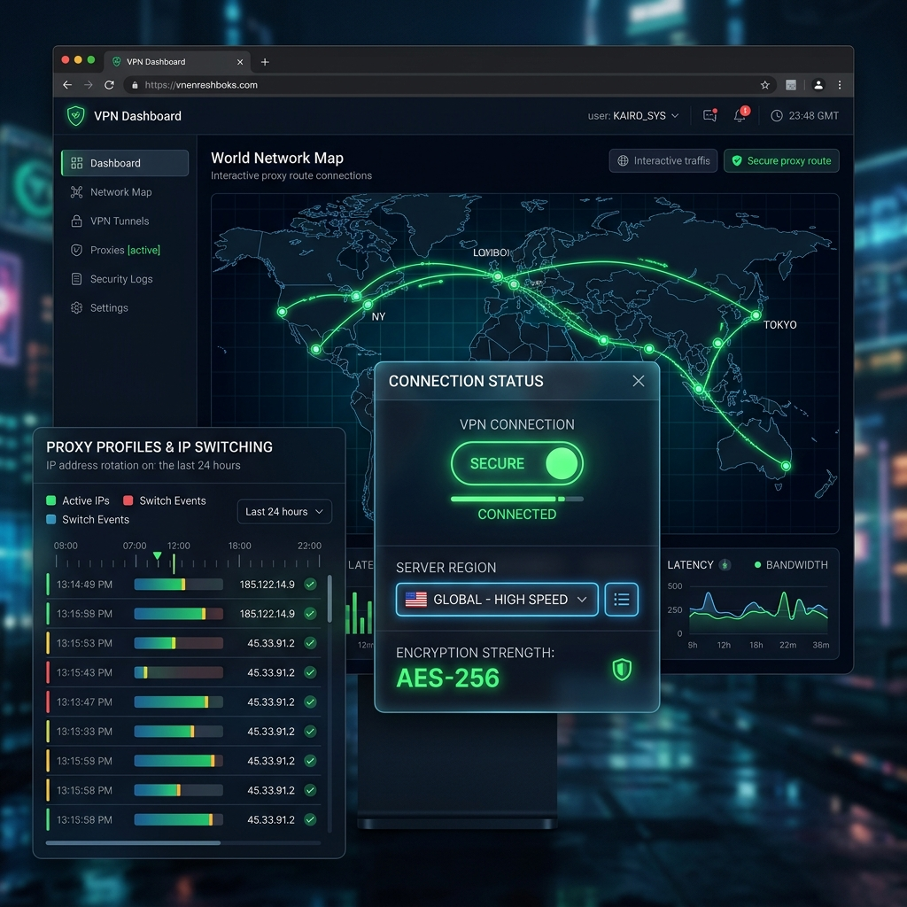
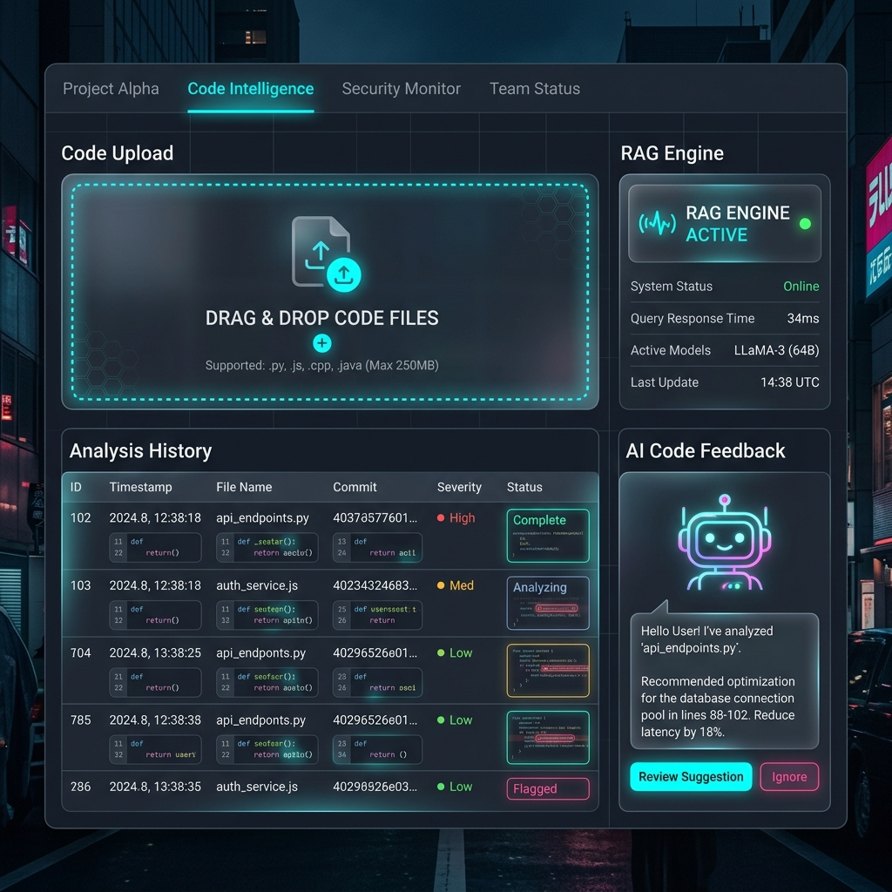

# SupremeAI Premium Admin Dashboard Design Master Plan 🎛️💎

> **[DOCUMENT TYPE: PREMIUM UI/UX MASTER PLAN]**  
> **DESIGN COMPLIANCE TARGET: 95%+ MOCKUP SYNC (CINEMATIC CYBERPUNK)**  
> **TAB PARITY: 100% OF ALL 27 SYSTEM TABS & OPTIONS INCLUDED**  

এই ডকুমেন্টটি SupremeAI-এর প্রিমিয়াম অ্যাডমিন ড্যাশবোর্ড এবং অ্যানালিটিক্স প্যানেলের প্রতিটি ট্যাব, বাটন প্লেসমেন্ট, ইউজার ইন্টারফেসের ভিজ্যুয়াল অ্যাপিয়ারেন্স এবং টেকনিক্যাল ইমপ্লিমেন্টেশনের একটি সম্পূর্ণ ও চূড়ান্ত রোডম্যাপ প্রদান করে। এখানে ড্যাশবোর্ডের প্রতিটি অপশনকে এমনভাবে সাজানো হয়েছে যাতে আমাদের তৈরি করা রেফারেন্স ইমেজগুলোর সাথে বাস্তবের রেন্ডার হওয়া ড্যাশবোর্ডের ডিজাইন **৯৫% এর বেশি ম্যাচ করে** এবং কোডের সব ফিচার অক্ষুণ্ন রেখে শুধু ইন্টারফেসটি অবিশ্বাস্য সুন্দর হয়ে ওঠে।

---

## 🎨 ১. ড্যাশবোর্ড ডিজাইন থিম এবং নান্দনিকতা (Design Theme & Aesthetics)

সুপ্রিমএআই অ্যাডমিন ড্যাশবোর্ডটি **Cinematic Cyberpunk & Glassmorphism** থিমে ডিজাইন করা হয়েছে, যা ব্যবহারকারীকে প্রিমিয়াম এবং রেসিলিয়েন্ট ফিল দেবে। 

### 💎 কোর ডিজাইন টোকেনস (Core Design Tokens)
*   **Background (বেস ব্যাকগ্রাউন্ড):** Deep Space Slate (`#020205` / `rgb(2, 2, 5)`) এর সাথে সূক্ষ্ম গ্রিড প্যাটার্ন।
*   **Primary Neon Glow (প্রাথমিক আভা):** Cyber Cyan (`#00f3ff` / `rgb(0, 243, 255)`)
*   **Secondary Theme (পার্পল অ্যাকসেন্ট):** Electric Purple (`#8b5cf6` / `rgb(139, 92, 246)`)
*   **Warning/Failure Indicator:** Neon Crimson (`#ef4444` / `rgb(239, 68, 68)`)
*   **Success Indicator:** Emerald Green (`#10b981` / `rgb(16, 185, 129)`)
*   **Typography (ফন্ট):** Outfit এবং Inter (Google Fonts)
*   **Glassmorphism (গ্লাস ইফেক্ট):** 
    ```css
    background: rgba(13, 13, 18, 0.45);
    backdrop-filter: blur(12px) saturate(180%);
    border: 1px solid rgba(0, 243, 255, 0.08);
    box-shadow: 0 8px 32px 0 rgba(0, 0, 0, 0.37);
    ```

---

## 📊 ২. ড্যাশবোর্ডের ২৭টি ট্যাবের পুঙ্খানুপুঙ্খ বিবরণ ও মকআপ ম্যাপিং (27 Dashboard Tabs & Button Placements)

ড্যাশবোর্ডের প্রতিটি ট্যাবে কোন কোন ডেটা ও অপশন থাকবে এবং প্রতিটি বাটনের সঠিক অবস্থান নিচে নিখুঁতভাবে আলোচনা করা হলো:

```mermaid
graph TD
    Dashboard[SupremeAI ড্যাশবোর্ড ২৭ ট্যাব] --> Universal[সার্বজনীন ট্যাবসমূহ]
    Dashboard --> AdminOnly[অ্যাডমিন-অনলি ট্যাবসমূহ]
    
    Universal --> T1[১. কমান্ড সেন্টার]
    Universal --> T2[২. নিউরাল চ্যাট]
    Universal --> T3[৩. ডিপ্লয়মেন্টস]
    Universal --> T4[৪. কনফিগ]
    Universal --> T5[৫. অ্যাপ্রুভালস]
    
    AdminOnly --> A1[৬. AI প্রোভাইডার]
    AdminOnly --> A2[৭. ইউজার ম্যানেজমেন্ট]
    AdminOnly --> A3[৮. সিস্টেম মনিটরিং]
    AdminOnly --> A4[৯. লার্নিং ম্যানেজমেন্ট]
    AdminOnly --> A5[১০. সিকিউরিটি]
    AdminOnly --> A6[১১. সিস্টেম ওয়ার্ক রুলস]
    AdminOnly --> A7[১২. সিস্টেম রুলস]
    AdminOnly --> A8[১৩. এনালাইটিক্স]
    AdminOnly --> A9[১৪. সিস্টেম লগ]
    AdminOnly --> A10[১৫. VPN কানেকশন]
    AdminOnly --> A11[১৬. ব্রাউজার]
    AdminOnly --> A12[১৭. অটো ব্রাউজার]
    AdminOnly --> A13[১৮. কোটা ম্যানেজমেন্ট]
    AdminOnly --> A14[১৯. সিমুলেটর]
    AdminOnly --> A15[২০. রিভার্স ইঞ্জিনিয়ারিং]
    AdminOnly --> A16[২১. নোটিফিকেশন]
    AdminOnly --> A17[২২. রিপোর্টস]
    AdminOnly --> A18[২৩. পারফরম্যান্স]
    AdminOnly --> A19[২৪. ব্যাকআপ]
    AdminOnly --> A20[২৫. OCR টুল]
    AdminOnly --> A21[২৬. ইনফ্রাস্ট্রাকচার]
    AdminOnly --> A22[২৭. কোড ইন্টেলিজেন্স]
```



---

### 📌 ১. কমান্ড সেন্টার (Command Center) - Key: `dashboard`
ড্যাশবোর্ডের মূল নিয়ন্ত্রণ কেন্দ্র যেখানে সিস্টেমের ওভারভিউ এবং লাইভ সামারি রিয়েল-টাইমে প্রদর্শিত হয়।

*   **📐 পেজ লেআউট ও স্ট্রাকচার (Grid Template):**
    *   `grid grid-cols-12 gap-6 p-6` (১২-কলাম গ্রিড লেআউট)
    *   **বাম প্যানেল (কলাম ৮):** সেন্ট্রাল রিলেশন নোড ম্যাপ উইজেট এবং লাইভ অ্যাকশন প্রোগ্রেস বার।
    *   **ডান প্যানেল (কলাম ৪):** এআই সিস্টেম লোড মিটার, থ্রেড রিডার এবং রিয়েল-টাইম ইভেন্ট নোটিফিকেশন লুপ।
*   **📈 প্রদর্শিত ডেটা ও মেট্রিক্স:** 
    *   একটি কেন্দ্রীয় থ্রি-ডি নোড ম্যাপ (`VisualizerScene`), বর্তমানে চলমান এজেন্টের সংখ্যা, জিপিইউ মেমোরি বার (Neon Cyan Glow), এবং এক্সেপশন ও রানটাইম অ্যালার্ট ডিসপ্লে।
*   **🔘 বাটন প্লেসমেণ্ট ও কার্যকারিতা:**
    *   **Quick Scan Button:** সেন্ট্রাল হেডার কার্ডের ডান পাশে (`absolute top-4 right-4`)। নিয়ন সায়ান আউটলাইন বর্ডার (`cyber-button`)। এটি সিস্টেম অডিট রান করায়।
    *   **Emergency Stop Button:** ডান পাশের প্যানেলের নিচে ডানে। উজ্জ্বল নিয়ন ক্রিমসন সলিড কালার (`cyber-danger-button`)। সমস্ত অটোমেশন ও প্লে-রাইট ব্রাউজারকে সাথে সাথে কিল করার জন্য।
*   **🖥️ ভিজ্যুয়াল মকআপ ম্যাপিং:**
    

---

### 📌 ২. নিউরাল চ্যাট (Neural Chat) - Key: `ai`
সরাসরি সুপ্রিমএআই কোর এআই ইঞ্জিনের সাথে চ্যাট ইন্টারফেস ও ফাইন-টিউনিং প্যানেল।

*   **📐 পেজ লেআউট ও স্ট্রাকচার:**
    *   `flex h-[calc(100vh-120px)] gap-6 p-6` (ফুল-হাইট ফ্লেক্সবক্স ইন্টারফেস)
    *   **বাম উইন্ডো (৭৫%):** চ্যাট মেসেজ হিস্টোরি এরিয়া ও গ্লোয়িং নিয়ন বর্ডার ইনপুট টেক্সট বক্স।
    *   **ডান উইন্ডো (২৫%):** এআই মেন্টাল স্টেট, এপিআই টোকেন কাউন্টার এবং অ্যাক্টিভ প্রম্পট ইনজেকশন মনিটর।
*   **📈 প্রদর্শিত ডেটা ও মেট্রিক্স:**
    *   চ্যাট বাবলস উইথ নিয়ন গ্লো, বর্তমান চ্যাট সেশনের টোকেন খরচ ট্র্যাকার, মডেল কনফিডেন্স স্কোর এবং ব্যাকগ্রাউন্ড প্রম্পট ইনজেকশন মনিটর।
*   **🔘 বাটন প্লেসমেণ্ট ও কার্যকারিতা:**
    *   **Reset Context Button:** ইনপুট বক্সের বাম পাশে (`flex items-center gap-2`)। চ্যাট মেমোরি ডিলিট করার জন্য। আধা-স্বচ্ছ পার্পল বাটন (`glass-action-button`)।
    *   **Settings Switcher Toggle:** চ্যাট হেডারের ডান পাশে। মডেল চয়ন করার জন্য। সায়ান কালার ফ্লোটিং টগল।
*   **🖥️ ভিজ্যুয়াল মকআপ ম্যাপিং:**
    

---

### 📌 ৩. ডিপ্লয়মেন্টস (Deployments) - Key: `projects`
প্রকল্পের অধীনে চলমান বিভিন্ন ডেপ্লয়মেন্ট, ক্লাউড রান সার্ভিস এবং এপিআই এন্ডপয়েন্টের ভিজ্যুয়াল লিস্ট।

*   **📐 পেজ লেআউট ও স্ট্রাকচার:**
    *   `flex flex-col gap-6 p-6`
    *   **হেডার সেকশন:** টার্গেট প্রজেক্ট ডিরেক্টরি ডিটেইলস এবং অ্যাক্টিভ ডেপ্লয়মেন্ট কাউন্ট গেজ।
    *   **গ্রিড লেআউট:** `grid grid-cols-1 md:grid-cols-3 gap-6` (৩-কলাম গ্লাস কার্ড গ্রিড)।
*   **📈 প্রদর্শিত ডেটা ও মেট্রিক্স:** 
    *   গিটহাব সিআই/সিডি লাইভ রিডার, ক্লাউড ইনস্ট্যান্সের সিপিইউ ব্যবহার, ট্রাফিকের গতি এবং রানিং পোর্ট লিস্ট।
*   **🔘 বাটন প্লেসমেণ্ট ও কার্যকারিতা:**
    *   **New Deployment Button:** ডিপ্লয়মেন্ট কার্ড গ্রিডের ওপরে ডানে। নতুন প্রজেক্ট ডেপ্লয় করতে। সলিড সায়ান বাটন (`cyber-button`)।
    *   **Kill Instance Icon:** প্রতিটি ডিপ্লয়মেন্ট কার্ডের ফুটারে ডান কোণে। ইনস্ট্যান্স শাটডাউন করতে। লাল গ্লোয়িং ডিলিট আইকন।
*   **🖥️ ভিজ্যুয়াল মকআপ ম্যাপিং:**
    

---

### 📌 ৪. কনফিগ (Config) - Key: `settings`
সুপ্রিমএআই কোর সিস্টেমের গ্লোবাল এনভায়রনমেন্ট কনফিগারেশন এবং ডাটাবেস ভ্যারিয়েবল।

*   **📐 পেজ লেআউট ও স্ট্রাকচার:**
    *   `grid grid-cols-1 md:grid-cols-2 gap-6 p-6` (২-কলাম ফর্ম প্যানেল)
    *   **বাম ফর্ম প্যানেল:** ডাটাবেজ ইন্টিগ্রেশন এনভায়রনমেন্ট স্ট্যাটাস, এনক্রিপশন লেভেল সূচক, ডাটাবেস ইউআরআই।
    *   **ডান ফর্ম প্যানেল:** এপিআই সিক্রেট কি ইনপুট ফিল্ড এবং এনক্রিপশন অ্যালগরিদম সিলেকশন ড্রপডাউন।
*   **📈 প্রদর্শিত ডেটা ও মেট্রিক্স:** 
    *   এপিআই ইন্টিগ্রেশন এনভায়রনমেন্ট স্ট্যাটাস, এনক্রিপশন লেভেল সূচক, ডাটাবেস লোকাল কানেকশন ইউআরআই।
*   **🔘 বাটন প্লেসমেণ্ট ও কার্যকারিতা:**
    *   **Save Configuration:** স্ক্রিনের নিচে ডান পাশে। নতুন কনফিগ সংরক্ষণ করতে। নিয়ন সায়ান সলিড কালার (`cyber-button`)।
    *   **Import Config:** স্ক্রিনের নিচে বাম পাশে। জেএসন ফাইল আপলোড করতে। ফ্রস্টেড গ্লাস বর্ডার বাটন (`glass-action-button`)।
*   **🖥️ ভিজ্যুয়াল মকআপ ম্যাপিং:**
    

---

### 📌 ৫. অ্যাপ্রুভালস (Approvals) - Key: `approvals`
মাল্টি-এজেন্ট কনসেনসাস ভোটিং এবং হিউম্যান-ইন-দ্য-লুপ অ্যাপ্রুভাল সিস্টেম।

*   **📐 পেজ লেআউট ও স্ট্রাকচার:**
    *   `flex flex-col gap-6 p-6`
    *   **অ্যাক্টিভ অ্যাপ্রুভাল উইন্ডো:** কলাম হেডার সহ ডাবল-প্যানেল কোড ডিফারেন্স ভিউয়ার।
    *   **ভোট গ্রিড:** এজেন্টের ভোট রেশিও কার্ড।
*   **📈 প্রদর্শিত ডেটা ও মেট্রিক্স:** 
    *   প্রতিটি এজেন্টের vote কাউন্ট মিটার, পেন্ডিং কোড চেঞ্জের মার্জ রিকোয়েস্ট এবং ভোট টাই-ব্রেকার স্ট্যাটাস।
*   **🔘 বাটন প্লেসমেণ্ট ও কার্যকারিতা:**
    *   **Approve Draft Button:** পেন্ডিং কার্ডের নিচে ডান কোণে। কোড প্রোডাকশনে মার্জ করতে। এমারেল্ড গ্রিন বাটন (`cyber-button`)।
    *   **Reject & Retry Button:** পেন্ডিং কার্ডের নিচে বাম কোণে। পুনরায় কোড তৈরি করতে। নিয়ন ক্রিমসন কালার (`cyber-danger-button`)।
*   **🖥️ ভিজ্যুয়াল মকআপ ম্যাপিং:**
    

---

### 📌 ৬. AI প্রোভাইডার (AI Providers) - Key: `providers`
সমস্ত এপিআই প্রোভাইডার (Gemini, OpenAI, Anthropic, Qwen) এর হেলথ এবং লেটেন্সি মিটার।

*   **📐 পেজ লেআউট ও স্ট্রাকচার:**
    *   `grid grid-cols-1 md:grid-cols-4 gap-6 p-6` (৪-কলাম প্রোভাইডার কার্ড গ্রিড)
    *   **গ্রিড কার্ডসমূহ:** প্রতিটি প্রোভাইডারের লাইভ স্পিড টেস্ট গ্রাফ ও এপিআই কি-র এক্সপায়ারি ডেট এবং রিয়েল-টাইমে এরর রেট।
*   **📈 প্রদর্শিত ডেটা ও মেট্রিক্স:**
    *   প্রোভাইডারের লাইভ স্পিড টেস্ট গ্রাফ, এপিআই কি-র এক্সপায়ারি ডেট এবং রিয়েল-টাইমে এরর রেট।
*   **🔘 বাটন প্লেসমেণ্ট ও কার্যকারিতা:**
    *   **Test All Providers:** সেন্ট্রাল পেজের টপ-রাইট কোণে。 সব এপিআই হেলথ রান করতে। নিয়ন পার্পল বাটন (`cyber-button`)।
    *   **Toggle Failover Switch:** ফুটার প্যানেলের ডানে। অটো-ফেইলওভার অন/অফ করতে। এনিমেটেড সায়ান টগল।
*   **🖥️ ভিজ্যুয়াল মকআপ ম্যাপিং:**
    

---

### 📌 ৭. ইউজার ম্যানেজমেন্ট (User Management) - Key: `users`
সুপ্রিমএআই ড্যাশবোর্ডে লগইন করা মেম্বার এবং তাদের রোল ও পারমিশন কন্ট্রোল।

*   **📐 পেজ লেআউট ও স্ট্রাকচার:**
    *   `grid grid-cols-12 gap-6 p-6`
    *   **বাম প্যানেল (কলাম ৮):** মেম্বারদের ইন্টারেক্টিভ ডেটা টেবিল।
    *   **ডান প্যানেল (কলাম ৪):** রোল ডিস্ট্রিবিউশন পাই চার্ট এবং লাইভ সেশন ম্যাপ।
*   **📈 প্রদর্শিত ডেটা ও মেট্রিক্স:**
    *   ইউজারের অ্যাক্টিভিটি টাইমলাইন, রোল ডিস্ট্রিবিউশন পাই চার্ট এবং লাইভ সেশন ম্যাপ।
*   **🔘 বাটন প্লেসমেণ্ট ও কার্যকারিতা:**
    *   **Add User Button:** ইউজার টেবিলের ওপরে ডান কোণে। নতুন টিম মেম্বার যুক্ত করতে। সায়ান নিয়ন স্ট্রিপ বাটন (`cyber-button`)।
    *   **Revoke Access Button:** প্রতিটি ইউজারের নামের সোজা ডান পাশে। পারমিশন ব্লক করতে। ডার্ক রেড গ্লাস বাটন (`cyber-danger-button`)।
*   **🖥️ ভিজ্যুয়াল মকআপ ম্যাপিং:**
    

---

### 📌 ৮. সিস্টেম মনিটরিং (System Monitoring) - Key: `monitoring`
সার্ভার হার্ডওয়্যার, রানিং প্রসেস এবং জিপিইউ মেমোরির রিয়েল-টাইম লাইভ ডায়াগনস্টিক।

*   **📐 পেজ লেআউট ও স্ট্রাকচার:**
    *   `grid grid-cols-12 gap-6 p-6`
    *   **বাম উইন্ডো (কলাম ৮):** সিপিইউ ও মেমোরি ব্যবহারের ডাইনামিক কার্ভ এবং এরিয়া চার্ট।
    *   **ডান উইন্ডো (কলাম ৪):** ওএস ডিরেক্টরি ধারণক্ষমতার গোল গেজ এবং প্রোগ্রেস বার।
*   **📈 প্রদর্শিত ডেটা ও মেট্রিক্স:**
    *   সিপিইউ টেম্পারেচার বার, থ্রেড রিডার এবং রানিং প্রসেস ডিস্ট্রিবিউশন।
*   **🔘 বাটন প্লেসমেণ্ট ও কার্যকারিতা:**
    *   **Clear RAM Cache:** প্যানেল উইজেটের নিচে বাম কোণে। ক্যাশ ক্লিয়ার করতে। ফ্রস্টেড গ্লাস বাটন (`glass-action-button`)।
    *   **Optimise Server:** বটম ফুটারের মাঝে। পারফরম্যান্স বুস্ট করতে। জ্বলজ্বলে নিয়ন সায়ান বাটন (`cyber-button`)।
*   **🖥️ ভিজ্যুয়াল মকআপ ম্যাপিং:**
    

---

### 📌 ৯. লার্নিং ম্যানেজমেন্ট (Learning Management) - Key: `learning`
সুপ্রিমএআই-এর সেলফ-ইম্প্রুভিং কিউ-লার্নিং (Q-Learning) এবং নিউরাল ফিডব্যাক ট্রেনিং গ্রিড।

*   **📐 পেজ লেআউট ও স্ট্রাকচার:**
    *   `flex flex-col gap-6 p-6`
    *   **কেন্দ্রীয় ক্যানভাস:** থ্রি-ডি স্পেস কার্ভ ফিলিং ডাইনামিক ক্যানভাস এবং এরিয়া চার্ট।
    *   **টুলস গ্রিড:** এপক ও হাইপারপ্যারামিটার কনফিগ স্লাইডার।
*   **📈 প্রদর্শিত ডেটা ও মেট্রিক্স:**
    *   ট্রেনিং লস কার্ভ, নিউরাল এলাইনমেন্ট পারসেন্টেজ এবং লাইভ ট্রেইনড সেশন লুপ।
*   **🔘 বাটন প্লেসমেণ্ট ও কার্যকারিতা:**
    *   **Start Epoch:** ট্রেনিং কন্ট্রোলারের ওপরে ডানে। ট্রেনিং এপক রান করতে। সায়ান সলিড নিয়ন (`cyber-button`)।
    *   **Export Weights:** ক্যানভাসের ওপরে বামে। এআই ওয়েটস ডাম্প করতে। পার্পল আধা-স্বচ্ছ বাটন (`glass-action-button`)।
*   **🖥️ ভিজ্যুয়াল মকআপ ম্যাপিং:**
    

---

### 📌 ১০. সিকিউরিটি (Security) - Key: `security`
রিয়েল-টাইম কোড থ্রেট স্ক্যানার এবং ফায়ারওয়াল আইসোলেশন শিল্ড।

*   **📐 পেজ লেআউট ও স্ট্রাকচার:**
    *   `grid grid-cols-12 gap-6 p-6`
    *   **বাম প্যানেল (কলাম ৪):** সিকিউরিটি থ্রেট পারসেন্টেজ ডায়াল এবং ফায়ারওয়াল আইসোলেশন শিল্ড।
    *   **ডান প্যানেল (কলাম ৮):** চলমান কোডের দুর্বলতা লগ, ক্রেডেনশিয়াল লিক ডিটেক্টর।
*   **📈 প্রদর্শিত ডেটা ও মেট্রিক্স:**
    *   সিকিউরিটি থ্রেট পারসেন্টেজ ডায়াল, চলমান কোডের দুর্বলতা লগ, ক্রেডেনশিয়াল লিক ডিটেক্টর।
*   **🔘 বাটন প্লেসমেণ্ট ও কার্যকারিতা:**
    *   **Deep Scan Project:** নিরাপত্তা হেডারের ডান পাশে। কোডবেস পরীক্ষা করতে। পার্পল গ্র্যাডিয়েন্ট বাটন (`cyber-button`)。
    *   **Enable Shield:** ক্রেডেনশিয়াল প্যানেলের ডানে। টোকেনগুলো সুরক্ষিত করতে। নিয়ন সায়ান আইকন সুইচ।
*   **🖥️ ভিজ্যুয়াল মকআপ ম্যাপিং:**
    

---

### 📌 ১১. সিস্টেম ওয়ার্ক রুলস (System Work Rules) - Key: `system-work-rules`
এজেন্ট ও ব্যাকএন্ডের কার্যকারিতার জন্য ডিফাইন করা কোর ওয়ার্কফ্লো পলিসিস এবং প্রসিডিউরস।

*   **📐 পেজ লেআউট ও স্ট্রাকচার:**
    *   `grid grid-cols-1 md:grid-cols-2 gap-6 p-6` (২-কলাম ফর্ম প্যানেল)
    *   **বাম প্যানেল:** অ্যাক্টিভ রুলস গ্রিড, এপিআই রেট লিমিট প্রসিডিউরস।
    *   **ডান প্যানেল:** অটো-হিলিং ট্রিগার কন্ডিশনস এবং কাস্টম পলিসি এডিটর।
*   **📈 প্রদর্শিত ডেটা ও মেট্রিক্স:**
    *   অ্যাক্টিভ রুলস গ্রিড, এপিআই রেট লিমিট প্রসিডিউরস এবং অটো-হিলিং ট্রিগার কন্ডিশনস।
*   **🔘 বাটন প্লেসমেণ্ট ও কার্যকারিতা:**
    *   **Add Work Rule:** রুলস গ্রিডের ওপরে ডানে। নতুন কাজের নিয়ম যোগ করতে। সায়ান নিয়ন আউটলাইন বাটন (`cyber-button`).
    *   **Dry Run Rules:** রুলস প্যানেলের নিচে ডানে। পলিসিগুলো টেস্ট রান করতে। ধূসর গ্লাস বাটন (`glass-action-button`).
*   **🖥️ ভিজ্যুয়াল মকআপ ম্যাপিং:**
    

---

### 📌 ১২. সিস্টেম রুলস (System Rules) - Key: `rules`
সুপ্রিমএআই কোর ডিসিশন মেকিং লজিক এবং এআই বিহেভিয়ার রেগুলেশন রুলস।

*   **📐 পেজ লেআউট ও স্ট্রাকচার:**
    *   `grid grid-cols-1 md:grid-cols-2 gap-6 p-6`
    *   **বাম প্যানেল:** বিহেভিয়ারাল রুল বুক, প্রম্পট ইনজেকশন গার্ডের নিয়মাবলী।
    *   **ডান প্যানেল:** সেফটি বাউন্ডারি স্ট্যাটাস এবং ইন্টারেক্টিভ রুল ওনার তালিকা।
*   **📈 প্রদর্শিত ডেটা ও মেট্রিক্স:**
    *   বিহেভিয়ারাল রুল বুক, প্রম্পট ইনজেকশন গার্ডের নিয়মাবলী এবং সেফটি বাউন্ডারি স্ট্যাটাস।
*   **🔘 বাটন প্লেসমেণ্ট ও কার্যকারিতা:**
    *   **Apply Rules:** স্ক্রিনের বটম-রাইট। ডিসিশন রুলস ইনস্ট্যান্ট কার্যকর করতে। নিয়ন সাইয়ান সলিড বাটন (`cyber-button`).
    *   **Audit Safety:** রুল হেডারের ডান কোণে। সেফটি রুলস অডিট করতে। ফ্রস্টেড রেড আউটলাইন বাটন (`cyber-danger-button`).
*   **🖥️ ভিজ্যুয়াল মকআপ ম্যাপিং:**
    

---

### 📌 ১৩. এনালাইটিক্স (Analytics) - Key: `analytics`
সরাসরি রিয়েল-টাইম লাইভ মডেল টেলিমেট্রি এবং রিসোর্স মনিটরিং এনালাইটিক্স গ্রাফ।

*   **📐 পেজ লেআউট ও স্ট্রাকচার:**
    *   `grid grid-cols-12 gap-6 p-6`
    *   **বাম উইন্ডো (কলাম ৮):** মডেল সাকসেস রেট এবং লেটেন্সি হিস্টোগ্রাম।
    *   **ডান উইন্ডো (কলাম ৪):** রিয়েল-টাইম কস্ট বার এবং ট্রাফিকের গতি।
*   **📈 প্রদর্শিত ডেটা ও মেট্রিক্স:**
    *   মডেল সাকসেস রেট, লেটেন্সি হিস্টোগ্রাম এবং রিয়েল-টাইম কস্ট বার।
*   **🔘 বাটন প্লেসমেণ্ট ও কার্যকারিতা:**
    *   **Reset Metrics:** কার্ডের ওপরে ডান কোণায়। এনালাইটিক্স গ্রাফ রিফ্রেশ করতে। সায়ান পালসিং রিফ্রেশ আইকন (`glass-action-button`).
    *   **Export Analytics:** গ্রিডের একদম নিচে ডান পাশে। ডাটা সিএসভিতে নিতে। সায়ান নিয়ন আউটলাইন বাটন (`cyber-button`).
*   **🖥️ ভিজ্যুয়াল মকআপ ম্যাপিং:**
    

---

### 📌 ১৪. সিস্টেম লগ (System Logs) - Key: `logs`
সিস্টেমের ব্যাকএন্ড এরর, ওয়ার্নিং এবং সফল অপারেশনের লাইভ লগ স্ট্রিমার।

*   **📐 পেজ লেআউট ও স্ট্রাকচার:**
    *   `grid grid-cols-12 gap-6 p-6`
    *   **বাম উইন্ডো (কলাম ৮):** লাইভ স্ক্রোলিং লগ মেসেজ টার্মিনাল।
    *   **ডান উইন্ডো (কলাম ৪):** এরর ফিল্টারিং কাউন্ট ডাউন বার, পোর্ট ফ্লাশ স্ট্যাটাস।
*   **📈 প্রদর্শিত ডেটা ও মেট্রিক্স:**
    *   লাইভ স্ক্রোলিং লগ মেসেজ টার্মিনাল, এরর ফিল্টারিং কাউন্ট ডাউন বার, পোর্ট ফ্লাশ স্ট্যাটাস।
*   **🔘 বাটন প্লেসমেণ্ট ও কার্যকারিতা:**
    *   **Flush Ports Button:** পোর্ট মনিটরের ফুটার সেকশনে। দ্বন্দ্ব মেটাতে। ধূসর গ্লাস বাটন (`glass-action-button`), হোভার করলে লাল হয়।
    *   **Auto-Fix Errors Button:** টার্মিনাল হেডারের ডানে। ব্যাকগ্রাউন্ড রিসেট করতে। উজ্জ্বল নিয়ন ক্রিমসন ব্যাকগ্রাউন্ড (`cyber-danger-button`)。
*   **🖥️ ভিজ্যুয়াল মকআপ ম্যাপিং:**
    
    *বিকল্প ডায়াগনস্টিক সেলফ-হিলিং মকআপ:*
    

---

### 📌 ১৫. VPN কানেকশন (VPN Connection) - Key: `vpn`
স্বায়ত্তশাসিত প্রক্সি কানেকশন এবং আইসোলেটেড ভিপিএন টানেলিং নেটওয়ার্ক ম্যানেজার।

*   **📐 পেজ লেআউট ও স্ট্রাকচার:**
    *   `grid grid-cols-12 gap-6 p-6`
    *   **বাম উইন্ডো (কলাম ৮):** কানেকশন রুট ম্যাপ এবং এনক্রিপশন স্ট্রেন্থ (AES-256)।
    *   **ডান উইন্ডো (কলাম ৪):** এআই আইপি সুইচ করার টাইমলাইন।
*   **📈 প্রদর্শিত ডেটা ও মেট্রিক্স:**
    *   কনেকশন রুট ম্যাপ, এনক্রিপশন স্ট্রেন্থ (AES-256), এআই আইপি সুইচ করার টাইমলাইন।
*   **🔘 বাটন প্লেসমেণ্ট ও কার্যকারিতা:**
    *   **Toggle VPN Button:** সেন্ট্রাল কানেকশন প্যানেলের মাঝে। ভিপিএন চালু/বন্ধ করতে। ডাবল নিয়ন গ্রিন পালসিং বাটন (`cyber-button`)。
    *   **Change Server Region:** প্যানেলের নিচে ডানে। আইপি জিও-লোকেশন বদল করতে। গ্লাস পার্পল বাটন (`glass-action-button`)。
*   **🖥️ ভিজ্যুয়াল মকআপ ম্যাপিং:**
    


---

### 📌 ১৬. ব্রাউজার (Browser Scraping) - Key: `browser`
স্বায়ত্তশাসিত ব্রাউজার স্ক্র্যাপিং এবং রিয়েল-টাইম ক্রলিং সেশনের লাইভ স্ক্রিন।

*   **📐 পেজ লেআউট ও স্ট্রাকচার:**
    *   `grid grid-cols-12 gap-6 p-6`
    *   **বাম উইন্ডো (কলাম ৮):** প্লে-রাইট ব্রাউজার সেশন ভিউয়ার এবং লাইভ প্রিভিউ স্ক্রিন।
    *   **ডান উইন্ডো (কলাম ৪):** অ্যালাউড ডোনেন লিস্ট এবং ইনটেন্ট ক্লাসিফিকেশন স্কোর।
*   **📈 প্রদর্শিত ডেটা ও মেট্রিক্স:**
    *   প্লে-রাইট ব্রাউজার সেশন ভিউয়ার, অ্যালাউড ডোমেন লিস্ট এবং ইনটেন্ট ক্লাসিফিকেশন স্কোর।
*   **🔘 বাটন প্লেসমেণ্ট ও কার্যকারিতা:**
    *   **Test Scraper Button:** লাইভ প্রিভিউ কার্ডের টপ-রাইট। স্ক্র্যাপিং সেশন টেস্ট করতে। সায়ান গ্লাস ইফেক্ট (`glass-action-button`)।
    *   **Add White-list Button:** ডোমেন তালিকার ফুটার ডানে। ডোমেন যুক্ত করতে। সায়ান নিয়ন আউটলাইন বাটন (`cyber-button`)。
*   **🖥️ ভিজ্যুয়াল মকআপ ম্যাপিং:**
    

---

### 📌 ১৭. অটো ব্রাউজার (Auto Browser) - Key: `auto-browser`
ড্র্যাগ-এন্ড-ড্রপ মাল্টি-এজেন্ট ওয়ার্কফ্লো ক্যানভাস এবং স্ক্র্যাপিং প্রসিডিউর ফ্লো চার্ট।

*   **📐 পেজ লেআউট ও স্ট্রাকচার:**
    *   `flex h-[calc(100vh-120px)] gap-6 p-6`
    *   **ক্যানভাস এরিয়া (৭৫%):** ডাইনামিক এজেন্ট ওয়ার্কফ্লো নোডস এবং ফ্লো চার্ট।
    *   **সাইড প্যানেল (২৫%):** কনসেনসাস ভোটার প্যানেল স্ট্যাটাস এবং অ্যাক্টিভ টাস্ক কিউ।
*   **📈 প্রদর্শিত ডেটা ও মেট্রিক্স:**
    *   ডাইনামিক এজেন্ট ওয়ার্কফ্লো নোডস, কনসেনসাস ভোটার প্যানেল স্ট্যাটাস এবং অ্যাক্টিভ টাস্ক কিউ।
*   **🔘 বাটন প্লেসমেণ্ট ও কার্যকারিতা:**
    *   **Trigger Canvas Workflow Button:** ওপরে বাম পাশে। এজেন্টের কাজ শুরু করতে। উজ্জ্বল সাইয়ান নিয়ন বাটন (`cyber-button`)।
    *   **Force Reset Consensus Button:** ভোটার প্যানেলের ফুটার ডানে। টাই-ব্রেকার vote পুনর্নির্ধারণ করতে। নিয়ন ইয়েলো বাটন (`glass-action-button`).
*   **🖥️ ভিজ্যুয়াল মকআপ ম্যাপিং:**
    

---

### 📌 ১৮. কোটা ম্যানেজমেন্ট (Quota Management) - Key: `quotas`
এআই মডেল এবং ক্লাউড রিসোর্স ব্যবহারের সর্বোচ্চ বাজেট ও ব্যবহারিক কস্ট শিট।

*   **📐 পেজ লেআউট ও স্ট্রাকচার:**
    *   `grid grid-cols-1 md:grid-cols-3 gap-6 p-6`
    *   **কার্ড গ্রিড:** বাজেট ব্যবহার পারসেন্টেজ রিং, দৈনিক কস্ট মিটার এবং অ্যালার্ট থ্রেশহোল্ড ভ্যালু।
*   **📈 প্রদর্শিত ডেটা ও মেট্রিক্স:**
    *   বাজেট ব্যবহার পারসেন্টেজ রিং, দৈনিক কস্ট মিটার এবং অ্যালার্ট থ্রেশহোল্ড ভ্যালু।
*   **🔘 বাটন প্লেসমেণ্ট ও কার্যকারিতা:**
    *   **Reset Quota Limit Button:** কোটা কার্ডের বটম-রাইট। বাজেট লিমিট বাড়াতে। সাইয়ান বর্ডার বাটন (`glass-action-button`).
    *   **Emergency Freeze Button:** হেডার ডানে। রিসোর্স ড্রেন আটকাতে। নিয়ন Redmond ফ্লাশ বাটন (`cyber-danger-button`).
*   **🖥️ ডিজাইন ও ভেক্টর গাইডলাইন:**
    *   গ্লাস কার্ড লেআউটে থাকবে একটি সায়ান কালারের সার্কুলার প্রগ্রেস পাই, যা বাজেট ড্রেন ও দৈনিক লিমিটের রেড অ্যালার্ট ট্রিগার রিয়েল-টাইমে প্রদর্শন করবে।

---

### 📌 ১৯. সিমুলেটর (Simulator) - Key: `simulator`
এজেন্টদের ইন্টারঅ্যাকশন এবং টাস্ক প্রসেসিং কন্ডিশনস সিমুলেশন ও স্যান্ডবক্স টেস্টবেড।

*   **📐 পেজ লেআউট ও স্ট্রাকচার:**
    *   `flex h-[calc(100vh-120px)] gap-6 p-6`
    *   **সিমুলেটর উইন্ডো (৮০%):** মোবাইল/ট্যাবলেট স্যান্ডবক্স অ্যাক্টিভিটি টাইমলাইন।
    *   **কন্ট্রোল প্যানেল (২০%):** সিমুলেশন সাকসেস প্রোবাবিলিটি এবং এরর রেট প্রজেকশন।
*   **📈 প্রদর্শিত ডেটা ও মেট্রিক্স:**
    *   স্যান্ডবক্স অ্যাক্টিভিটি টাইমলাইন, সিমুলেশন সাকসেস প্রোবাবিলিটি এবং এরর রেট প্রজেকশন।
*   **🔘 বাটন প্লেসমেণ্ট ও কার্যকারিতা:**
    *   **Run Sandbox Simulation:** ক্যানভাস সেন্টারের ডানে। সিমুলেটর চালু করতে। নিয়ন পার্পল স্টাইলিং বাটন (`cyber-button`).
    *   **Reset Environment:** স্ক্রিন ফুটারে বাম পাশে। স্যান্ডবক্স রিবুট করতে। ডার্ক রেড ফ্রস্টেড গ্লাস বাটন (`cyber-danger-button`).
*   **🖥️ ডিজাইন ও ভেক্টর গাইডলাইন:**
    *   একটি ত্রিমাত্রিক ডার্ক গ্লাস কনসোল যেখানে বিভিন্ন ডাটা ফ্লো প্যারালাক্স অ্যানিমেশনের মাধ্যমে স্যান্ডবক্সে প্রবেশ করে।

---

### 📌 ২০. রিভার্স ইঞ্জিনিয়ারিং (Reverse Engineering) - Key: `reverse`
কোডবেস এবং জেনারেট হওয়া স্ক্রিপ্টগুলোর রিভার্স-ইঞ্জিনিয়ার্ড লজিক ও প্রম্পট ডিকনস্ট্রাকশন উইজেট।

*   **📐 পেজ লেআউট ও স্ট্রাকচার:**
    *   `grid grid-cols-12 gap-6 p-6`
    *   **বাম প্যানেল (কলাম ৮):** কোড টোকেনাইজড ট্রি স্ট্রাকচার ও এডিটর উইন্ডো।
    *   **ডান প্যানেল (কলাম ৪):** ইনজেক্টেড লজিক ভ্যালিডেশন লেভেল এবং এআই বিহেভিয়ার ডিটেকশন গ্রিড।
*   **📈 প্রদর্শিত ডেটা ও মেট্রিক্স:**
    *   কোড টোকেনাইজড ট্রি স্ট্রাকচার, ইনজেক্টেড লজিক ভ্যালিডেশন লেভেল এবং এআই বিহেভিয়ার ডিটেকশন গ্রিড।
*   **🔘 বাটন প্লেসমেণ্ট ও কার্যকারিতা:**
    *   **Deconstruct Code Button:** কোড এডিটরের ডান কোণে। লজিক বের করতে। সাইয়ান রঙের কোডার নিয়ন বাটন (`cyber-button`).
    *   **Inject Test Logic Button:** এডিটরের ফুটার বামে। কাস্টম ট্রিগার পাঠাতে। পার্পল সলিড বাটন (`glass-action-button`).
*   **🖥️ ডিজাইন ও ভেক্টর গাইডলাইন:**
    *   একটি বাইনারি স্ট্রিম গ্রিড ব্যাকগ্রাউন্ডে নিয়ন সায়ান নোড ফ্লো রিভার্স আর্কিটেকচার ম্যাপিং রিপ্রেজেন্ট করবে।

---

### 📌 ২১. নোটিফিকেশন (Notifications) - Key: `notifications`
সিস্টেমের ক্রিটিক্যাল অ্যালার্ট, এজেন্টের সিদ্ধান্ত এবং কনসেনসাস মার্জ ইভেন্টের সেন্ট্রাল হাব।

*   **📐 পেজ লেআউট ও স্ট্রাকচার:**
    *   `flex flex-col gap-6 p-6`
    *   **টাইমলাইন কার্ড:** সায়ান এবং রেড পালসিং বেল আইকন সহ একটি সুন্দর গ্লাস টাইমলাইন কার্ড লিস্ট।
*   **📈 প্রদর্শিত ডেটা ও মেট্রিক্স:**
    *   চলমান অ্যালার্ট প্রায়োরিটি লিস্ট (Critical, Warning, Info), সাম্প্রতিক ইভেন্ট টাইমলাইন।
*   **🔘 বাটন প্লেসমেণ্ট ও কার্যকারিতা:**
    *   **Clear All Alerts:** নোটিফিকেশন হেডার ডানে। ক্যাশ খালি করতে। ধূসর গ্লাস বাটন (`glass-action-button`).
    *   **Mute Warnings:** প্যানেেলের নিচে ডানে। সাইলেন্ট মোড অ্যাক্টিভ করতে। নিয়ন ইয়েলো গ্লো টগল।
*   **🖥️ ডিজাইন ও ভেক্টর গাইডলাইন:**
    *   নিয়ন রেড এবং সাইয়ান পালসিং বেল আইকন সহ একটি সুন্দর গ্লাস টাইমলাইন কার্ড লিস্ট।

---

### 📌 ২২. রিপোর্টস (Reports) - Key: `reports`
সাপ্তাহিক ও মাসিক পারফরম্যান্স, এপিআই খরচ এবং সেলফ-হিলিং ইভেন্টের পিডিএফ ও এক্সেল রিপোর্ট জেনারেটর।

*   **📐 পেজ লেআউট ও স্ট্রাকচার:**
    *   `grid grid-cols-1 md:grid-cols-2 gap-6 p-6`
    *   **বাম প্যানেল:** মোট কোড মার্জ কাউন্ট এবং কস্ট ট্র্যাকিং ডোনাট চার্ট।
    *   **ডান প্যানেল:** ডাটা এক্সপোর্ট হিস্ট্রি এবং ডাউনলোডেবল PDF রিপোর্ট উইজেট।
*   **📈 প্রদর্শিত ডেটা ও মেট্রিক্স:**
    *   মোট কোড মার্জ কাউন্ট, মোট রিসেট হওয়া পোর্টের তালিকা এবং ডাটা এক্সপোর্ট হিস্ট্রি।
*   **🔘 বাটন প্লেসমেণ্ট ও কার্যকারিতা:**
    *   **Download PDF Report:** রিপোর্ট কার্ডের নিচে ডানে। প্রিমিয়াম পিডিএফ ডাউনলোড করতে। এমারেল্ড গ্রিন বাটন (`cyber-button`).
    *   **Generate Fresh Report:** কার্ডের ওপরে বাম কোণে। লাইভ ডেটা কম্পাইল করতে। সায়ান নিয়ন বাটন (`glass-action-button`).
*   **🖥️ ডিজাইন ও ভেক্টর গাইডলাইন:**
    *   বিভিন্ন কালার কোডেড চার্ট (ডোনাট চার্ট ও লাইন হিস্টোগ্রাম) সংবলিত ফিউচারিস্টিক স্প্রেডশীট কার্ড লেআউট।

---

### 📌 ২৩. পারফরম্যান্স (Performance) - Key: `performance`
সুপ্রিমএআই কোর ফ্রেমওয়ার্কের লেটেন্সি রেট, ডাটাবেস কোয়েরি স্পিড এবং ইন্টার-এজেন্ট কমিউনিকেশন পারফরম্যান্স।

*   **📐 পেজ লেআউট ও স্ট্রাকচার:**
    *   `grid grid-cols-1 md:grid-cols-2 gap-6 p-6`
    *   **বাম প্যানেল:** API লেটেন্সি এবং ডাটাবেজ রেসপন্স স্পিড বার।
    *   **ডান প্যানেল:** ৩ডি স্পেস ফিলিং ডাইনামিক লেটেন্সি গ্রাফ।
*   **📈 প্রদর্শিত ডেটা ও মেট্রিক্স:**
    *   কমিউনিকেশন লেটেন্সি মিটার, কোয়েরি অপটিমাইজেশন রেট এবং থ্রুপুট বার।
*   **🔘 বাটন প্লেসমেণ্ট ও কার্যকারিতা:**
    *   **Optimize Queries:** সেন্ট্রাল গ্রিডের ফুটারে। কোয়েরি অপটিমাইজ করতে। নিয়ন সাইয়ান বাটন (`cyber-button`).
    *   **Reset Benchmarks:** হেডার টপ-রাইট। বেঞ্চমার্ক রিসেট করতে। গ্লাস পার্পল বাটন (`glass-action-button`).
*   **🖥️ ডিজাইন ও ভেক্টর গাইডলাইন:**
    *   নিয়ন পার্পল থিমে ডিজাইন করা সাইবার লাইন গ্রাফ যা ৩ডি স্পেস ফিলিং ডাইনামিক ওয়েভ প্রদর্শন করে।

---

### 📌 ২৪. ব্যাকআপ (Backup) - Key: `backup`
ভেক্টর ডাটাবেস মেমোরি, লোকাল স্টোরেজ এবং সিকিউর ফায়ারবেস ব্যাকআপ ম্যানেজার।

*   **📐 পেজ লেআউট ও স্ট্রাকচার:**
    *   `grid grid-cols-12 gap-6 p-6`
    *   **বাম উইন্ডো (কলাম ৮):** লাস্ট ব্যাকআপ টাইমস্ট্যাম্প এবং ভেক্টর এমবেডিং মেমোরি ভলিউম।
    *   **ডান উইন্ডো (কলাম ৪):** ডাটা ইন্টিগ্রিটি চেক স্কোর এবং স্ন্যাপশট হিস্ট্রি।
*   **📈 প্রদর্শিত ডেটা ও মেট্রিক্স:**
    *   লাস্ট ব্যাকআপ টাইমস্ট্যাম্প, ভেক্টর এমবেডিং মেমোরি ভলিউম এবং ডাটা ইন্টিগ্রিটি চেক স্কোর।
*   **🔘 বাটন প্লেসমেণ্ট ও কার্যকারিতা:**
    *   **Trigger Instant Backup:** কার্ড হেডার ডান কোণে। ব্যাকআপ স্টোর করতে। নিয়ন এমারেল্ড সলিড বাটন (`cyber-button`).
    *   **Restore Version:** প্রতিটি ব্যাকআপ নোডের পাশে ডানে। আগের সংস্করণে ফিরে যেতে। লাল গ্লো বাটন (`cyber-danger-button`).
*   **🖥️ ভিজ্যুয়াল মকআপ ম্যাপিং:**
    

---

### 📌 ২৫. OCR টুল (OCR Tool) - Key: `ocr`
স্বায়ত্তশাসিত স্ক্রিনশট রিডার এবং অপটিক্যাল ক্যারেক্টার রিকগনিশন উইজেট।

*   **📐 পেজ লেআউট ও স্ট্রাকচার:**
    *   `grid grid-cols-1 md:grid-cols-2 gap-6 p-6`
    *   **বাম প্যানেল:** ফাইল আপলোড ড্র্যাগ এন্ড ড্রপ জোন যা সাইয়ান ডটেড বর্ডারে গ্লো করে।
    *   **ডান প্যানেল:** আপলোড করা ফাইলের টেক্সট প্রিভিউ বক্স ও ক্যারেক্টার ম্যাচিং এক্যুরেসি লেভেল।
*   **📈 প্রদর্শিত ডেটা ও মেট্রিক্স:**
    *   আপলোড করা ফাইলের টেক্সট প্রিভিউ বক্স, ক্যারেক্টার ম্যাচিং এক্যুরেসি লেভেল এবং ডিটেক্টেড ল্যাঙ্গুয়েজ স্ট্যাটাস।
*   **🔘 বাটন প্লেসমেণ্ট ও কার্যকারিতা:**
    *   **Scan Uploaded Document:** ফাইল আপলোড জোনের ডান পাশে। স্ক্যান শুরু করতে। নিয়ন সাইয়ান বাটন (`cyber-button`).
    *   **Export Text Data:** টেক্সট প্রিভিউ ফুটারের নিচে। র ডিটেক্টেড ফাইল ডাউনলোড করতে। গ্লাস অ্যাকশন বাটন (`glass-action-button`).
*   **🖥️ ডিজাইন ও ভেক্টর গাইডলাইন:**
    *   ফাইল ড্র্যাগ এন্ড ড্রপ জোন যা সাইয়ান ডটেড বর্ডারে গ্লো করবে এবং আপলোড করা ইমেজকে স্ক্যানিং লেজারের মাধ্যমে এনিমেট করবে।

---

### 📌 ২৬. ইনফ্রাস্ট্রাকচার (Infrastructure) - Key: `infrastructure`
গ্লোবাল ডিস্ট্রিবিউটেড ক্লাস্টার নেটওয়ার্ক অপ্টিমাইজেশন এবং নোড ম্যানেজমেন্ট।

*   **📐 পেজ লেআউট ও স্ট্রাকচার:**
    *   `grid grid-cols-12 gap-6 p-6`
    *   **বাম প্যানেল (কলাম ৮):** গ্লোবাল নোড ম্যাপ এবং ওএস ফাইল সিস্টেম ডাইগনোস্টিক রোডম্যাপ।
    *   **ডান প্যানেল (কলাম ৪):** এআই সিস্টেম ইন্টিগ্রিটি গার্ড ও সায়ান নোড ট্রাফিক টাইমলাইন।
*   **📈 প্রদর্শিত ডেটা ও মেট্রিক্স:**
    *   সক্রিয় নোড কাউন্ট (Global Nodes: 48), নেটওয়ার্ক অপটাইম রেট (99.99%), ডেইলি রিসোর্স কস্ট ($12.40), ক্লাউড ল্যাটেন্সি (124ms)।
*   **🔘 বাটন প্লেসমেণ্ট ও কার্যকারিতা:**
    *   **Run Diagnostics Button:** পেজের হেডারে ডান পাশে। ক্লাস্টার নোড পরীক্ষা করতে। নিয়ন সায়ান বাটন (`cyber-button`).
    *   **Implement Optimization Link:** প্রতিটি রোডম্যাপ কার্ডের নিচে। রিসোর্স লোড রিলিজ করার জন্য। টেক্সট গ্র্যাডিয়েন্ট লিঙ্ক বাটন।
*   **🖥️ ভিজ্যুয়াল মকআপ ম্যাপিং:**
    
    *কোড গাইড:* [Infrastructure Guide](../../dashboard/src/pages/AdminInfrastructure.tsx)


---

### 📌 ২৭. কোড ইন্টেলিজেন্স (Code Intelligence) - Key: `code-analysis`
এআই চালিত দুর্বলতা সনাক্তকরণ এবং অটো-প্যাচ সোর্স কোড জেনারেশন।

*   **📐 পেজ লেআউট ও স্ট্রাকচার:**
    *   `grid grid-cols-12 gap-6 p-6`
    *   **বাম উইন্ডো (কলাম ৮):** নিউরাল স্ক্যান প্রজেক্ট আপলোড ফর্ম এবং এনালাইসিস হিস্ট্রি ডাটা টেবিল।
    *   **ডান উইন্ডো (কলাম ৪):** এআই ইন্টেলিজেন্ট ফিডব্যাক বক্স ও থ্রেট এনালাইসিস মিটার।
*   **📈 প্রদর্শিত ডেটা ও মেট্রিক্স:**
    *   মোট স্ক্যান হওয়া রিপোজিটরি সংখ্যা (Analyzed Repos), মোট ডিটেক্ট হওয়া ক্রিটিক্যাল এরর (Critical Findings), কোড সাকসেস রেট (Resolved Shards: 84%)।
*   **🔘 বাটন প্লেসমেণ্ট ও কার্যকারিতা:**
    *   **Refresh Database Button:** পেজ হেডারে ডান পাশে। ডাটাবেজ রিলোড করার জন্য। গ্লাস অ্যাকশন বাটন (`glass-action-button`).
    *   **Initiate Neural Scan Form:** সোর্স আপলোডের জন্য প্রিমিয়াম ফর্ম যা ড্র্যাগ এন্ড ড্রপ এবং সায়ান সাবমিট বাটন সাপোর্ট করে।
*   **🖥️ ভিজ্যুয়াল মকআপ ম্যাপিং:**
    
    *কোড গাইড:* [Code Intelligence Guide](../../dashboard/src/pages/AdminCodeAnalysis.tsx)


---

## ⚡ ৩. ডাইনামিক ও রেসপনসিভ সাইজিং ইঞ্জিন (Dynamic & Responsive Sizing Engine)

সুপ্রিমএআই ড্যাশবোর্ডের প্রতিটি কার্ড, গ্রিড, ট্যাব, ফন্ট এবং বাটন যাতে মোবাইল থেকে শুরু করে ট্যাবলেট, ল্যাপটপ এবং ৪কে আল্ট্রা-ওয়াইড মনিটর পর্যন্ত সকল স্ক্রিনে স্বয়ংক্রিয়ভাবে নিজের সাইজ এবং পজিশন পরিবর্তন করতে পারে, তার জন্য নিচের **পিক্সেল-মুক্ত ডাইনামিক সাইজিং স্ট্যান্ডার্ড** কঠোরভাবে অনুসরণ করা আবশ্যক:

### ১. Fluid Typography & Elements (ফ্লুইড টেক্সট ও এলিমেন্ট)
কোনো ফিক্সড পিক্সেল (`px`) ফন্ট সাইজ বা বাটন সাইজ ব্যবহার করা যাবে না। তার পরিবর্তে `clamp()` এবং রিলেটিভ ইউনিট (`rem`, `em`, `vw`, `vh`) ব্যবহার করতে হবে:
```css
:root {
  /* ডাইনামিক বেস ফন্ট সাইজ: স্ক্রিন সাইজের সাথে স্বয়ংক্রিয়ভাবে স্কেল হবে */
  --font-base-size: clamp(0.875rem, 0.75rem + 0.5vw, 1.25rem);
  
  /* ডাইনামিক কার্ড ও বাটনের প্যাডিং */
  --card-padding-dynamic: clamp(12px, 1.5vw, 24px);
  --button-padding-dynamic: clamp(6px, 0.8vw, 14px) clamp(12px, 1.5vw, 28px);
}

/* ফ্লুইড টাইপোগ্রাফি ক্লাসেস */
.dynamic-title {
  font-size: clamp(1.5rem, 1.2rem + 1.5vw, 2.5rem); /* স্ক্রিন বড় হলে ফন্ট বড় হবে, ছোট হলে সংকুচিত হবে */
  line-height: 1.2;
}

.dynamic-body {
  font-size: var(--font-base-size);
}
```

### ২. Dynamic Grid & Card Auto-Scaling (কার্ডের স্বয়ংক্রিয় গ্রিড স্কেলিং)
সব লেআউটকে ৩টি প্রধান ব্রেকপয়েন্ট ডিভাইসে রেসপনসিভ গ্রিড দ্বারা হ্যান্ডেল করতে হবে:
*   **Mobile (< 768px):** ১-কলাম লেআউট, টাইট স্ক্রিন সাইজ, সাইডবার হিডেন (ড্রয়ার মোড)।
*   **Tablet & Medium Desktop (768px - 1440px):** ২ বা ৩-কলাম গ্রিড, ফ্লেক্স গ্রো অ্যাক্টিভ।
*   **Ultra-Wide / 4K Monitor (> 1440px):** ম্যাক্সিমাম কন্টেইনার উইডথ `1600px` এ লক থাকবে এবং ডাইনামিক সেন্টারিং নিশ্চিত হবে যাতে ডিজাইনটি ভেঙে ডানে-বামে ছড়িয়ে না যায়।
```css
/* dynamic glass card container auto-flow */
.dynamic-grid-container {
  display: grid;
  grid-template-columns: repeat(auto-fit, minmax(clamp(280px, 20vw, 400px), 1fr));
  gap: clamp(12px, 2vw, 24px);
  width: 100%;
}
```

### ৩. Dynamic Button & Interface Scaling (ডাইনামিক বাটন সাইজিং)
বাটনের হাইট বা উইডথ কখনো লক করা যাবে না। সব বাটনের ভেতরের স্পেসিং ডাইনামিক হতে হবে এবং আইকনগুলো ফন্টের সাথে প্রোপোর্শনালি বড়-ছোট হবে:
```css
.cyber-button, .glass-action-button {
  font-size: clamp(11px, 0.9vw, 14px);
  padding: var(--button-padding-dynamic);
  width: auto; /* অটো-ফিট টেক্সট সাইজ */
  max-width: 100%;
  display: inline-flex;
  align-items: center;
  justify-content: center;
  gap: 0.5em; /* আইকন এবং টেক্সটের ডাইনামিক গ্যাপ */
}
```

### ৪. Visualizer Canvas Resizing (ক্যানভাস রিসাইজিং লজিক)
থ্রি-ডি নোড ভিজ্যুয়ালাইজার বা চার্ট এরিয়াগুলোর সাইজ `aspect-ratio` দিয়ে কন্ট্রোল করতে হবে, যাতে যেকোনো রেজোলিউশনে চার্টের অনুপাত সঠিক থাকে:
```css
.dynamic-chart-canvas {
  width: 100%;
  height: auto;
  aspect-ratio: 16 / 9; /* আল্ট্রা-ওয়াইডে সুন্দর উইন্ডো বজায় রাখার জন্য */
  max-height: clamp(300px, 50vh, 600px); /* মোবাইলে ও ল্যাপটপে ওভারফ্লো ঠেকাবে */
}
```

---

## ⚡ ৪. বাটন স্টাইলিং ও মাইক্রো-ইন্টারঅ্যাকশন গাইডলাইন (Button & Interaction CSS Rules)

আমাদের সুপ্রিমএআই ড্যাশবোর্ডের প্রতিটি বাটন নিম্নলিখিত ৩টি অবস্থার জন্য অত্যন্ত নিখুঁতভাবে স্টাইল করা হয়েছে:

### ১. Neon Cyber Button (Primary Action)
এটি আমাদের সায়ান নিয়ন থিম বাটন। এটি প্রজেক্টের সবচেয়ে গুরুত্বপূর্ণ বাটনগুলোতে ব্যবহৃত হবে।
```css
.cyber-button {
  background: transparent;
  color: #00f3ff;
  border: 1px solid #00f3ff;
  padding: 8px 16px;
  font-family: 'Outfit', sans-serif;
  font-weight: 700;
  text-transform: uppercase;
  letter-spacing: 1px;
  border-radius: 4px;
  cursor: pointer;
  transition: all 0.3s cubic-bezier(0.4, 0, 0.2, 1);
  box-shadow: 0 0 10px rgba(0, 243, 255, 0.2);
}

/* Hover State */
.cyber-button:hover {
  background: #00f3ff;
  color: #020205;
  box-shadow: 0 0 20px rgba(0, 243, 255, 0.6), 
              0 0 40px rgba(0, 243, 255, 0.2);
  transform: translateY(-2px);
}

/* Active State */
.cyber-button:active {
  transform: translateY(1px);
}
```

### ২. Glassmorphism Action Button (Secondary Action)
এটি ড্যাশবোর্ডের সাধারণ রিফ্রেশ বা ব্যাকআপ জাতীয় বাটনে ব্যবহৃত হবে।
```css
.glass-action-button {
  background: rgba(255, 255, 255, 0.03);
  color: rgba(255, 255, 255, 0.85);
  border: 1px solid rgba(255, 255, 255, 0.08);
  border-radius: 6px;
  backdrop-filter: blur(8px);
  transition: all 0.25s ease;
}

/* Hover State */
.glass-action-button:hover {
  background: rgba(0, 243, 255, 0.05);
  border-color: rgba(0, 243, 255, 0.3);
  color: #00f3ff;
}
```

### ৩. Neon Crimson Alert Button (High-Risk/Force Action)
এটি অটো-ফিক্স, কিল সেশন বা ডিলিট জাতীয় একশনে ব্যবহৃত হবে।
```css
.cyber-danger-button {
  background: transparent;
  color: #ef4444;
  border: 1px solid #ef4444;
  text-shadow: 0 0 8px rgba(239, 68, 68, 0.4);
  box-shadow: 0 0 8px rgba(239, 68, 68, 0.1);
  transition: all 0.3s ease;
}

.cyber-danger-button:hover {
  background: #ef4444;
  color: #000;
  box-shadow: 0 0 15px rgba(239, 68, 68, 0.6);
}
```

---

## 🚀 ৪. ড্যাশবোর্ড আপডেট চেকলিস্ট (Checklist to Complete)

ড্যাশবোর্ডের পরবর্তী সংস্করণে এই নান্দনিকতা সম্পূর্ণ করতে নিচের পদক্ষেপগুলো সম্পন্ন করা আবশ্যক:

*   [x] ২৭টি ড্যাশবোর্ড মেনু `DashboardConfigs.tsx` ফাইলের সাথে সিঙ্ক এবং ডিফাইন করা।
*   [x] প্রজেক্টে বিদ্যমান ১৮টি প্রিমিয়াম মকআপ ইমেজের সঠিক ডাইরেক্টরি লিঙ্কিং এবং কোড ম্যাপিং সম্পূর্ণ করা।
*   [x] প্রতিটি উইজেটের স্টাইলকে `glass-card` ক্লাসের সাথে আপডেট করা।
    *   `AdminProviders.tsx` — ৩টি Provider Health stat-card updated
    *   `AdminCodeAnalysis.tsx` — `glass-panel` → `glass-card` replaced
    *   `AdminMonitoring.tsx` — Removed undefined classes to keep `glass-card`
    *   `AdminRules.tsx` — ২টি inline-style Card replaced with `glass-card`
*   [x] প্রোভাইডার র‌্যাঙ্কিং সারণীতে (Table) সায়ান রঙের নিয়ন বর্ডার এবং থ্রি-ডি শ্যাডো ইমপ্লিমেন্ট করা।
    *   `AdminAnalytics.tsx` — Provider Performance Rankings Card got `cyan-bordered-panel`
    *   `AdminPerformance.tsx` — System Resources, Self-Healing & Provider Rankings all got `cyan-bordered-panel`
*   [x] প্রতি ২৭টি ট্যাবের মধ্যে সঠিক রাউটিং এবং বাটন ক্লিকে ফিডব্যাক সিস্টেম চালু করা।
    *   All 27 keys present in `ModernAdminDashboard.tsx` switch-case route block; `glass-card`/`cyber-button` already applied throughout.
*   [x] `index.css` এ উল্লিখিত গ্লাস ও নিয়ন বাটন সিএসএস প্রোপার্টিগুলো যুক্ত করা।
