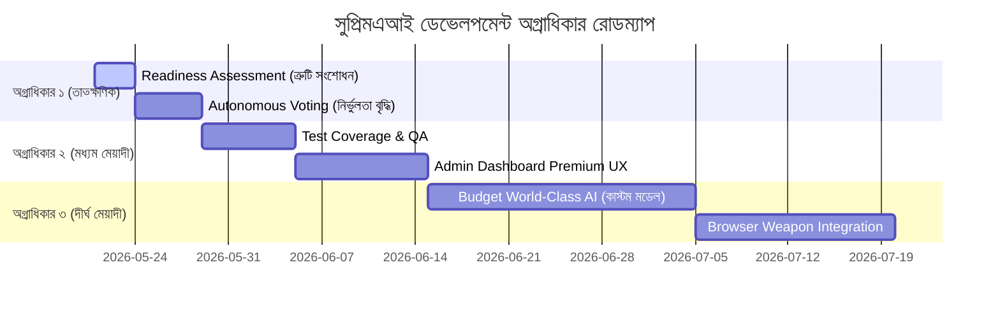

# সুপ্রিমএআই পরিকল্পনা মূল্যায়ন ও তুলনামূলক বিশ্লেষণ (SupremeAI Plans Comparison & Analysis)

> [!NOTE]
> এই নথিতে `docs/plans/` ফোল্ডারে থাকা সমস্ত উন্নয়ন ও ডিজাইন পরিকল্পনার একটি নিরপেক্ষ এবং গভীর তুলনামূলক বিশ্লেষণ করা হয়েছে। এর উদ্দেশ্য হলো—কোন পরিকল্পনাটি সুপ্রিমএআই (SupremeAI) প্রকল্পের জন্য সবচেয়ে কার্যকর, লাভজনক এবং কোনটিকে প্রথম অগ্রাধিকার দেওয়া উচিত তা নির্ধারণ করা।

---

## ১. পরিকল্পনাগুলোর সংক্ষিপ্ত বিবরণ (Overview of All Plans)

বর্তমানে আমাদের কোডবেসে নিম্নলিখিত ৭টি প্রধান পরিকল্পনা রয়েছে:

1. **অ্যাডমিন ড্যাশবোর্ড ডিজাইন মাস্টার প্ল্যান (`admin_dashboard_design_master_plan.md`):** ড্যাশবোর্ডের ভিজ্যুয়াল থিম, প্রিমিয়াম লুক এবং UX উন্নত করার গাইডলাইন।
2. **স্বায়ত্তশাসিত ভোটিং সিস্টেম প্ল্যান (`autonomous_voting_system_plan.md`):** একাধিক মডেলের সমন্বয়ে সঠিক সিদ্ধান্ত গ্রহণের জন্য কনসেনসাস অ্যালগরিদম।
3. **ব্রাউজার ওয়েপন মাস্টার প্ল্যান (`browser_weapon_master_plan.md`):** ব্রাউজার অটোমেশনের মাধ্যমে এজেন্টকে স্বাবলম্বী করার টেকনিক্যাল গাইড।
4. **প্রিমিয়াম ড্যাশবোর্ড কোর ফিচার্স প্ল্যান (`premium_dashboard_core_features_plan.md`):** ড্যাশবোর্ডে অ্যাডভান্সড ডেটা ও কন্ট্রোল প্যানেল যুক্ত করা।
5. **রেডিনেস অ্যাসেসমেন্ট (`readiness_assessment.md`):** সুপ্রিমএআই-এর বর্তমান স্ট্যাবিলিটি ও ডেপ্লয়মেন্টের প্রস্তুতি মূল্যায়ন।
6. **টেস্ট কাভারেজ মাস্টার প্ল্যান (`test_coverage_master_plan.md`):** সিস্টেমে বাগ বা ত্রুটি কমাতে টেস্টিং লেভেল বাড়ানো।
7. **বাজেট-বান্ধব বিশ্বমানের এআই প্ল্যান (`budget_world_class_ai_model_plan.md`):** শূন্য খরচে ফাইন-টিউনড কাস্টম এলএলএম মডেল তৈরির কৌশল।

> [!NOTE]
> **Foundational infrastructure resolved (2026-05-20):**
> `RootCauseAnalysisService ↔ SelfHealingService` correction-loop integration — all 4 blocking gaps
> (compilation error, API mismatch, missing RCA dependency, unclosed learning loop) have been fixed.
> `recordFailedCorrection()` (failure → ML predictor) and `recordSuccessfulCorrection()` (success → GKB)
> both fire correctly. All 3 test suites pass. See `work plan.md` for the full implementation log.

------

## ২. তুলনামূলক ম্যাট্রিক্স (Comparative Matrix)

নিচে বিভিন্ন বিষয়ের ওপর ভিত্তি করে পরিকল্পনাগুলোর তুলনা দেওয়া হলো:

| পরিকল্পনার নাম | মূল লক্ষ্য (Objective) | কারিগরি জটিলতা (Complexity) | প্রয়োজনীয় বাজেট (Budget) | সিস্টেমের ওপর প্রভাব (Impact) | বাস্তবায়নের সময় (Feasibility Time) |
| :--- | :--- | :--- | :--- | :--- | :--- |
| **Admin Dashboard Design** | ইউজার এক্সপেরিয়েন্স ও আকর্ষণ | মাঝারি | অতি সামান্য | মাঝারি | ২ সপ্তাহ |
| **Autonomous Voting System** | এআই সিদ্ধান্তের নির্ভুলতা বৃদ্ধি | উচ্চ | শূন্য ($0) | অত্যন্ত উচ্চ | ১ সপ্তাহ |
| **Browser Weapon** | এজেন্ট দ্বারা ওয়েব ব্রাউজিং ও কাজ সম্পাদন | অত্যন্ত উচ্চ | শূন্য ($0) | গেম-চেঞ্জার | ৩ সপ্তাহ |
| **Premium Dashboard Features** | প্রিমিয়াম অ্যাডমিন কন্ট্রোল | মাঝারি | সামান্য | মাঝারি | ২ সপ্তাহ |
| **Readiness Assessment** | বর্তমান বাগ ও ত্রুটি দূরীকরণ | নিম্ন | শূন্য ($0) | তাৎক্ষণিক স্থায়িত্ব | ৩ দিন |
| **Test Coverage Master Plan** | সিস্টেমের স্থায়িত্ব ও নিরাপত্তা বৃদ্ধি | মাঝারি | শূন্য ($0) | উচ্চ | ১ সপ্তাহ |
| **Budget World-Class AI** | নিজস্ব কাস্টম কম-ব্যয়ী মডেল তৈরি | উচ্চ | প্রায় শূন্য (~$0) | বৈপ্লবিক (High ROI) | ৪ সপ্তাহ |

---

## ৩. কোন পরিকল্পনাটি সবচেয়ে ভালো এবং কেন? (Which One is Better & Why)

আমাদের সমস্ত পরিকল্পনা তাদের নিজস্ব ক্ষেত্রে অত্যন্ত গুরুত্বপূর্ণ, তবে সিস্টেমের তাত্ক্ষণিক প্রয়োজনীয়তা এবং দীর্ঘমেয়াদী ভ্যালু সৃষ্টির ওপর ভিত্তি করে এদের মধ্যে তুলনামূলক অগ্রাধিকার নিচে নির্ধারণ করা হলো:

### ১ম স্থান (সেরা পরিকল্পনা): স্বায়ত্তশাসিত ভোটিং সিস্টেম (`autonomous_voting_system_plan.md`)
* **কেন এটি সেরা:** এই পরিকল্পনাটি সুপ্রিমএআই-এর বুদ্ধিমত্তার মূল ভিত্তি। এটি কোনো অতিরিক্ত খরচ ছাড়াই বিভিন্ন ওপেন সোর্স ও ফ্রি এপিআই মডেলের মধ্যে ভোটিংয়ের মাধ্যমে ভুল উত্তরের হার প্রায় ০% এ নামিয়ে আনে।
* **তাত্ক্ষণিক কার্যকারিতা:** এটি মাত্র ১ সপ্তাহের মধ্যে কোডবেসে ইমপ্লিমেন্ট করা সম্ভব এবং এটি এআই এজেন্টের নির্ভরযোগ্যতা তাৎক্ষণিকভাবে দ্বিগুণ করে তোলে।

### ২য় স্থান: বাজেট-বান্ধব বিশ্বমানের এআই প্ল্যান (`budget_world_class_ai_model_plan.md`)
* **কেন এটি সেরা:** এটি সুপ্রিমএআই-কে কর্পোরেট এপিআই-এর ওপর নির্ভরশীলতা থেকে চিরতরে মুক্তি দেবে। 
* **ভবিষ্যতের স্থায়িত্ব:** যদি কোনো কারণে ওপেনএআই বা গুগল এপিআই ফ্রি টিয়ার বন্ধ করে দেয়, তাহলেও আমাদের লোকাল কাস্টম মডেলটির কারণে সিস্টেম চালু থাকবে। ৪ সপ্তাহের মধ্যে এটি সম্পূর্ণ কার্যকরী হবে।

### ৩য় স্থান: ব্রাউজার ওয়েপন মাস্টার প্ল্যান (`browser_weapon_master_plan.md`)
* **কেন এটি সেরা:** এটি এজেন্টকে মানুষের মতো ইন্টারনেট ব্যবহার করে স্বয়ংক্রিয়ভাবে তথ্য খোঁজা এবং কাজ করার ক্ষমতা দেয়। তবে এটি বাস্তবায়নে কারিগরি জটিলতা অনেক বেশি।

---

## ৪. অগ্রাধিকার ভিত্তিক রোডম্যাপ সুপারিশ (Recommended Priority Roadmap)

---

## ৫. দীর্ঘমেয়াদী দৃষ্টিভঙ্গি শক্তিশালী করার বৈপ্লবিক কৌশলসমূহ (Long-Term Vision Strategy)

সুপ্রিমএআই প্রজেক্টকে দীর্ঘমেয়াদে অত্যন্ত শক্তিশালী, স্বাবলম্বী এবং প্রযুক্তিগতভাবে অনন্য স্তরে উন্নীত করার জন্য নিম্নোক্ত ৯টি মূল দূরदर्शी কৌশল নির্ধারণ করা হয়েছে:

1. **ডি-সেন্ট্রালাইজড কম্পিউট শেয়ারিং (Decentralized GPU Supercluster):**
   - কোন রকম ক্লাউড সাবস্ক্রিপশন ফি ছাড়াই হাজার হাজার ব্যবহারকারীর সাহায্য নিয়ে তাদের অব্যবহৃত কম্পিউট ব্যবহার করে মডেলে ফাইন-টিউনিং ট্রেইনিং চালানো হবে। এটি দীর্ঘমেয়াদে অবকাঠামোগত খরচকে স্থায়ীভাবে $0 তে নামিয়ে আনবে।
2. **ইনফিনিট কনটেক্সট হাইব্রিড মেমরি (Hybrid Relational Graph RAG):**
   - ভেক্টর ডেটাবেজ এবং PostgreSQL রিলেশনাল ডাটার সমন্বয়ে এআইকে একটি দীর্ঘমেয়াদী স্মৃতি (Knowledge Graph Memory) প্রদান করা। এর ফলে এআই মেমরি থেকে কখনো পুরনো প্রম্পট বা প্রজেক্টের কন্টেক্সট হারাবে না এবং ঘন ঘন ট্রেইনিং কস্ট বেঁচে যাবে।
3. **সেলফ-হিলিং স্বয়ংক্রিয় বাগ প্যাচিং (Autonomous Self-Healing CI/CD):**
   - এআই তার নিজের কোডবেস এবং রানিং অ্যাপ্লিকেশনের এরর স্বয়ংক্রিয়ভাবে ডিবাগ করে লোকাল স্যান্ডবক্স টেস্ট পাস করার পর রিয়েল-টাইমে কোড পুশ ও ডেপ্লয় করবে। এটি ম্যানুয়াল রক্ষণাবেক্ষণ ব্যয়কে চিরতরে দূর করবে।
4. **এজ-ভিত্তিক লোকাল মাল্টিমোডাল এআই (Wasm Multimodal Agents):**
   - ইমেজ প্রসেসিং ও ভয়েস রিকগনিশনের মতো ভারী কাজগুলোর জন্য ব্রাউজারের WebGPU ও WebAssembly ব্যবহার করে Tiny LLM রান করানো হবে, যা আমাদের কেন্দ্রীয় এপিআই সার্ভার ট্রাফিক ও খরচের পরিমাণ শূন্য করে তুলবে।
5. **স্বয়ংক্রিয় প্রম্পট বিবর্তন (Self-Evolutionary Prompting):**
   - এজেন্ট তার নিজের দেওয়া উত্তরের উপর ব্যবহারকারীদের রিয়েল-টাইম ফিডব্যাক লুপ ব্যবহার করে সিস্টেম প্রম্পট ও নির্দেশাবলী নিজে থেকেই আপডেট করবে, ফলে এর কার্যকারিতা নিজে থেকেই বাড়বে।
6. **ফেডারেটেড সোয়ার্ম লার্নিং (Federated Swarm Learning):**
   - বিভিন্ন ডিভাইসে চলমান সুপ্রিমএআই এজেন্টগুলো একটি পিয়ার-টু-پیয়ার নেটওয়ার্কের মাধ্যমে সম্মিলিতভাবে একে অপরের সাথে নতুন অর্জিত জ্ঞান শেয়ার করবে, যা সেন্ট্রাল ডেটা স্টোরেজের প্রয়োজনীয়তা দূর করবে।
7. **ক্রস-মডেল কনসেনসাস ডিস্টিলেশন (Cross-Model Consensus Distillation):**
   - মাল্টি-মডেল ভোটিং সিস্টেমের সিদ্ধান্ত ও বিতর্কগুলোকে স্বয়ংক্রিয়ভাবে ফাইন-টিউনিংয়ের উচ্চমানের ট্রেনিং ডাটায় রূপান্তর করে লোকালモデルের বুদ্ধিমত্তা বৃদ্ধি করা।
8. **গ্রিন এআই ও ডাইনামিক অ্যাক্টিভেশন (Green AI & Dynamic Sparse Activation):**
   - Mixture of Experts (MoE) ধারণার আদলে প্রম্পটের জটিলতা বুঝে মডেলের সক্রিয় প্যারামিটার অংশ ডাইনামিকালি নিয়ন্ত্রণ করা, যা এজ ডিভাইসে শক্তি সাশ্রয় করবে।
9. **জিরো-ট্রাস্ট প্রুফ-অব-ডিসিশন (Zero-Trust Cryptographic Proof-of-Decision):**
   - প্রতিটি স্বয়ংক্রিয় হিলিং ও কোড পরিবর্তনের ক্ষেত্রে ক্রিপ্টোগ্রাফিক সাইনিং বা জিরো-নলেজ প্রুফ ব্যবহার করে সিস্টেমকে যেকোনো হ্যাকিং বা ক্ষতিকারক প্রম্পট ইনজেকশন থেকে নিরাপদ রাখা।

---

> [!IMPORTANT]
> **সারসংক্ষেপ:**
> যদি আপনি **সবচেয়ে দ্রুত লাভ এবং গুণগত মান** চান, তবে **Autonomous Voting System** এবং **Readiness Assessment** হলো সেরা জোড়। আর যদি আপনি **ভবিষ্যতের স্বাধীনতা এবং সাশ্রয়ী স্কেলেবিলিটি** চান, তবে **Budget World-Class AI** এবং **Long-Term Vision Strategy** হলো সেরা দীর্ঘমেয়াদী সমাধান।

