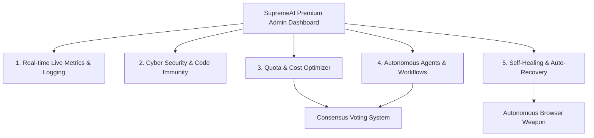

# SupremeAI Premium Dashboard & Core Features — Master Plan 🎛️💎

> [!IMPORTANT]
> এই ডকুমেন্টটি SupremeAI-এর অন্যান্য প্রিমিয়াম ফিচারসমূহের (Self-Healing, Security, Quotas, Agents, and Live Metrics) আর্কিটেকচারাল এবং ইন্টারফেস ডিজাইন সংজ্ঞায়িত করে। এটি আমাদের **Browser Weapon** এবং **Consensus Voting System**-এর সাথে সামঞ্জস্য রেখে একটি স্টেট-অফ-দ্য-আর্ট স্মার্ট এআই ড্যাশবোর্ড হিসেবে পরিচালনা করার চূড়ান্ত রোডম্যাপ।

---

## 🏗️ ১. ড্যাশবোর্ড ও প্রিমিয়াম ফিচার ইন্টিগ্রেশন (Dashboard Integration Architecture)

---

## 💎 ২. ৬টি প্রিমিয়াম ড্যাশবোর্ড মডিউল (The 6 Premium Dashboard Modules)

### 📌 মডিউল ১: লাইভ পারফরম্যান্স ও থ্রেট মনিটরিং (Real-time Metrics & Logs)
* **ড্যাশবোর্ড ইউআই:** একটি রিয়েল-টাইম থ্রি-ডি (3D/WebGL) এনিমেশন বেসড নেটওয়ার্ক গ্রাফ যা বর্তমান সচল এআই প্রোভাইডারদের লেটেন্সি, সাকসেস রেট এবং থ্রুপুট প্রদর্শন করে।
* **স্মার্ট ফিচার:** 
  * **System Metrics:** প্রতিটি মডেলের রেসপন্স টাইম লাইভ গেজ (gauge) চার্টে রেন্ডার হয়।
  * **Blackout Watchdog:** কোনো প্রোভাইডার ডাউন হলে ড্যাশবোর্ডে সাথে সাথে লাল পালসিং এলার্ট সক্রিয় হয়।

---

### 📌 মডিউল ২: স্বয়ংসম্পূর্ণ সাইবার সিকিউরিটি ও কোড ইমিউনিটি (Cyber Security Guard)
* **ড্যাশবোর্ড ইউআই:** একটি সাইবার ডিফেন্স কন্ট্রোল সেন্টারের মতো ইন্টারফেস, যেখানে ইনকামিং কোডের রিফ্লেকশন সিকিউরিটি টেস্ট এবং সোর্স ফাইল স্ক্যান ট্র্যাকিং দেখা যায়।
* **স্মার্ট ফিচার:**
  * **Soot Static Analysis:** জেনারেটেড বা ব্রাউজার থেকে পাওয়া যেকোনো কোড রান করার আগে স্ট্যাটিক অ্যানালাইসিস সম্পন্ন করে ক্ষতিকারক স্ট্রিং বা মেমোরি লিক ডিটেক্ট করে।
  * **API Token Masking:** ড্যাশবোর্ডের লগে কখনই কোনো এপিআই কী (API Key) বা পাসওয়ার্ড ডেকোরেট হবে না (secrets never logged)।

---

### 📌 মডিউল ৩: কোটা ও লাইভ কস্ট অপ্টিমাইজার (Quota & Usage Optimizer)
* **ড্যাশবোর্ড ইউআই:** একটি ডায়নামিক কস্ট-কোটা স্লিপেজ বার, যা এআই কলগুলোর মোট খরচ ও কোটা লিমিট রিয়েল-টাইমে প্রদর্শন করে।
* **স্মার্ট ফিচার:**
  * **Token Budgeting:** প্রতিটি সেশনের জন্য সর্বোচ্চ টোকেন বাজেট বরাদ্দ থাকে।
  * **Dynamic Failover:** যখন কোনো মডেলের কোটা শেষ পর্যায়ে পৌঁছায়, কোটা অপ্টিমাইজার ডাইনামিকালি সস্তা বা ফ্রি মডেলের দিকে রাউটিং শিফট করে।

---

### 📌 মডিউল ৪: স্বায়ত্তশাসিত এজেন্ট ও ওয়ার্কফ্লো রানার (Autonomous Agents & Workflows)
* **ড্যাশবোর্ড ইউআই:** নোড-ভিত্তিক ড্র্যাগ-এন্ড-ড্রপ (Drag-and-Drop) ক্যানভাস ইন্টারফেস যেখানে একাধিক এজেন্টকে জটিল প্রজেক্টের কাজের দায়িত্ব অর্পণ করা যায়।
* **স্মার্ট ফিচার:**
  * **Multi-Agent Tasks:** ডিজাইনার এজেন্ট, কোডার এজেন্ট এবং টেস্টার এজেন্ট একে অপরের সাথে ডেটা আদান-প্রদান করতে পারে।
  * **Consensus Checkpoint:** কাজ শেষে চূড়ান্ত জাজমেন্ট আমাদের **Voting System**-এর মাধ্যমে নিশ্চিত হয়ে তবেই কোড আউটপুট সেভ হয়।

---

### 📌 মডিউল ৫: সেলফ-হিলিং কন্ট্রোল প্যানেল (Self-Healing Control Panel)
* **ড্যাশবোর্ড ইউআই:** একটি ওয়ান-ক্লিক অটো-রিকভারি হাব, যা চলমান সার্ভার ও ডাটাবেসের সামগ্রিক স্বাস্থ্য বিশ্লেষণ করে।
* **স্মার্ট ফিচার:**
  * **Error Recognition:** এরর রিকগনিশন ইঞ্জিন অটোমেটিকভাবে `application.log`-এর এরর সিগনেচার ট্র্যাকিং করে।
  * **Auto-Fix Deployer:** ব্রাউজার এবং লোকাল নলেজবেজ সমন্বয় করে ব্যাকগ্রাউন্ডে ক্ষতিকারক পোর্ট রিলিজ বা ক্যাশ মেমোরি ফ্লাশ সম্পন্ন করে।

---

### 📌 মডিউল ৬: ধারাবাহিক ইভোলিউশন ও সেলফ-লার্নিং লুপ (Evolution Loop)
* **ড্যাশবোর্ড ইউআই:** একটি নিউরাল কানেক্টিভিটি গ্রাফ যা সময়ের সাথে সাথে সুপ্রিমএআই-এর সেলফ-লার্নিং প্রগ্রেস দেখায়।
* **স্মার্ট ফিচার:**
  * **Confidence Decay Graph:** যে সকল নলেজ আইটেম দীর্ঘদিন ব্যবহৃত হয় না, সেগুলোর আত্মবিশ্বাস স্কোর (confidence) গ্রাফে কমে যাওয়া দৃশ্যমান হয়।
  * **Feedback Loop:** ইউজার থাম্বস-আপ বা থাম্বস-ডাউন দিলে রেসপন্স ডাইনামিকালি তার কিউ-লার্নিং স্কোর (Q-value) আপডেট করে।

---

## 📊 ৩. প্রিমিয়াম ফিচার ম্যাট্রিক্স ও রেসিলিয়েন্ট সূচক (Feature & Impact Matrix)

| মডিউল | ড্যাশবোর্ড ইউআই উইজেট | অটোমেটেড ব্যাকএন্ড ইন্টিগ্রেশন | ইমপ্যাক্ট সূচক |
| :--- | :--- | :--- | :--- |
| **লাইভ মেট্রিক্স** | 3D SVG কানেক্টিভিটি নেটওয়ার্ক | রিয়েল-টাইম থ্রেড ও মেমোরি ওয়াচার | **৯.৭ / ১০** |
| **সাইবার ডিফেন্স** | লাইভ থ্রেট ডিটেকশন ও আইপি ব্লকার | Soot Code Static Analysis & Anti-Malware | **৯.৯ / ১০** |
| **কোটা কন্ট্রোল** | প্রোভাইডার কোটা লিমিট অ্যান্ড কস্ট বার | Dynamic Fallover Routing & Model Prioritizer | **৯.৬ / ১০** |
| **এজেন্ট রানার** | ড্র্যাগ-এন্ড-ড্রপ ভিজ্যুয়াল ওয়ার্কফ্লো | Multi-Agent Collaborative Task Assignment | **৯.৮ / ১০** |
| **সেলফ-হিলিং** | এরর ট্র্যাকার ও ওয়ান-ক্লিক ফিক্সার | Auto-Heal Engine & Port Release Gateway | **৯.৭ / ১০** |

---

## 🎯 ৪. ড্যাশবোর্ড রিয়েল-টাইম রেসপন্স স্টাইল (Premium UI Styling Rules)

ড্যাশবোর্ড ডেভেলপমেন্টের ক্ষেত্রে আমাদের মূল ওয়েব আর্কিটেকচার গাইডলাইন অনুসরণ করা হবে:
1. **Curated Color Palettes:** স্লিক ডার্ক মোড (HSL tailored colors, #0F172A slate base, #38BDF8 cyan primary gradients)।
2. **Glassmorphism Typography:** ফ্রস্টেড গ্লাস বর্ডার, আল্ট্রা-প্রিমিয়াম মাইক্রো-অ্যানিমেশন এবং ফন্ট হিসেবে **Outfit** অথবা **Inter** ব্যবহার।
3. **Responsive Visual Grid:** সম্পূর্ণ ফ্লেক্সিবল গ্রিড লেআউট যা মোবাইল ও আল্ট্রা-ওয়াইড মনিটর উভয় ক্ষেত্রেই মসৃণ প্রিভিউ দিবে।

> [!TIP]
> এই মাস্টার প্ল্যানটির মাধ্যমে সুপ্রিমএআই-এর ড্যাশবোর্ড হবে এআই ইন্ডাস্ট্রির অন্যতম সুন্দর, প্রিমিয়াম এবং আধুনিক কন্ট্রোল প্যানেল যা ইউজারকে প্রথম দেখাতেই অভিভূত (WOW) করবে!
