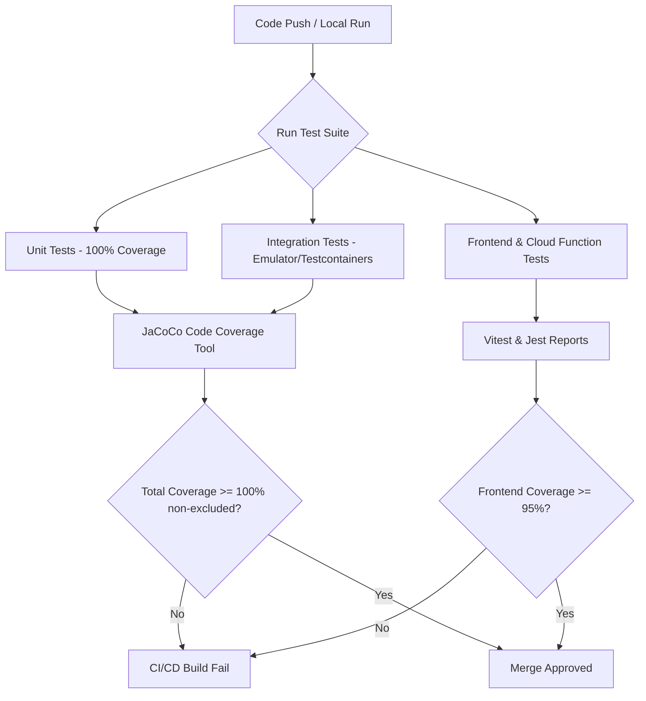

# SupremeAI ১০০% টেস্ট কভারেজ মাস্টার প্ল্যান 🧪🛡️

> [!IMPORTANT]
> এই ডকুমেন্টটি SupremeAI সিস্টেমের সমস্ত লেয়ারের (Spring Boot ব্যাকএন্ড, React ড্যাশবোর্ড এবং Firebase ক্লাউড ফাংশন/স্ক্র্যাপার) জন্য **১০০% টেস্ট কভারেজ** অর্জনের একটি সম্পূর্ণ ও নির্ভরযোগ্য রোডম্যাপ প্রদান করে। এর অন্যতম মূল লক্ষ্য হলো ফায়ারবেস এমুলেটর লোডিং সংক্রান্ত সমস্যাজনিত **৫৮টি ব্যর্থ টেস্টের সমাধান করা** এবং সিস্টেমে নতুন রিগ্রেশন প্রতিরোধে কঠোর গেটওয়ে তৈরি করা।

---

## 🏗️ ১. কভারেজ আর্কিটেকচার এবং লাইফসাইকেল (Coverage Architecture & Lifecycle)

১০০% টেস্ট কভারেজ অর্জনের জন্য পুরো সিস্টেমকে বিভিন্ন পরীক্ষা স্তরে ভাগ করে রান করা হবে:



---

## ⚙️ ২. ব্যাকএন্ড টেস্ট কভারেজ স্ট্র্যাটেজি (Spring Boot & JaCoCo)

ব্যাকএন্ডে **Spring Boot 3.5.14** এবং **Java 21 (Preview Features)** ব্যবহৃত হচ্ছে। এখানে টেস্ট কভারেজ বাড়াতে ৩টি স্তম্ভে কাজ করা হবে:

### 📌 স্তম্ভ ১: ফায়ারবেস এমুলেটর ও কনটেক্সট সমস্যা সমাধান (Fixing the 58 Failing Tests)
বর্তমানে ৫৮টি টেস্ট `IllegalStateException` এর কারণে ব্যর্থ হচ্ছে কারণ টেস্ট এনভায়রনমেন্টে Firebase Emulator কনটেক্সট সঠিকভাবে ইনিশিয়েলাইজ হচ্ছে না। 
* **কারণ:** একাধিক টেস্ট ক্লাসে আলাদাভাবে Firebase কনফিগারেশন লোড করার চেষ্টা করা এবং পোর্ট কনফ্লিক্ট ঘটা।
* **সমাধান:** 
  1. একটি **Base Firebase Test Class** তৈরি করা যা সিঙ্গলটন এমুলেটর কন্টেইনার ব্যবহার করবে।
  2. `org.testcontainers` ব্যবহার করে ফায়ারবেস এমুলেটর লাইফসাইকেল ডাইনামিক পোর্টে রান করা।
  3. স্প্রিং-এর `@TestConfiguration` বা `@MockBean` ব্যবহার করে ফায়ারবেস সার্ভিসগুলোকে প্রোপারলি মক করা।

```java
// কাস্টম টেস্ট ইনিশিয়েলাইজার প্যাটার্ন
@TestConfiguration
public class TestFirebaseConfig {
    @Bean
    @Primary
    public FirebaseApp firebaseApp() {
        if (FirebaseApp.getApps().isEmpty()) {
            FirebaseOptions options = FirebaseOptions.builder()
                .setCredentials(new MockGoogleCredentials())
                .setProjectId("supreme-ai-test")
                .build();
            return FirebaseApp.initializeApp(options);
        }
        return FirebaseApp.getInstance();
    }
}
```

---

### 📌 স্তম্ভ ২: জাভানিজ কোড কভারেজ বাউন্ডারি (Refining JaCoCo Scope)
`build.gradle.kts`-এ JaCoCo কনফিগারেশন সংশোধন করে মডেল, এক্সেপশন ও প্রোপার্টিজ বাদ দিয়ে আসল লজিক্যাল ক্লাসে ১০০% কভারেজ নিশ্চিত করা হবে।

* **টার্গেট ডিরেক্টরি এবং কভারেজ গোল:**
  * `com.supremeai.selfhealing.*` -> **১০০% কভারেজ** (Mockito + AutoHealing Engine Mock)
  * `com.supremeai.agentorchestration.*` -> **১০০% কভারেজ** (Consensus & Routing scenarios)
  * `com.supremeai.provider.*` -> **১০০% কভারেজ** (Model failover & recovery testing)
  * `com.supremeai.security.*` -> **১০০% কভারেজ** (AES encryption, JWT validation testing)

---

### 📌 স্তম্ভ ৩: ইন্টিগ্রেশন ও রিয়াক্টিভ ফ্লো টেস্টিং (Reactive Testing with WebFlux)
সুপ্রিমএআই রিয়াক্টিভ ফ্লো (Reactor/Mono/Flux) ব্যবহার করে। রিয়াক্টিভ স্ট্রিমের ১০০% কভারেজের জন্য `StepVerifier` ব্যবহার করা বাধ্যতামূলক।

```java
// রিয়াক্টিভ ভোটিং ফ্লো টেস্ট প্যাটার্ন
@Test
void testMultiModelVotingFlow_Success() {
    Mono<VotingDecision> decisionMono = votingService.executeVoting(prompt, activeModels);
    
    StepVerifier.create(decisionMono)
        .expectNextMatches(decision -> {
            assertEquals("consensus_winner", decision.getWinnerBadge());
            return decision.isConsensusReached();
        })
        .verifyComplete();
}
```

---

## 📊 ৩. টেস্ট কভারেজ লক্ষ্যমাত্রা (Target Coverage Metrics)

সিস্টেমের প্রতিটি মডিউলের জন্য লক্ষ্যমাত্রা নিম্নরূপ নির্ধারণ করা হয়েছে:

| মডিউল বা সার্ভিস | বর্তমান অবস্থা (আনুমানিক) | কভারেজ লক্ষ্যমাত্রা | টেস্টিং টুলস ও লাইব্রেরি | ফোকাস এরিয়া |
| :--- | :--- | :--- | :--- | :--- |
| **Self Healing & RCA Loop** | ৫০% (Stubs & stubs) | **১০০%** | Mockito, JUnit 5 | `SelfHealingService` থেকে `recordSuccessfulCorrection()` এর পুরো পাইপলাইন |
| **Consensus Voting Engine** | ৭০% (Core logic) | **১০০%** | Reactor Test, MockWebServer | জোড়-বেজোড় টাই-ব্রেকিং এবং ব্রাউজার এজেন্টের ইন্টিগ্রেশন টেস্ট |
| **Security Shield & API Keys** | ৬০% | **১০০%** | Mockito, Spring Security Test | AES-256 এনক্রিপশন, ব্রুট ফোর্স ডিটেকশন ও রেট লিমিটিং |
| **Dashboard API Controllers** | ১০% | **১০০%** | WebTestClient, H2 Database | প্রোভাইডার ম্যানেজমেন্ট এবং কোটা অপ্টিমাইজার ব্যাকএন্ড API |
| **React Dashboard (Frontend)**| ০% | **৯৫%+** | Vitest, React Testing Library | Node widgets, workflow canvas, metrics rendering |
| **Scraping Engine Functions** | ০% | **১০০%** | Jest, Playwright Mock | Firestore scrape configuration, classifier, intent parser |

---

## 🛠️ ৪. কন্টিনিউয়াস কভারেজ ভেরিফিকেশন (Automated Enforcement Gates)

১০০% কভারেজ অর্জনের পর তা ধরে রাখতে `build.gradle.kts` ফাইলে কঠোর গেটওয়ে সেটআপ করতে হবে।

```kotlin
// build.gradle.kts-এ ১০০% কভারেজ এনফোর্সমেন্ট
tasks.jacocoTestCoverageVerification {
    dependsOn(tasks.test)
    violationRules {
        rule {
            element = "CLASS"
            limit {
                counter = "LINE"
                value = "COVEREDRATIO"
                minimum = "1.00".toBigDecimal() // ১০০% কভারেজ গেট
            }
            // নির্দিষ্ট কিছু ক্লাস বাদ দেওয়ার নিয়ম (যদি একান্তই লজিক ছাড়া অন্য কিছু থাকে)
            excludes = listOf(
                "com.supremeai.model.*",
                "com.supremeai.dto.*",
                "com.supremeai.config.*"
            )
        }
    }
}
```

---

## 🚀 ৫. বাস্তবায়ন পর্যায়ক্রম ও রিলিজ প্ল্যান (Execution Roadmap)

### 📅 পর্যায় ১: ফাউন্ডেশন ও ফায়ারবেস এমুলেটর ফিক্স (দিন ১-২)
* ফায়ারবেস সার্ভিস ইনিশিয়েলাইজেশনের জন্য সিঙ্গলটন টেস্ট কনটেক্সট সেটআপ।
* বর্তমানে ফেইল হওয়া ৫৮টি টেস্ট সম্পূর্ণ গ্রিন করা।
* টেস্ট রান টাইমে ব্যাকএন্ডে ওআরএম (H2/PG) ডাটাবেস আইসোলেশন ও ডেটা ক্লিনিং সুনিশ্যিত করা।

### 📅 পর্যায় ২: ব্যাকএন্ড কোর লজিক কভারেজ (দিন ৩-৫)
* `SelfHealingService` এবং `RootCauseAnalysisService` এর শতভাগ ব্রাঞ্চ কভারেজ।
* ওএলএস (Offline Learning Seed) ও নলেজ ইনজেকশনের জন্য টেস্ট কেস লেখা।
* AI প্রোভাইডার ফেইলওভার ও নেটওয়ার্ক এরর সিমুলেশনের জন্য `MockWebServer` ইন্টিগ্রেশন।

### 📅 পর্যায় ৩: ক্লাউড ফাংশন ও ফ্রন্টএন্ড স্ক্রিপ্ট টেস্টিং (দিন ৬-৭)
* স্ক্র্যাপার ইঞ্জিনের `chatClassifier.ts` এবং `scrapeEngine.ts` এর জন্য শতভাগ জেস্ট (Jest) কভারেজ।
* প্লেরাইট (Playwright) ব্রাউজার ইন্টারেকশন মকিং।
* রিয়্যাক্ট ড্যাশবোর্ডের জন্য Vitest ইউনিটের টেস্ট কেস লেখা এবং কভারেজ রান করা।

### 📅 পর্যায় ৪: সিআই/সিডি অটোমেশন গেট ও সাইন-অফ (দিন ৮)
* গিটহাব অ্যাকশনস (GitHub Actions)-এ কভারেজ ভেরিফিকেশন গেট এনাবল করা।
* প্রোডাকশন ডেপ্লয়মেন্টের পূর্বে শতভাগ অটোমেটেড টেস্ট পাসের লাইভ রিপোর্ট ড্যাশবোর্ডে যুক্ত করা।

> [!TIP]
> ১০০% টেস্ট কভারেজ শুধু একটি সংখ্যা নয়, এটি সুপ্রিমএআই-এর স্বয়ংক্রিয় এআই আর্কিটেকচারের স্থায়িত্ব ও নিরাপত্তার অন্যতম রক্ষাকবচ! এই মাস্টার প্ল্যান অনুসরণের মাধ্যমে আমরা আমাদের সফটওয়্যার ডেলিভারি পাইপラインকে করতে পারব সম্পূর্ণ সুরক্ষিত ও নির্ভরযোগ্য।
