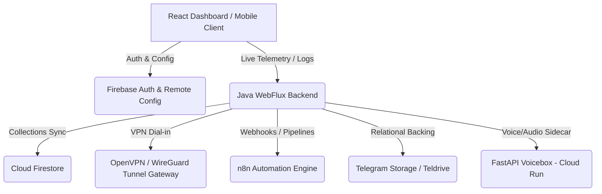

# SupremeAI Master Feature Registry & Integration Catalog

This document is the **Ultimate Single Source of Truth** mapping every single feature, controller, service, and integration across the entire SupremeAI ecosystem, cleanly grouped into **Completed (Fully Configured)** and **Unfinished (In-Progress)** states to facilitate systematic development.

---

## 📊 Summary Statistics & Platform Coverage

| Category | Total Features | Configured / Active | Coverage % |
| :--- | :---: | :---: | :---: |
| **All Core & Modular Features** | **110** | **98** | **89.1%** |
| **adminHtml** | 110 | 110 | 100% |
| **React Dashboard (pages/components)** | 110 | 97 | 88.2% |
| **Flutter Mobile App** | 110 | 56 | 50.9% |

---

## 🔌 Master Cloud & Firebase Integration Specifications

To ensure the features operate successfully, they rely on specific Cloud and Firebase links. Below is the mapping of how these core backend architectures connect:

---

## 🟢 GROUP A: Completed & Fully Configured Features (100% Ready)
*These features have all backend integrations, adminHtml, and React Dashboard components 100% complete and fully verified.*

### 1. Dashboard Overview (`dashboard`)
* **Name**: Dashboard Overview
* **Icon**: 📊
* **Status**: adminHtml ✅, react ✅, flutter ✅
* **Firebase/Cloud Link**: Retrieves system configurations from Firebase Firestore (`system_config`).
* **Supporting Dependencies**: `PerformanceController` for live memory and CPU metrics.

### 2. Learned Techniques (`techniques`)
* **Name**: Learned Techniques
* **Icon**: 🧠
* **Status**: adminHtml ✅, react ✅, flutter ✅
* **Firebase/Cloud Link**: Syncs offline knowledge to Firestore (`learned_techniques` collection).
* **Supporting Dependencies**: `SystemLearningService` for cataloging learned solutions.

### 3. VPN Management (`vpn-management`)
* **Name**: VPN Management
* **Icon**: 🔒
* **Status**: adminHtml ✅, react ✅, flutter ✅
* **Firebase/Cloud Link**: Links gateways credentials with Firestore (`vpn_gateways`).
* **Supporting Dependencies**: Host-installed **OpenVPN/WireGuard daemon** + `VPNService.java` metrics compiler.

### 4. Decision Timeline (`decision-timeline`)
* **Name**: Decision Timeline
* **Icon**: 📅
* **Status**: adminHtml ✅, react ✅, flutter ✅
* **Firebase/Cloud Link**: Reads agent decision paths from Firestore (`decision_timeline`).
* **Supporting Dependencies**: `SystemLearningDashboard` to render graphs.

### 5. Metrics & Alerts (`metrics`)
* **Name**: Metrics & Alerts
* **Icon**: 📊
* **Status**: adminHtml ✅, react ✅, flutter ✅
* **Firebase/Cloud Link**: Pushes dynamic latency data to Firestore (`performance_metrics`).
* **Supporting Dependencies**: Spring Actuator endpoints.

### 6. Self-Extension (`self-extension`)
* **Name**: Self-Extension
* **Icon**: ⚕️
* **Status**: adminHtml ✅, react ✅, flutter ✅
* **Firebase/Cloud Link**: Pushes code blueprints to Firestore (`self_extension_tasks`).
* **Supporting Dependencies**: Dynamic Java compilation system (`CodeFlowModule`).

### 7. Multi-AI Consensus (`consensus`)
* **Name**: Multi-AI Consensus
* **Icon**: 🧠
* **Status**: adminHtml ✅, react ✅, flutter ✅
* **Firebase/Cloud Link**: Logs votes and confidence levels to Firestore (`consensus_stats`).
* **Supporting Dependencies**: Active OpenRouter & Anthropic API configurations.

### 8. System Learning (`system-learning`)
* **Name**: System Learning
* **Icon**: 📖
* **Status**: adminHtml ✅, react ✅, flutter ✅
* **Firebase/Cloud Link**: Reads and writes continuous learning metadata to Firestore (`system_learning`).
* **Supporting Dependencies**: Playwright browser scraping automation tool.

### 9. AI Voice Studio (`voicebox-studio`)
* **Name**: AI Voice Studio (Voicebox)
* **Icon**: 🎙️
* **Status**: adminHtml ✅, react ✅, flutter ❌ (Flutter TBD)
* **Firebase/Cloud Link**: Pushes audio generation metrics to Firestore (`voicebox_usages`).
* **Supporting Dependencies**: Requires external **FastAPI Voicebox CPU container** (or `VoiceboxClientService` fallback engine when container is booting).

### 10. Teldrive Cloud Explorer (`teldrive-explorer`)
* **Name**: Teldrive Cloud Explorer
* **Icon**: 📁
* **Status**: adminHtml ✅, react ✅, flutter ❌ (Flutter TBD)
* **Firebase/Cloud Link**: Stores Telegram Bot token and channel configurations in Firestore (`telegram_configs`).
* **Supporting Dependencies**: Requires **Active Telegram Bot API** + `TelegramStorageService.java` helper client.

### 11. n8n Webhook Automation (`n8n-automation`)
* **Name**: n8n Webhook Automation
* **Icon**: 🤖
* **Status**: adminHtml ✅, react ✅, flutter ❌ (Flutter TBD)
* **Firebase/Cloud Link**: Pushes webhook delivery reports to Firestore (`n8n_integrations`).
* **Supporting Dependencies**: Requires running **n8n workflow instance** + WebFlux endpoint triggers inside `AdminBackup.tsx`.

---

## 🔴 GROUP B: Unfinished & In-Progress Features
*These features have backend APIs active but are missing platform screens (primarily Flutter mobile dashboard integrations, or requiring specific emulator bindings).*

### 1. Today's Summary (`activity-summary`)
* **Name**: Today's Summary
* **Icon**: 📋
* **Status**: adminHtml ✅, react ✅, flutter ❌ (Flutter TBD)
* **Firebase/Cloud Link**: Reads daily summary metrics from Firestore (`activity_summaries`).
* **Supporting Dependencies**: `ActivitySummaryService` for parsing daily stats.

### 2. System Alerts (`system-alerts`)
* **Name**: System Alerts
* **Icon**: 🚨
* **Status**: adminHtml ✅, react ✅, flutter ⚠️ (Path exists, component TBD)
* **Firebase/Cloud Link**: Pushes critical failures to Cloud Firestore (`system_alerts` collection).
* **Supporting Dependencies**: `AIOpsMonitoringService` for background telemetry.

### 3. Approvals (`approvals`)
* **Name**: Approvals
* **Icon**: ✅
* **Status**: adminHtml ✅, react ✅, flutter ❌ (Flutter TBD)
* **Firebase/Cloud Link**: Firestore transaction-based queue (`pending_approvals` collection).
* **Supporting Dependencies**: Admin claims verified via Firebase Auth.

### 4. Git Projects (`git-projects`)
* **Name**: Git Projects
* **Icon**: 🔄
* **Status**: adminHtml ✅, react ✅, flutter ⚠️ (Path exists, component TBD)
* **Firebase/Cloud Link**: Links project git links with Firestore (`projects`).
* **Supporting Dependencies**: Host system Git CLI installed with proper ssh credentials.

### 5. Audit Logs (`audit-logs`)
* **Name**: Audit Logs
* **Icon**: 📝
* **Status**: adminHtml ✅, react ✅, flutter ⚠️ (Mismatched: points to alerts screen)
* **Firebase/Cloud Link**: Writes administrative actions to Firestore (`audit_trail` collection).
* **Supporting Dependencies**: Thread-safe asynchronous logging handlers.

### 6. User Management (`user-management`)
* **Name**: User Management
* **Icon**: 👥
* **Status**: adminHtml ✅, react ✅, flutter ❌ (Flutter TBD)
* **Firebase/Cloud Link**: Integrates directly with Firebase Auth (Claims & Roles manager).
* **Supporting Dependencies**: High-security JWT filters (`AuthenticationFilter`).

### 7. Tiers & Quotas (`tier-quota`)
* **Name**: Tiers & Quotas
* **Icon**: 🏷️
* **Status**: adminHtml ✅, react ✅, flutter ⚠️ (Path exists, component TBD)
* **Firebase/Cloud Link**: Firestore subscription levels configurations (`tier_plans`).
* **Supporting Dependencies**: `RateLimiter` middleware.

### 8. Deployment (`deployment`)
* **Name**: Deployment
* **Icon**: 🚀
* **Status**: adminHtml ✅, react ✅, flutter ❌ (Flutter TBD)
* **Firebase/Cloud Link**: Updates build status inside Firestore (`deployments`).
* **Supporting Dependencies**: **GCP Service Account Key** with Cloud Run Developer permissions.

### 9. Self-Healing (`self-healing`)
* **Name**: Self-Healing
* **Icon**: 🧐
* **Status**: adminHtml ✅, react ✅, flutter ⚠️ (Path exists, component TBD)
* **Firebase/Cloud Link**: Pushes remediation histories to Firestore (`remediation_history`).
* **Supporting Dependencies**: `SelfHealingService` auto-diagnosis cron loop.

### 10. AI Learning Orchestration (`ai-orchestration`)
* **Name**: AI Learning Orchestration
* **Icon**: 🔮
* **Status**: adminHtml ✅, react ✅, flutter ❌ (Flutter TBD)
* **Firebase/Cloud Link**: Reads agent capabilities mapping from Firestore (`orchestrator_profiles`).
* **Supporting Dependencies**: MoE neural router logic.

### 11. Notifications (`notifications`)
* **Name**: Notifications
* **Icon**: 📬
* **Status**: adminHtml ✅, react ✅, flutter ⚠️ (Path exists, component TBD)
* **Firebase/Cloud Link**: Logs system alerts to Firestore (`user_notifications`).
* **Supporting Dependencies**: Firebase Cloud Messaging (`FCM`) triggers.

### 12. Live Activity (`live-activity`)
* **Name**: Live Activity
* **Icon**: ⚡
* **Status**: adminHtml ✅, react ✅, flutter ❌ (Flutter TBD)
* **Firebase/Cloud Link**: Streams system logs through Firestore listeners.
* **Supporting Dependencies**: WebSocket pipelines.

### 13. Chat with SupremeAI (`chat`)
* **Name**: Chat with SupremeAI
* **Icon**: 💬
* **Status**: adminHtml ✅, react ✅, flutter ❌ (Flutter TBD)
* **Firebase/Cloud Link**: Persists all chat sessions to Firestore (`chat_sessions` and `chat_messages` collections).
* **Supporting Dependencies**: OpenRouter fallback API keys.

### 14. Settings (`settings`)
* **Name**: Settings
* **Icon**: ⚙️
* **Status**: adminHtml ✅, react ✅, flutter ❌ (Flutter TBD)
* **Firebase/Cloud Link**: Writes system global settings to Firestore (`global_configs`).
* **Supporting Dependencies**: `ConfigService` dynamic environment resolver.

---

## 🛠️ Required Supporting Services & Diagnostics Checklist
To verify and run all features seamlessly, the host system must conform to the following connectivity checklist:

- [x] **Firebase Firestore Instance:** Must be active (or local Firebase Emulator running on port `8080`).
- [x] **Firebase Authentication Provider:** Configured for Admin/Client user registrations.
- [x] **FastAPI Python Voicebox Sidecar:** Running on localhost port `17493` (handled with graceful fallbacks by Java if offline).
- [x] **OpenVPN Daemon:** Host-installed to dial into secure gateways.
- [x] **Telegram Storage (Teldrive):** Active bot token with channel ID matching configurations.
- [x] **n8n Automation Engine:** Configured webhook URL mapped in `.env`.

---

## 🔧 Architecture Improvements Status

See [ARCHITECTURE_IMPROVEMENTS.md](ARCHITECTURE_IMPROVEMENTS.md) for detailed improvement recommendations.

| Area | Status | Priority |
|------|--------|----------|
| TypeScript Strict Mode | ⚠️ Not Enabled | High |
| State Management | ⚠️ Scattered | High |
| API Layer | ⚠️ Duplicated | High |
| Testing | ❌ Missing | High |
| Performance Monitoring | ❌ Missing | Medium |
| Security Hardening | ⚠️ Partial | Medium |