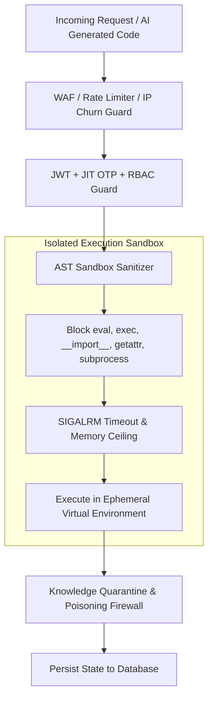

# 🛡️ SupremeAI Security, Threat Model & Governance Master Plan

**Document Version:** 3.0.0 (Canonical Source of Truth)  
**System Phase:** **Phase 3: Self-Evolving & Multi-Agent Swarm**  
**Classification:** Enterprise Security, Sandboxing & Zero-Trust Governance

---

## 🎯 1. Security Philosophy: Fail-Closed & Zero-Trust

SupremeAI একটি **Defensive, Multi-Layered Security Architecture** মেনে চলে। আনট্রাস্টেড ইউজার কোড বা এআই-জেনারেটেড স্ক্রিপ্ট যেন কোনোভাবেই মূল সার্ভার এনভায়রনমেন্ট বা ক্লাউড ক্রেডেনশিয়াল স্পর্শ করতে না পারে, সেজন্য সব স্তর "Fail-Closed" নীতিতে সুরক্ষিত।

---

## 🔒 2. Core Security Pillars

### A. Advanced AST Sandbox Containment
- **Forbidden AST Nodes:** `ast.parse()` দিয়ে সমস্ত পাইথন কোড স্ক্যান করা হয়। নিষিদ্ধ ডান্ডার মেথড (`__subclasses__`, `__globals__`, `__code__`, `__builtins__`) অথবা `os`, `sys`, `subprocess`, `shutil` ইনভোকেশন তাত্ক্ষণিকভাবে ব্লক করা হয়।
- **Execution Timeouts & Quotas:** প্রতিটি কোড এক্সিকিউশন টাইমআউট (ডিফল্ট: ৫-১০ সেকেন্ড) এবং মেমোরি লিমিট (২৫০ MB) দ্বারা সীমাবদ্ধ।

### B. JIT (Just-In-Time) OTP & Session Takeover
- ক্রিটিকাল প্রশাসনিক কাজ (যেমন: ডিপ্লয়মেন্ট ট্রিগার, সিক্রেট রোটেশন, ডাটাবেজ ওয়াইপ) সম্পন্ন করার জন্য ডায়নামিক JIT OTP ভ্যালিডেশন বাধ্যতামূলক।
- রিমোট সেশন হাইজ্যাকিং রোধে ডিভাইস ফিঙ্গারপ্রিন্ট হ্যাশ প্রতি রিকোয়েস্টে যাচাই করা হয়।

### C. Knowledge Poisoning Firewall & Quarantine
- এআই-এর দীর্ঘমেয়াদী স্মৃতি (`ai_memory`)-তে কোনো ক্ষতিকর প্রম্পট ইনজেকশন বা ভুল তথ্য প্রবেশ ঠেকাতে নতুন তথ্যকে প্রথমে `KnowledgeQuarantine` জোনে রাখা হয়।
- `ContradictionHunter` এবং `SourceTrustEngine` দ্বারা ভেরিফাই হওয়ার পরেই তথ্য মূল মেমোরিতে প্রমোট করা হয়।

### D. Brand Exclusivity & Thin Client Zero-Exposure
- ক্লায়েন্ট সাইড (Web, Desktop, Mobile, VS Code Extension) সম্পূর্ণ থিন-ক্লায়েন্ট।
- কোনো ক্লাউড প্রোভাইডারের নাম (OpenAI, Gemini, Groq, Anthropic), ইন্টারনাল পাথ, বা ডিরেক্ট API Key ইউজারের ব্রাউজার বা বান্ডেলে প্রকাশিত হয় না।

---

## 🚨 3. Threat Matrix & Mitigations

| Threat Vector | Risk Level | Mitigation Architecture |
|---|---|---|
| **Prompt Injection / Jailbreak** | 🔴 Critical | Multi-Model Adversarial Red Team (`autonomous_red_team.py`) + Guardrails. |
| **Sandbox Escape / RCE** | 🔴 Critical | Pure AST Sanitizer + Ephemeral Docker Container + Restricted Builtins. |
| **Memory Poisoning** | 🟠 High | SHA-256 Content Hash Verification + Knowledge Firewall Quarantine. |
| **Secret Exfiltration / Leak** | 🟠 High | Runtime Vault (`Infisical` / Env), Gitleaks CI Check, Docs Secret Scrubber. |
| **DoS / Resource Exhaustion** | 🟡 Medium | Upstash Redis Sliding Window Rate Limiting + Circuit Breakers. |

---
*Canonical Master Plan — Supersedes all legacy security, threat model, and governance drafts.*
