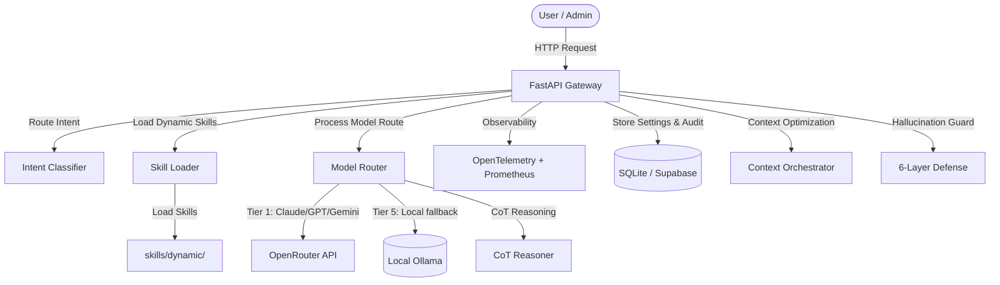
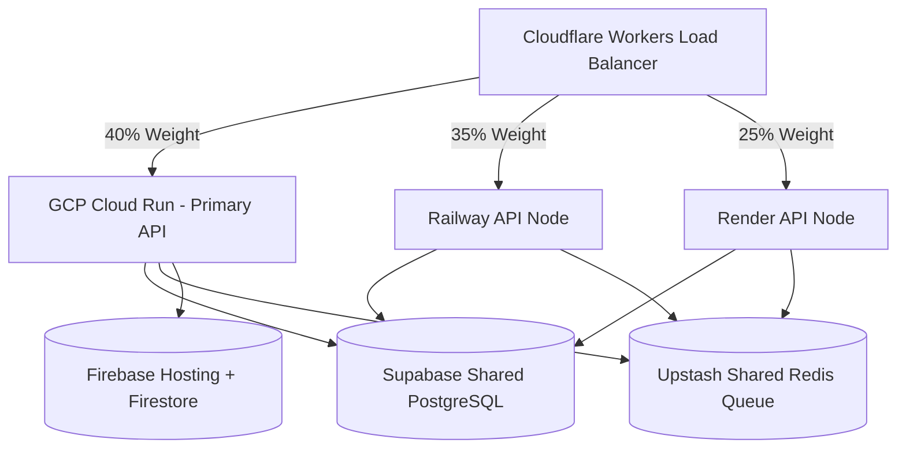

# 🏗️ Architecture & Design Blueprint

সুপ্রিম এআই ২.০ (SupremeAI 2.0) প্রজেক্টের সিস্টেম ডিজাইন, আর্কিটেকচারাল ফ্লো এবং মূল মডিউলগুলোর কার্যকারিতা নিচে বিস্তারিত দেওয়া হলো:

*Last updated: 2026-06-20 (Full project re-audit)*

## 🧱 সামগ্রিক আর্কিটেকচার (System Architecture)

SupremeAI 2.0 একটি অ্যাসিনক্রোনাস, মডুলার এবং সেলফ-লার্নিং এআই গেটওয়ে হিসেবে ডিজাইন করা হয়েছে।

---

## 🌐 মাল্টি-ক্লাউড অ্যাক্টিভ-অ্যাক্টিভ আর্কিটেকচার

- **Parallel Cloud Router (`brain/parallel_cloud_router.py`):** Active-Active ট্রাফিক রাউটিং।
- **GCP Cloud Run Router (`brain/gcp_router.py`):** GCP node health check + task routing।
- **GCP Firestore Queue (`core/gcp_firestore.py`):** Verification queue, SQLite fallback।
- **GCP Pub/Sub Queue (`core/gcp_pubsub_queue.py`):** Task queue, SQLite fallback।
- **GCP Cloud Functions (`tools/gcp_cloud_functions.py`):** OCR + generic HTTP trigger।
- **Upstash Redis Queue (`core/upstash_redis_queue.py`):** Shared distributed Redis queue।

---

## 📂 ডিরেক্টরি এবং কম্পোনেন্ট লেআউট

| ডিরেক্টরি | বিবরণ |
|---|---|
| `/admin` | Admin config & permissions (`god.py`) |
| `/api/routes/` | 14 API routes — task, stream, browser, simulator, memory, knowledge, marketplace, metrics, media, codeflow, agent_tasks, admin_dashboard, feedback, auth |
| `/brain/` | Model Router, Model Registry, LangGraph, CrewAI, Swarm, Parallel Router, GCP Router, MCP Client, Reasoning Orchestrator, Agent Departments, Autonomous Agent |
| `/core/` | 25+ modules — Hallucination Defense (6 layers), Auth, RBAC, Rate Limiter, Telemetry, Universal Rules, Upstash Redis, Firestore, Pub/Sub, Schema Validator, Audit Logger |
| `/document/` | সমস্ত ডকুমেন্টেশন, রুলস, এবং স্ট্যাটাস ট্র্যাকিং |
| `/evolution/` | Self-evolution engine (future: auto_skill_creator.py) |
| `/interfaces/` | VS Code Extension (v6.0.0), React Studio, Flutter Mobile, Telegram, Discord, Voice, CLI, Web Chat |
| `/memory/` | Long-Term, Episodic, Sliding Window, Checkpoint, ChromaDB, SQLite, Supabase, RAG Pipeline |
| `/skills/dynamic/` | CSV Exporter, Text Summarizer, Web Scraper |
| `/tools/` | 27+ tools — Vision, Video, Bengali Voice, VPN, OCR, RAG, CoT, Browser, Docker Sandbox, Cost Auditor, Health Checker, etc. |
| `/tests/` | 34 test files — 125 passed, 2 skipped |

---

## 🔄 ডেটা ফ্লো এবং লাইফসাইকেল (Request Lifecycle)

1. **Request Ingress:** FastAPI + Auth Middleware (JWT) + Rate Limiter + Observability Middleware।
2. **Intent Classification:** `core/intent.py` + `core/language_router.py`।
3. **Hallucination Defense:** 6-layer guard (Input Sanitizer → Generation Monitor → Factual Verifier → Code Validator → Output Validator → Error Pattern DB)।
4. **Model Routing:** `brain/model_router.py` → tier-based routing → OpenRouter/Ollama/Gemini/DeepSeek।
5. **CoT Reasoning:** Complex tasks → `tools/cot_reasoner.py` → self-verification।
6. **RAG Pipeline:** SEARCH tasks → `tools/local_search_rag.py` → ChromaDB → context augmentation।
7. **Skill Execution:** `skill_loader.py` → `skills/dynamic/` → runtime module execution।
8. **Response:** Output Validator → Audit Logger → Streaming (SSE) or JSON response।

---

## 🛡️ হ্যালুসিনেশন ডিফেন্স আর্কিটেকচার (6-Layer)

| Layer | Module | কাজ |
|---|---|---|
| Layer 1 | `core/input_sanitizer.py` | PII stripping, scope validation, ambiguity detection |
| Layer 2 | `core/generation_monitor.py` | Real-time token tracking, source attribution |
| Layer 3 | `core/factual_verifier.py` | DuckDuckGo async search + SymPy proof |
| Layer 4 | `core/code_validator.py` | AST syntax + AICodeValidator v2.1 |
| Layer 5 | `core/output_validator.py` | Multi-model consensus + EnhancedConfidenceScorer + HumanReviewPolicy |
| Meta | `core/error_pattern_db.py` | SQLite AI mistake logging + AIErrorPatternDB v2.1 |

---

## 📊 Observability & Monitoring

- **`core/telemetry.py`** — OpenTelemetry distributed tracing।
- **`core/observability_middleware.py`** — Request-level tracking।
- **`api/routes/metrics.py`** — Prometheus metrics endpoint (`/metrics`)।
- **Sentry SDK** — Production error tracking।
- **`tools/cost_auditor.py`** — API cost & usage audit reports।
- **`tools/health_checker.py`** — Daily dependency & key status checks।

---

*Last Synced: 2026-06-20 (Full project re-audit — all 100+ modules, telemetry, observability, new dirs added)*

<!-- Synced: 2026-06-20 (Full project re-audit — complete architecture update) -->
