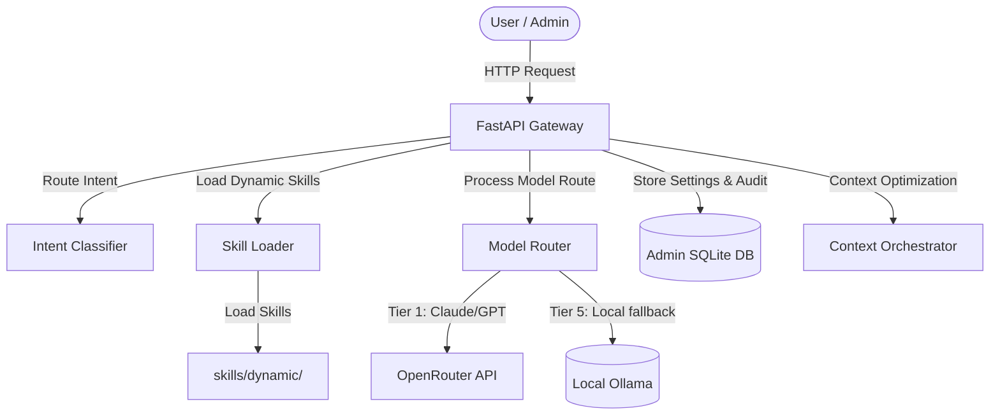

# 🏗️ Architecture & Design Blueprint

সুপ্রিম এআই ২.০ (SupremeAI 2.0) প্রজেক্টের সিস্টেম ডিজাইন, আর্কিটেকচারাল ফ্লো এবং মূল মডিউলগুলোর কার্যকারিতা নিচে বিস্তারিত দেওয়া হলো:

## 🧱 সামগ্রিক আর্কিটেকচার (System Architecture)

SupremeAI 2.0 একটি অ্যাসিনক্রোনাস, মডুলার এবং সেলফ-লার্নিং এআই গেটওয়ে হিসেবে ডিজাইন করা হয়েছে। এর প্রধান কম্পোনেন্টসমূহ:

---

## 📂 ডিরেক্টরি এবং কম্পোনেন্ট লেআউট (Directory Layout)

* **`/admin`**: অ্যাডমিনের কনফিগারেশন এবং পারমিশন রুলস ডেটাবেস (`god.py`)।
* **`/api`**: এপিআই রাউটিং এবং এন্ডপয়েন্ট হ্যান্ডলার (`routes/task.py`)।
* **`/brain`**: মডেল রাউটার (`model_router.py`) এবং ওলামা/ওপেনরাউটার মডেল রেজিস্ট্রি (`model_registry.py`)।
* **`/core`**: ডকার কনফিগারেশন, কনফিগার সেটিংস (`config.py`), এবং লগিং রুলস।
* **`/document`**: প্রজেক্টের যাবতীয় ডকুমেন্টেশন, রুলস, এবং স্ট্যাটাস ট্র্যাকিং।
* **`/skills`**: ডাইনামিক লাইব্রেরি এবং কাস্টম প্লাগইন লোডার (`installer.py`, `marketplace.py`, `registry.py`)।
* **`/tools`**: পূর্ববর্তী সংস্করণ (V1) থেকে মাইগ্রেট করা বিভিন্ন কাজের টুলস।
* **`/tests`**: প্রজেক্টের স্ট্যাবিলিটি ও ইন্টিগ্রেশন পরীক্ষার জন্য স্বয়ংক্রিয় টেস্ট কেস।

---

## 🔄 ডেটা ফ্লো এবং লাইফসাইকেল (Request Lifecycle)

4. **স্কিল এক্সিকিউশন (Dynamic Skill Loading)**: প্রয়োজন অনুযায়ী `SkillLoader` রানটাইমে কাস্টম পাইথন মডিউল (যেমন- CSV এক্সপোর্টার বা স্ক্র্যাপার) লোড ও এক্সিকিউট করে।

---

## 🛡️ হ্যালুসিনেশন ডিফেন্স আর্কিটেকচার (Hallucination Defense Architecture)

সিস্টেমে হ্যালুসিনেশন এবং ভুল আউটপুট প্রতিরোধ করার জন্য একটি ৬-লেয়ার বিশিষ্ট ডিফেন্স মেকানিজম এবং একটি মেটা-লার্নিং ডাটাবেস লেয়ার যুক্ত আছে। এটি ইনপুট স্যানিটাইজেশন, রিয়েল-টাইম টোকেন ট্র্যাকিং, এক্সটার্নাল ফ্যাক্ট ভেরিফিকেশন, AST কোড এবং পাথ ভ্যালিডেশন, ৩-মডেল যৌথ মতামত (consensus) দিয়ে রেসপন্স ফিল্টার ও সেলফ-কারেকশন করে, এবং AI ভুলের প্যাটার্ন লগ করে ভবিষ্যতের জন্য শেখে।
