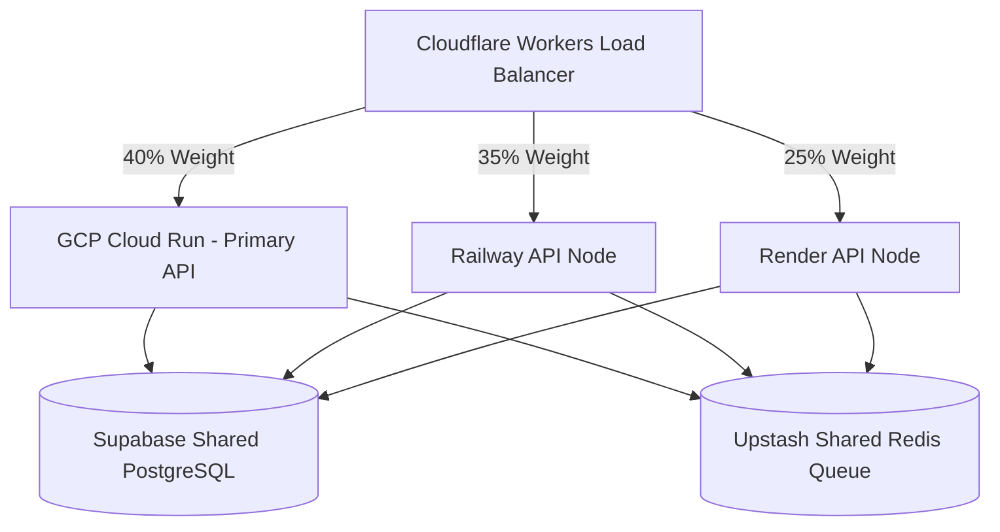

# 🏗️ Architecture & Design Blueprint

সুপ্রিম এআই ২.০ (SupremeAI 2.0) প্রজেক্টের সিস্টেম ডিজাইন, আর্কিটেকচারাল ফ্লো এবং মূল মডিউলগুলোর কার্যকারিতা নিচে বিস্তারিত দেওয়া হলো:

## 🧱 সামগ্রিক আর্কিটেকচার (System Architecture)

SupremeAI 2.0 একটি অ্যাসিনক্রোনাস, মডুলার এবং সেলফ-লার্নিং এআই গেটওয়ে হিসেবে ডিজাইন করা হয়েছে। এর প্রধান কম্পোনেন্টসমূহ:

---

## 🌐 মাল্টি-ক্লাউড অ্যাক্টিভ-অ্যাক্টিভ আর্কিটেকচার (Active-Active Mesh)

SupremeAI ২.০ একটি একক সার্ভারের উপর নির্ভরশীলতা এড়াতে এবং Railway-এর $৫ বাজেট সীমার সর্বোচ্চ সদ্ব্যবহার করতে **Active-Active Mesh Architecture** ব্যবহার করে।

* **Parallel Cloud Router (`brain/parallel_cloud_router.py`):** প্রজেক্টের সব নোড সচল রেখে রেসপন্স স্পিড, ল্যাটেন্সি এবং বাজেট রেশিও অনুযায়ী ট্রাফিক ভাগ করে দেয়।
* **GCP Cloud Run Router (`brain/gcp_router.py`):** GCP Cloud Run node-এ health check, task routing এবং config reporting করে।
* **GCP Verification Queue (`core/gcp_firestore.py`):** Firestore verification queue, local SQLite fallback সহ pending/verified queue state manage করে।
* **GCP Pub/Sub Queue (`core/gcp_pubsub_queue.py`):** Pub/Sub task queue, local SQLite fallback সহ publish/pull/ack flow manage করে।
* **GCP Cloud Functions Client (`tools/gcp_cloud_functions.py`):** Cloud Functions HTTP trigger client OCR এবং generic task payload-এর জন্য ব্যবহৃত হয়।
* **Shared State (Supabase / Upstash):** প্রতিটি ক্লাউড নোডকে সম্পূর্ণ স্টেটলেস রাখার জন্য ডাটাবেস ও টাস্ক কিউ শেয়ার্ড রিসোর্স হিসেবে কাজ করে।

---

## 📂 ডিরেক্টরি এবং কম্পোনেন্ট লেআউট (Directory Layout)

* **`/admin`**: অ্যাডমিনের কনফিগারেশন এবং পারমিশন রুলস ডেটাবেস (`god.py`)।
* **`/api`**: এপিআই রাউটিং এবং এন্ডপয়েন্ট হ্যান্ডলার (`routes/task.py`)।
* **`/brain`**: মডেল রাউটার (`model_router.py`), ওলামা/ওপেনরাউটার মডেল রেজিস্ট্রি (`model_registry.py`), থ্রেড-পুল স্বার্ম অর্কেস্ট্রেটর (`swarm_orchestrator.py`) এবং GCP Cloud Run router (`gcp_router.py`)।
* **`/core`**: ডকার কনফিগারেশন, কনফিগ সেটিংস (`config.py`), ইনপুট স্যানিটাইজার (`input_sanitizer.py`), কোড ও আউটপুট ভ্যালিডেটরস, অডিট লগার (`audit_logger.py`), GCP Firestore queue (`gcp_firestore.py`) এবং GCP Pub/Sub queue (`gcp_pubsub_queue.py`)।
* **`/document`**: প্রজেক্টের যাবতীয় ডকুমেন্টেশন, রুলস, এবং স্ট্যাটাস ট্র্যাকিং।
* **`/skills`**: ডাইনামিক লাইব্রেরি এবং কাস্টম প্লাগইন লোডার (`installer.py`, `marketplace.py`, `registry.py`)।
* **`/tools`**: CoT রিজনিং ইঞ্চিন, ডকার স্যান্ডবক্স (`docker_sandbox.py`), কস্ট অডিটর (`cost_auditor.py`), প্ল্যান সর্টার (`plan_sorter.py`), হেলথ চেকার (`health_checker.py`), মাল্টি-একাউন্ট রোটেটর (`multi_account_rotator.py`) এবং GCP Cloud Functions client (`gcp_cloud_functions.py`)।
* **`/tests`**: প্রজেক্টের স্ট্যাবিলিটি ও ইন্টিগ্রেশন পরীক্ষার জন্য স্বয়ংক্রিয় টেস্ট কেস।

---

## 🔄 ডেটা ফ্লো এবং লাইফসাইকেল (Request Lifecycle)

4. **স্কিল এক্সিকিউশন (Dynamic Skill Loading)**: প্রয়োজন অনুযায়ী `SkillLoader` রানটাইমে কাস্টম পাইথন মডিউল (যেমন- CSV এক্সপোর্টার বা স্ক্র্যাপার) লোড ও এক্সিকিউট করে।

---

## 🛡️ হ্যালুসিনেশন ডিফেন্স আর্কিটেকচার (Hallucination Defense Architecture)

সিস্টেমে হ্যালুসিনেশন এবং ভুল আউটপুট প্রতিরোধ করার জন্য একটি ৬-লেয়ার বিশিষ্ট ডিফেন্স মেকানিজম এবং একটি মেটা-লার্নিং ডাটাবেস লেয়ার যুক্ত আছে। এটি ইনপুট স্যানিটাইজেশন, রিয়েল-টাইম টোকেন ট্র্যাকিং, এক্সটার্নাল ফ্যাক্ট ভেরিফিকেশন, AST কোড এবং পাথ ভ্যালিডেশন, ৩-মডেল যৌথ মতামত (consensus) দিয়ে রেসপন্স ফিল্টার ও সেলফ-কারেকশন করে, এবং AI ভুলের প্যাটার্ন লগ করে ভবিষ্যতের জন্য শেখে।

---
*Last Synced with supremeai_1.0 Reusable Options Analysis: 2026-06-20 (GCP Deployed)*

