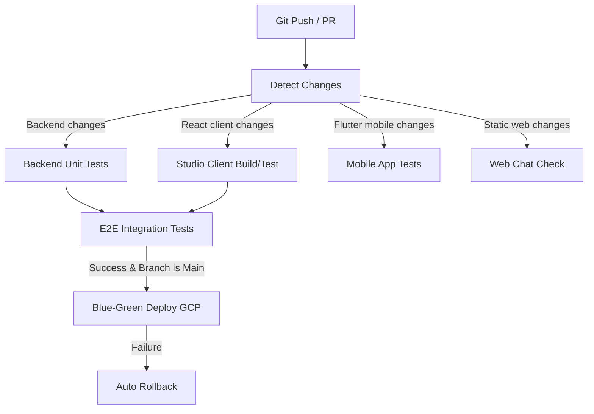

# 🐙 GitHub Integration & Cloud Deployment Guide

সুপ্রিম এআই ২.০ প্রজেক্টের গিটহাব রিপোজিটরি সেটআপ, লোকাল ও ক্লাউড ইন্টিগ্রেশন এবং স্বয়ংক্রিয় ডিপ্লয়মেন্ট (CI/CD) এর সম্পূর্ণ নির্দেশিকা নিচে দেওয়া হলো:

---

## 💻 ১. লোকাল সেটআপ এবং গিট কনফিগারেশন (Local Setup & Git Config)

### রিপোজিটরি ক্লোন করা
লোকাল সিস্টেমে প্রজেক্ট সেটআপ করতে প্রথমে রিপোজিটরি ক্লোন করুন:
```bash
git clone https://github.com/paykaribazaronline/supremeai.git
cd supremeai
```

### ব্রাঞ্চ ম্যানেজমেন্ট পলিসি
- **`main` / `master`**: প্রোডাকশন রেডি ব্রাঞ্চ। শুধুমাত্র সফল টেস্ট রান এবং রিভিউ শেষে কোড মার্জ করা হয়।
- **`develop`**: ইন্টিগ্রেশন ব্রাঞ্চ, যেখানে সমস্ত নতুন ফিচার বা বাগ ফিক্স মার্জ করে টেস্ট করা হয়।
- **ফিচার ব্রাঞ্চ**: নতুন ফিচারের জন্য `feat/feature-name` এবং বাগ ফিক্সের জন্য `fix/bug-name` ফরম্যাটে ব্রাঞ্চ তৈরি করতে হবে।

---

## ⚙️ ২. গিটহাব অ্যাকশনস CI/CD পাইপলাইন (GitHub Actions CI/CD)

প্রজেক্টের মূল চালিকাশক্তি হলো `.github/workflows/ci-cd.yml` ইউনিফাইড পাইপলাইন। এটি প্রতিটি পুশ বা পুল রিকোয়েস্টে স্বয়ংক্রিয়ভাবে নিচের কাজগুলো সম্পন্ন করে:

### পাইপলাইনের ধাপসমূহ (Pipeline Jobs):



1. **Detect Changes (`analyze-paths`)**: `paths-filter` অ্যাকশন ব্যবহার করে কোডের কোন স্ট্যাকে পরিবর্তন এসেছে তা স্বয়ংক্রিয়ভাবে ট্র্যাক করা হয়।
2. **Backend Unit Tests (`backend-test`)**: Python 3.11 পরিবেশ তৈরি করে, সব ডিপেন্ডেন্সি এবং Playwright ব্রাউজার (`python -m playwright install --with-deps chromium`) ইন্সটল করে Pytest রান করা হয়।
3. **Studio Client Build & Test (`studio-client`)**: রিঅ্যাক্ট প্রজেক্টের ডিপেন্ডেন্সি ইনস্টল, টাইপ চেকিং, ইউনিট টেস্টিং এবং প্রোডাকশন বিল্ড তৈরি করা হয়।
4. **Mobile App Analysis (`mobile`)**: Flutter SDK ব্যবহার করে মোবাইল অ্যাপের কোড অ্যানালিসিস এবং টেস্ট রান করা হয়।
5. **E2E Integration Tests (`e2e-tests`)**: ব্যাকগ্রাউন্ডে Redis সার্ভিস এবং Firebase Emulator চালু করে সম্পূর্ণ স্যান্ডবক্সড পরিবেশে E2E ফ্লো ও ইন্টিগ্রেশন টেস্ট পরিচালনা করা হয়।
6. **Blue-Green Deploy GCP (`deploy`)**: `main` ব্রাঞ্চে কোড মার্জ হলে GCP Cloud Run-এ নতুন ইমেজ বিল্ড করে পুশ করা হয় এবং কোনো ট্রাফিক ছাড়া গ্রিন রিভিশন ডেপ্লয় করা হয়।
7. **Auto Rollback (`rollback`)**: ডিপ্লয়মেন্টে কোনো ত্রুটি দেখা দিলে স্বয়ংক্রিয়ভাবে আগের সফল রিভিশনে ট্রাফিক ফেরত নেওয়া (Rollback) হয়।

---

## ☁️ ৩. ক্লাউড ডিপ্লয়মেন্ট এবং সিক্রেটস কনফিগারেশন (Cloud Integration & Secrets)

স্বয়ংক্রিয় ডিপ্লয়মেন্ট সচল রাখতে GitHub Repository Settings-এ নিচের ভেরিয়েবল ও সিক্রেটস যুক্ত করতে হবে:

### প্রয়োজনীয় Secrets (Settings -> Secrets and variables -> Actions):
- **`GCP_SA_KEY`**: Google Cloud Service Account Key (JSON ফরম্যাট), যার মাধ্যমে GitHub অ্যাকশনস GCP তে অ্যাক্সেস পাবে।
- **`GCP_PROJECT_ID`**: আপনার গুগল ক্লাউড প্রজেক্টের আইডি।

### প্রয়োজনীয় Variables (Actions Variables):
- **`GCP_ARTIFACT_REPOSITORY`**: Artifact Registry-র পাথ (যেমন: `gcr.io` বা নির্দিষ্ট ডকার রেজিস্ট্রি)।
- **`REGION`**: Cloud Run ডেপ্লয়মেন্টের অঞ্চল (যেমন: `us-central1`)।
- **`SERVICE`**: ক্লাউড রান সার্ভিসের নাম (ডিফল্ট: `supremeai-api`)।

### ব্লু-গ্রিন ডেপ্লয়মেন্ট ট্রাফিক রুলস:
1. কোড পুশ হলে প্রথমে **50% ট্রাফিক** নতুন সংস্করণে (Green) এবং **50% ট্রাফিক** আগের সংস্করণে (Blue) ভাগ করে দেওয়া হয়।
2. স্বয়ংক্রিয় স্মোক টেস্ট সফল হলে **100% ট্রাফিক** নতুন সংস্করণে প্রোমোট করা হয়।
3. স্মোক টেস্ট ব্যর্থ হলে **100% ট্রাফিক** সাথে সাথে পূর্ববর্তী রিভিশনে রোলব্যাক করা হয়।

<!-- Synced: 2026-06-20 (Full project re-audit — CI/CD pipeline verified, 34 test files confirmed) -->

<!-- Synced with Project Status Update: 2026-06-20 (React Studio Client Modularized) -->

<!-- Synced with Backend Optimization Update: 2026-06-20 (Backend production-ready optimized) -->

<!-- Synced with CI/CD Fix: 2026-06-20 (Pytest PYTHONPATH issue resolved in workflow) -->
