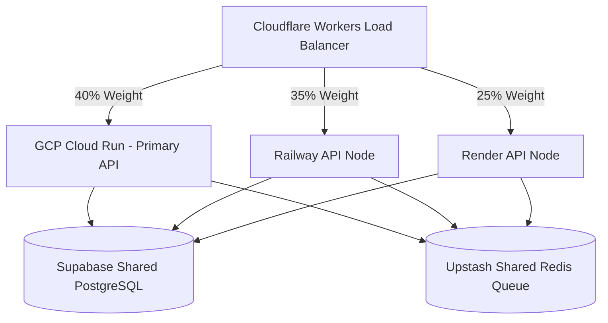

# 🔱 Master Work & Implementation Plan

সুপ্রিম এআই ২.০ প্রজেক্টের সামগ্রিক কাজের রোডম্যাপ, ডিজাইন আর্কিটেকচার এবং লোকাল রেপ্লিকেশন পরিকল্পনা নিচে একত্রিত করা হলো:

---

## 🏗️ Architecture & Core Strategy
* **Zero Cost Target:** $0-30/mo খরচে সিস্টেম পরিচালনা করা (Ollama, local ChromaDB/SQLite এবং API Key rotation এর মাধ্যমে)।
* **Universal Self-Learning:** প্লাগইন এবং স্কিল মার্কেটপ্লেসের সাহায্যে নতুন ফিচার নিজে নিজে যুক্ত করার সক্ষমতা।
* **FastAPI Backend:** হালকা এবং দ্রুতগতির Python FastAPI ভিত্তিক এপিআই গেটওয়ে।
* **Operational Governance:** প্রতিটি বড় সিদ্ধান্তের আগে `.antigravityrules` এবং `admin_rules_and_guidelines.md` যাচাই করা।
* **Automated Accountability:** প্রতিটি টাস্ক শেষে "What-Done", "Cost-Incurred", এবং "Next-Step" এর একটি অটো-রিপোর্ট জেনারেট করা।

---

## 🗺️ Upcoming Roadmap & Active Plans (Status Update)

### ১. 🌍 Global-First Architecture (10/10 Internationalization Plan)
* **Frontend:** স্টুডিও ক্লায়েন্ট এবং ভিএস কোড এক্সটেনশনে i18next ইন্টিগ্রেট করে ইংরেজি, বাংলা, স্প্যানিশ, চাইনিজ ইত্যাদি ভাষা সমর্থন করা।
* **VS Code Extension Update:** ইউজারের আইডিই (IDE) লোকাল ডিটেক্ট করে ব্যাকএন্ডে পাঠানো যাতে সাজেশন ইউজারের নিজস্ব ভাষায় আসে।
* **Circuit Breakers:** জাভা ব্যাকএন্ড ডাউন থাকলে অতিরিক্ত কল ব্লক করা, যাতে প্রজেক্টে কোনো ক্যাসকেডিং ফেইলিউর না ঘটে।

### ২. 👤 Personhood Layer & Identity Persistence (Synthetic Admin)
* **Voice Interface:** `interfaces/voice.py`-এ Whisper (STT) এবং Google TTS ইন্টিগ্রেট করা আছে, তবে Coqui TTS বা অনুরূপ অফলাইন/উন্নত লাইব্রেরির সাথে সম্পূর্ণ সংযোগ ও ওটিপি বা ডাইনামিক কল সেশন টেস্টিং করা বাকি।

### ৩. 🌐 Multi-Cloud Active-Active Mesh (GCP-First Integration) & Render Fixes
* **Active-Active Routing:** GCP Cloud Run, Railway এবং Render-এর মধ্যে ট্রাফিক ডিস্ট্রিবিউশন করার জন্য `brain/parallel_cloud_router.py` (Parallel Router) এবং `brain/gcp_router.py` ইমপ্লিমেন্ট করা।
* **GCP Free Tier Services:**
  - **Cloud Run:** ২ মিলিয়ন request/মাস (FastAPI API hosting)
  - **Cloud Functions:** ২ মিলিয়ন invocation/মাস (OCR, web scrapers)
  - **Cloud Storage:** ৫ GB (File storage, model weights)
  - **Firestore:** ১ GB, ৫০K reads/day (Verification queue, config)
  - **Cloud Pub/Sub:** ১০ GB/মাস (Task queue, messaging)
* **GCP Setup & Deployment:** GCP প্রোজেক্ট তৈরি করা, ক্লাউড রান-এ ডেপ্লয় করা এবং `.env` ভ্যারিয়েবল সেট করা।
* **Render Deployment Fixes:** `render.yaml`-এ `/health` চেক পাথ ফিক্স করা, ডাইনামিক `$PORT` বাইন্ডিং যুক্ত করা এবং `core/app.py`-এ `/actuator/health` যুক্ত করে ব্যাকওয়ার্ড কমপ্যাটিবিলিটি বজায় রাখা।

#### 🏗️ GCP + SupremeAI Architecture & Benefits

* **GCP-SupremeAI Benefits:**
  - **Zero Cost:** GCP Always Free tier ব্যবহারের মাধ্যমে সর্বনিম্ন খরচে পরিচালনা করা।
  - **Scalability:** Cloud Run এর মাধ্যমে অটো-স্কেলিং ও হাই-ল্যাটেন্সি হ্যান্ডলিং।
  - **Firestore & Pub/Sub:** ডাটাবেস ও কিউ হ্যান্ডলিং-এর জন্য মেইনটেইন্যান্স-ফ্রি সার্ভিস।

---

## 🔍 SupremeAI 2.0 — Missing Skills, Dependencies & Tools Analysis

সুপ্রিম এআই ২.০ প্রজেক্টের কোডবেস বিশ্লেষণ করে যেসকল ফাইল, ডিপেনডেন্সি এবং ফিচারগুলোর কাজ বাকি আছে:

### ১. 🔴 Critical Missing (কোডে ইম্পোর্ট আছে কিন্তু ফাইল নেই)
* **SupremeOrchestrator** (`brain.langgraph_agent.SupremeOrchestrator`): ✅ Created `brain/langgraph_agent.py`.
* **CrewAgent & CrewTask** (`brain.crewai_agents.CrewAgent`, `CrewTask`): ✅ Created `brain/crewai_agents.py`.
* **core.app (as module)**: ✅ `core/app.py` now exports `model_router`, `intent_clf`, and `admin_god` as module-level singletons.
* **SkillLoader** (`skill_loader.SkillLoader`): ✅ `skill_loader.py` already present and functional.
* **RAGPipeline** (`memory.rag_pipeline.RAGPipeline`): ✅ Verified and functional in `memory/rag_pipeline.py`.

### ২. 🟡 Missing Dependencies (requirements.txt-এ নেই কিন্তু কোডে ব্যবহৃত)
* ✅ `typer>=0.12.0` এবং `rich>=13.0.0` (CLI ইন্টারফেসের জন্য) — Added to requirements.txt
* ✅ `celery>=5.4.0` এবং `redis>=5.0.0` (অ্যাসিনক্রোনাস টাস্ক কিউ এর জন্য) — Added to requirements.txt
* ✅ `google-cloud-firestore>=2.16.0` (মাল্টি-অ্যাকাউন্ট রোটেটরের জন্য) — Added to requirements.txt
* ✅ `pytest>=8.0.0` এবং `pytest-anyio>=4.0.0` (টেস্টিং ফ্রেমওয়ার্ক) — Added to requirements.txt

### ৩. 🟠 Missing Features (আংশিক বা অনুপস্থিত ফিচারসমূহ)
* **Checkpoint/Resume:** দীর্ঘ কাজের জন্য স্টেট ব্যাকআপ এবং SQLite ভিত্তিক রিস্টোর সুবিধা।
* **Sliding Window Memory:** বড় ডকুমেন্টের জন্য মেমোরি কন্ট্রোল ও স্লাইডিং উইন্ডো।
* **Dynamic VPN Switching:** সিকিউরিটি ও আইপি ব্লকিং এড়ানোর জন্য ডাইনামিক ভিপিএন।
* **CI/CD, Terraform IaC, and E2E Tests:** পাইপলাইন এবং ইনফ্রাস্ট্রাকচার কোড।

### ৪. 🔵 Missing Tools/Skills (ভবিষ্যতের পরিকল্পনা)
* Python Email Handler, SMS Handler, PDF Processor, Image Generator, Calendar/Scheduler, Notification Service, Backup/Restore Tool, Log Analyzer, Performance Profiler, Auto-Documentation Generator।
