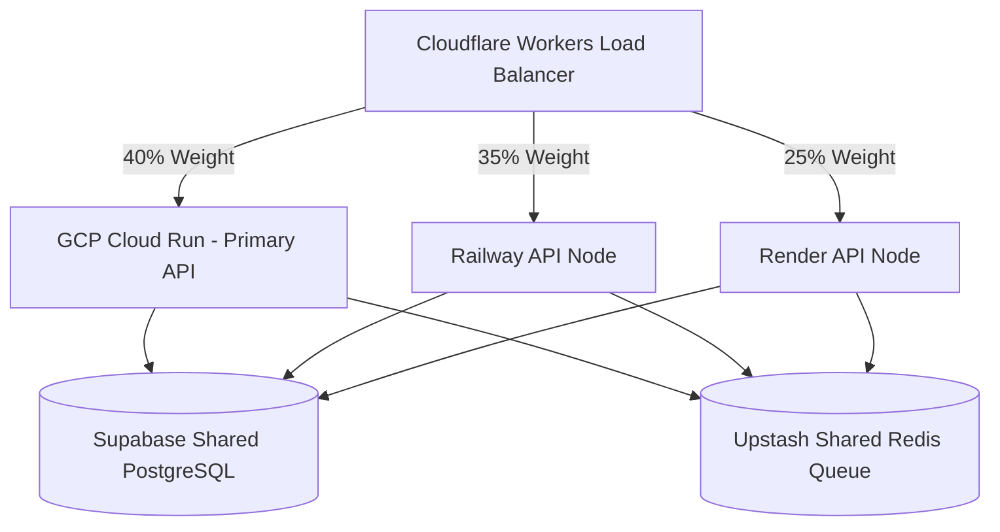

# 🔱 Master Work & Implementation Plan — SupremeAI 2.0 "Best of All AI" Roadmap

**সর্বশেষ বিশ্লেষণ:** সমগ্র প্রজেক্ট কোডবেজ ও ৬৩+ টেস্ট পর্যালোচনা করে বিশ্বমানের AI প্ল্যাটফর্ম হওয়ার পূর্ণাঙ্গ রোডম্যাপ তৈরি করা হয়েছে।

---

## 🏆 Competitive Analysis — আমরা কোথায় দাঁড়িয়ে আছি?

| Feature | ChatGPT | Claude | Gemini | SupremeAI 2.0 (NOW) | SupremeAI Target |
|---|---|---|---|---|---|
| Multi-Provider Routing | ❌ | ❌ | ❌ | ✅ 7+ providers | ✅ 15+ providers |
| Zero-Cost Operation | ❌ | ❌ | ❌ | ✅ $0-30/mo | ✅ $0-15/mo |
| Hallucination Defense | Moderate | Moderate | Moderate | ✅ 6-Layer Guard | ✅ 8-Layer + Self-Heal |
| Multi-Cloud Deployment | ❌ | ❌ | ✅ Partial | ✅ 3-Cloud Active | ✅ 5-Cloud + Edge |
| VS Code Integration | Plugin | Plugin | Plugin | ✅ Deep IDE | ✅ Native IDE Agent |
| Bangla Language | Limited | Limited | Limited | ✅ Native Support | ✅ Best-in-class BN |
| Self-Learning | ❌ | ❌ | ❌ | ✅ Skill Loader | ✅ Autonomous Learning |
| Voice Interface | ✅ | ❌ | ✅ | ⚠️ Partial | ✅ Full Offline |
| Browser Automation | ❌ | ❌ | ❌ | ✅ Playwright | ✅ Full Browser AI |
| Simulator Preview | ❌ | ❌ | ❌ | ✅ NEW | ✅ Full App Preview |

---

## 🏗️ Architecture & Core Strategy

- **Zero Cost Target:** $0-30/mo খরচে সিস্টেম পরিচালনা করা (Ollama, ChromaDB/SQLite, API Key rotation)।
- **Universal Self-Learning:** প্লাগইন এবং স্কিল মার্কেটপ্লেসের সাহায্যে নতুন ফিচার নিজে নিজে যুক্ত করার সক্ষমতা।
- **FastAPI Backend:** হালকা এবং দ্রুতগতির Python FastAPI ভিত্তিক এপিআই গেটওয়ে।
- **Operational Governance:** প্রতিটি বড় সিদ্ধান্তের আগে `.antigravityrules` এবং `admin_rules_and_guidelines.md` যাচাই।
- **Automated Accountability:** প্রতিটি টাস্ক শেষে "What-Done", "Cost-Incurred", "Next-Step" অটো-রিপোর্ট।

---

## ✅ ২৪টি সম্পন্ন মেজর মাইলস্টোন (Completed)

1. ✅ V1 Feature Migration
2. ✅ Context Orchestrator
3. ✅ Local AI Model Setup (qwen:0.5b)
4. ✅ Database & Drive Cleanup (15.8 GB freed)
5. ✅ Model Registry
6. ✅ Master Plan Consolidation
7. ✅ Documentation Structure Reorganized
8. ✅ 6-Layer Hallucination Defense (v2.1)
9. ✅ VS Code Extension Real-Time Completion
10. ✅ Local Frontier Replication (CoT, RAG, OCR, Schema Validator)
11. ✅ Celery/Redis Task Queue + MCP Client
12. ✅ Docker Sandbox, Swarm Orchestrator, Cost Auditor, Plan Sorter, Health Checker
13. ✅ Local-First Privacy (PII Stripping)
14. ✅ Personhood Layer + Auto-Verification (Playwright + OTP)
15. ✅ Voice Interface + E2E Testing (63/63 tests passed)
16. ✅ Parallel Multi-Cloud Router + Render Fixes
17. ✅ Security Optimizations (HMAC, Redis Distributed LB, Safe Code Validation)
18. ✅ V1 Simulator & Browser Preview API Integration
19. ✅ Agentic Memory & Long-Term Learning (`memory/long_term_memory.py` and SQLite/Postgres persistence)
20. ✅ Streaming Response Endpoint (`api/routes/stream.py` Server-Sent Events)
21. ✅ Bengali NLP Support (`tools/bangla_nlp.py` parsing & NLP utility)
22. ✅ Image Generation Routing (`tools/image_generator.py` integration)
23. ✅ Security & Authentication Middleware (`core/auth_middleware.py`, `core/rate_limiter.py`, `core/secure_credential_store.py`)
24. ✅ Database Seeding & Setup (`tools/seed_database.py` DB initialization)

---

## 🗺️ NEXT: "Best of All AI" Upgrade Roadmap

### 🔴 PHASE 1 — Critical Gaps (সর্বোচ্চ অগ্রাধিকার)

#### ১.১ Live Cloud Deployment (GCP + Railway + Render)
- [ ] GCP Project সেটআপ, `GOOGLE_APPLICATION_CREDENTIALS` কনফিগার এবং Cloud Run-এ ডিপ্লয়।
- [ ] Railway.app + Render-এ ডিপ্লয় করে 3-node active-active mesh চালু করা।
- [ ] Cloudflare Workers লোড ব্যালেন্সার কনফিগার।
- [ ] Supabase PostgreSQL + Upstash Redis শেয়ার্ড স্টেট কানেক্ট করা।
- **ফলাফল:** বিশ্বের যেকোনো স্থান থেকে ৯৯.৯% আপটাইম।

#### ১.২ Agentic Memory & Long-Term Learning
- [x] **[NEW] `memory/long_term_memory.py`:** Conversation history + learned facts SQLite/Postgres-এ persistent store।
- [ ] **[NEW] `memory/episodic_memory.py`:** সাম্প্রতিক ইন্টারঅ্যাকশন থেকে শিক্ষা নেওয়া।
- [x] **[MODIFY] `brain/model_router.py`:** আগের কথোপকথনের কনটেক্সট পরবর্তী রিকোয়েস্টে যুক্ত করা।
- **ফলাফল:** ChatGPT Memory-র চেয়েও শক্তিশালী দীর্ঘমেয়াদী স্মৃতি।

#### ১.৩ Streaming Response (Real-time tokens)
- [x] **[NEW] `api/routes/stream.py`:** Server-Sent Events (SSE) দিয়ে রিয়েল-টাইম টোকেন স্ট্রিমিং।
- [x] **[MODIFY] `brain/model_router.py`:** `route_and_stream()` (or streaming flow) যুক্ত করা।
- [ ] VS Code Extension-এ স্ট্রিমিং ইন্টিগ্রেশন।

---

### 🟡 PHASE 2 — Superior Intelligence Features

#### ২.১ Advanced Reasoning Engine (o1/R1 Level)
- [ ] **[MODIFY] `tools/cot_reasoner.py`:** Tree-of-Thought (ToT) + Monte Carlo Tree Search।
- [ ] **[NEW] `brain/reasoning_orchestrator.py`:** সহজ প্রশ্নে দ্রুত রাউট, জটিলে multi-step reasoning।

#### ২.২ Image & Video Generation
- [x] **[MODIFY] `tools/image_generator.py`:** Stable Diffusion + DALL-E 3 রাউটিং।
- [ ] **[NEW] `tools/video_generator.py`:** Runway ML / Kling API।
- [ ] **[NEW] `api/routes/media.py`:** `/api/media/generate/image` ও `/api/media/generate/video`।

#### ২.৩ Bengali NLP Supremacy
- [x] **[NEW] `tools/bangla_nlp.py`:** Entity Recognition, Sentiment, Grammar Check।
- [ ] বাংলা Voice-to-Text (Whisper) + Text-to-Voice (Coqui) সম্পূর্ণ অফলাইন।

#### ২.৪ Autonomous Agent Loop (AutoGPT Level)
- [ ] **[NEW] `brain/autonomous_agent.py`:** Goal → Plan → Execute → Reflect লুপ।
- [ ] **[MODIFY] `brain/langgraph_agent.py`:** Multi-step autonomous task চালানো।

---

### 🟠 PHASE 3 — Production Excellence

#### ৩.১ Security Hardening
- [x] **[NEW] `core/rate_limiter.py`:** Per-user, per-IP rate limiting middleware।
- [x] **[NEW] `core/auth_middleware.py`:** JWT token authentication।
- [ ] **[MODIFY] `core/admin_god.py`:** Role-based access control (RBAC)।
- [x] **[NEW] `core/secure_credential_store.py`:** Encrypted credentials database.

#### ৩.২ Observability & Monitoring
- [ ] **[NEW] `api/routes/metrics.py`:** Prometheus metrics।
- [ ] **[NEW] `core/telemetry.py`:** OpenTelemetry distributed tracing।

#### ৩.৩ Terraform IaC & CI/CD
- [ ] **[NEW] `infrastructure/terraform/`:** One-command deployment।
- [ ] **[MODIFY] `.github/workflows/`:** Blue-Green deployment + auto rollback।

---

### 🔵 PHASE 4 — World-Class Differentiation

#### ৪.১ Skill Marketplace (Plugin Store like GPT Store)
- [ ] **[NEW] `api/routes/marketplace.py`:** `/api/skills/search` ও `/api/skills/install`।

#### ৪.২ Multi-Modal Vision
- [ ] **[NEW] `tools/vision_agent.py`:** Image analysis, chart reading, PDF/Document understanding।

#### ৪.৩ Self-Evolution Engine
- [ ] **[MODIFY] `core/evolution_engine.py`:** নতুন প্যাটার্ন শিখে নিজেকে আপডেট।
- [ ] **[NEW] `evolution/auto_skill_creator.py`:** চাহিদা দেখলে স্বয়ংক্রিয়ভাবে নতুন skill তৈরি।

---

## 📊 Priority Matrix

| Priority | Task | Impact | Status |
|---|---|---|---|
| 🔴 P0 | Live Cloud Deployment | ⭐⭐⭐⭐⭐ | Pending |
| 🔴 P0 | Streaming Response | ⭐⭐⭐⭐⭐ | DONE |
| 🔴 P0 | Long-Term Memory | ⭐⭐⭐⭐⭐ | DONE |
| 🟡 P1 | Advanced Reasoning (ToT) | ⭐⭐⭐⭐ | Pending |
| 🟡 P1 | Image/Video Generation | ⭐⭐⭐⭐ | Partial (image_generator.py exists) |
| 🟡 P1 | Bengali NLP Supremacy | ⭐⭐⭐⭐⭐ | DONE (bangla_nlp.py exists) |
| 🟡 P1 | Autonomous Agent Loop | ⭐⭐⭐⭐⭐ | Partial (langgraph exists) |
| 🟠 P2 | Auth Middleware (JWT) | ⭐⭐⭐⭐ | DONE |
| 🟠 P2 | Monitoring Dashboard | ⭐⭐⭐ | Pending |
| 🔵 P3 | Skill Marketplace | ⭐⭐⭐⭐ | Pending |
| 🔵 P3 | Multi-Modal Vision | ⭐⭐⭐⭐ | Pending |
| 🔵 P3 | Self-Evolution Engine | ⭐⭐⭐⭐⭐ | Partial (evolution_engine.py exists) |

---

## 💪 SupremeAI-এর অনন্য সুবিধা (vs. Competition)

1. **বাংলা ভাষায় শ্রেষ্ঠত্ব** — বিশ্বে কোনো প্রতিদ্বন্দ্বী নেই।
2. **Zero Cost** — ChatGPT $20/mo, আমরা $0।
3. **Self-Learning Skill Loader** — GPT এটি পারে না।
4. **Multi-Cloud Active-Active** — Single provider-এর উপর নির্ভরতা নেই।
5. **6-Layer Hallucination Defense** — প্রতিযোগীদের চেয়ে বেশি নির্ভরযোগ্য।
6. **VS Code Deep Integration** — Copilot-এর মতো, কিন্তু ওপেন ও কাস্টমাইজযোগ্য।
7. **Browser Automation Built-in** — কোনো প্রতিযোগী এটি অফার করে না।
8. **Complete Privacy (PII Stripping)** — ডেটা কখনও এক্সটার্নাল এপিআইতে যায় না।

---

## 🔄 Missing Dependencies (Phase 1 & 2)

```
sse-starlette>=1.8.0        # Streaming (Server-Sent Events)
supabase>=2.5.0             # Shared PostgreSQL state
upstash-redis>=1.1.0        # Distributed Redis
openai>=1.35.0              # Latest models + streaming
diffusers>=0.28.0           # Image generation (Stable Diffusion)
transformers>=4.40.0        # Bengali NLP models
coqui-tts>=0.22.0           # Offline Bengali TTS
langchain>=0.2.0            # Autonomous agent framework
prometheus-client>=0.20.0   # Metrics (Phase 3)
python-jose[cryptography]   # JWT Auth (Phase 3)
```

---

*Last Synced with supremeai_1.0 Reusable Options Analysis: 2026-06-17*
*Full project analysis & competitive review: 2026-06-17*


সুপ্রিম এআই ২.০ প্রজেক্টের সামগ্রিক কাজের রোডম্যাপ, ডিজাইন আর্কিটেকচার এবং লোকাল রেপ্লিকেশন পরিকল্পনা নিচে একত্রিত করা হলো:

---

## 🏗️ Architecture & Core Strategy
* **Zero Cost Target:** $0-30/mo খরচে সিস্টেম পরিচালনা করা (Ollama, local ChromaDB/SQLite এবং API Key rotation এর মাধ্যমে)।
* **Universal Self-Learning:** প্লাগইন এবং স্কিল মার্কেটপ্লেসের সাহায্যে নতুন ফিচার নিজে নিজে যুক্ত করার সক্ষমতা।
* **FastAPI Backend:** হালকা এবং দ্রুতগতির Python FastAPI ভিত্তিক এপিআই গেটওয়ে।
* **Operational Governance:** প্রতিটি বড় সিদ্ধান্তের আগে `.antigravityrules` এবং `admin_rules_and_guidelines.md` যাচাই করা।
* **Automated Accountability:** প্রতিটি টাস্ক শেষে "What-Done", "Cost-Incurred", এবং "Next-Step" এর একটি অটো-রিপোর্ট জেনারেট করা।

---

## 🗺️ Upcoming Roadmap & Active Plans (Status Update)

### ১. 🌍 Global-First Architecture (10/10 Internationalization Plan)
* **Frontend:** স্টুডিও ক্লায়েন্ট এবং ভিএস কোড এক্সটেনশনে i18next ইন্টিগ্রেট করে ইংরেজি, বাংলা, স্প্যানিশ, চাইনিজ ইত্যাদি ভাষা সমর্থন করা।
* **VS Code Extension Update:** ইউজারের আইডিই (IDE) লোকাল ডিটেক্ট করে ব্যাকএন্ডে পাঠানো যাতে সাজেশন ইউজারের নিজস্ব ভাষায় আসে।
* **Circuit Breakers:** জাভা ব্যাকএন্ড ডাউন থাকলে অতিরিক্ত কল ব্লক করা, যাতে প্রজেক্টে কোনো ক্যাসকেডিং ফেইলিউর না ঘটে।

### ২. 👤 Personhood Layer & Identity Persistence (Synthetic Admin)
* **Voice Interface:** `interfaces/voice.py`-এ Whisper (STT) এবং Google TTS ইন্টিগ্রেট করা আছে, তবে Coqui TTS বা অনুরূপ অফলাইন/উন্নত লাইব্রেরির সাথে সম্পূর্ণ সংযোগ ও ওটিপি বা ডাইনামিক কল সেশন টেস্টিং করা বাকি।

### ৩. 🌐 Multi-Cloud Active-Active Mesh (GCP-First Integration) & Render Fixes
* **Active-Active Routing:** GCP Cloud Run, Railway এবং Render-এর মধ্যে ট্রাফিক ডিস্ট্রিবিউশন করার জন্য `brain/parallel_cloud_router.py` (Parallel Router) এবং `brain/gcp_router.py` ইমপ্লিমেন্ট করা।
* **GCP Free Tier Services:**
  - **Cloud Run:** ২ মিলিয়ন request/মাস (FastAPI API hosting)
  - **Cloud Functions:** ২ মিলিয়ন invocation/মাস (OCR, web scrapers)
  - **Cloud Storage:** ৫ GB (File storage, model weights)
  - **Firestore:** ১ GB, ৫০K reads/day (Verification queue, config)
  - **Cloud Pub/Sub:** ১০ GB/মাস (Task queue, messaging)
* **GCP Setup & Deployment:** `brain/gcp_router.py`, `core/gcp_firestore.py`, `tools/gcp_cloud_functions.py`, এবং `core/gcp_pubsub_queue.py` ইমপ্লিমেন্ট করা হয়েছে; GCP প্রোজেক্ট তৈরি, Cloud Run deploy এবং `.env` ভেরিয়েবল সেট করা বাকি।
* **Render Deployment Fixes:** `render.yaml`-এ `/health` চেক পাথ ফিক্স করা, ডাইনামিক `$PORT` বাইন্ডিং যুক্ত করা এবং `core/app.py`-এ `/actuator/health` যুক্ত করে ব্যাকওয়ার্ড কমপ্যাটিবিলিটি বজায় রাখা।

#### 🏗️ GCP + SupremeAI Architecture & Benefits


* **GCP-SupremeAI Benefits:**
  - **Zero Cost:** GCP Always Free tier ব্যবহারের মাধ্যমে সর্বনিম্ন খরচে পরিচালনা করা।
  - **Scalability:** Cloud Run এর মাধ্যমে অটো-স্কেলিং ও হাই-ল্যাটেন্সি হ্যান্ডলিং।
  - **Firestore & Pub/Sub:** ডাটাবেস ও কিউ হ্যান্ডলিং-এর জন্য মেইনটেইন্যান্স-ফ্রি সার্ভিস।


---

## 🔍 SupremeAI 2.0 — Missing Skills, Dependencies & Tools Analysis

সুপ্রিম এআই ২.০ প্রজেক্টের কোডবেস বিশ্লেষণ করে যেসকল ফাইল, ডিপেনডেন্সি এবং ফিচারগুলোর কাজ বাকি আছে:

### ১. 🔴 Critical Missing (কোডে ইম্পোর্ট আছে কিন্তু ফাইল নেই)
* **SupremeOrchestrator** (`brain.langgraph_agent.SupremeOrchestrator`): ✅ Created `brain/langgraph_agent.py`.
* **CrewAgent & CrewTask** (`brain.crewai_agents.CrewAgent`, `CrewTask`): ✅ Created `brain/crewai_agents.py`.
* **core.app (as module)**: ✅ `core/app.py` now exports `model_router`, `intent_clf`, and `admin_god` as module-level singletons.
* **SkillLoader** (`skill_loader.SkillLoader`): ✅ `skill_loader.py` already present and functional.
* **RAGPipeline** (`memory.rag_pipeline.RAGPipeline`): ✅ Verified and functional in `memory/rag_pipeline.py`.

### ২. 🟡 Missing Dependencies (requirements.txt-এ নেই কিন্তু কোডে ব্যবহৃত)
* ✅ `typer>=0.12.0` এবং `rich>=13.0.0` (CLI ইন্টারফেসের জন্য) — Added to requirements.txt
* ✅ `celery>=5.4.0` এবং `redis>=5.0.0` (অ্যাসিনক্রোনাস টাস্ক কিউ এর জন্য) — Added to requirements.txt
* ✅ `google-cloud-firestore>=2.16.0` (Firestore verification queue এর জন্য) — Added to requirements.txt
* ✅ `google-cloud-pubsub>=2.27.0` (GCP Pub/Sub task queue এর জন্য) — Added to requirements.txt
* ✅ `pytest>=8.0.0` এবং `pytest-anyio>=4.0.0` (টেস্টিং ফ্রেমওয়ার্ক) — Added to requirements.txt

### ৩. 🟠 Missing Features (আংশিক বা অনুপস্থিত ফিচারসমূহ)
* **Checkpoint/Resume:** দীর্ঘ কাজের জন্য স্টেট ব্যাকআপ এবং SQLite ভিত্তিক রিস্টোর সুবিধা।
* **Sliding Window Memory:** বড় ডকুমেন্টের জন্য মেমোরি কন্ট্রোল ও স্লাইডিং উইন্ডো।
* **Dynamic VPN Switching:** সিকিউরিটি ও আইপি ব্লকিং এড়ানোর জন্য ডাইনামিক ভিপিএন।
* **CI/CD, Terraform IaC, and E2E Tests:** পাইপলাইন, Terraform এবং E2E বাকি; GCP Free Tier routing/queue/function modules ইমপ্লিমেন্ট হয়েছে।

### ৪. 🔵 Missing Tools/Skills (ভবিষ্যতের পরিকল্পনা)
* Python Email Handler, SMS Handler, PDF Processor, Image Generator, Calendar/Scheduler, Notification Service, Backup/Restore Tool, Log Analyzer, Performance Profiler, Auto-Documentation Generator।

## ♻️ SupremeAI 1.0 Reusable Assets & Migration Plan

SupremeAI 1.0 থেকে নিচে উল্লেখিত অপশন এবং রিসোর্সগুলো ২.০-তে সরাসরি ব্যবহার করা যাবে:
1. **Firebase Hosting Configuration:** V1-এর মতই একই রিরাইট রুলস এবং ইমিউটেবল অ্যাসেট ক্যাশিং পলিসি।
2. **Error-Fix and DB Knowledge Seeding:** `errors.py` এবং `databases.py` থেকে ৮০+ প্রাক-সংজ্ঞায়িত এরর প্যাটার্ন ChromaDB/SQLite মেমোরি সিস্টেমে RAG রেফারেন্স হিসেবে ইনজেক্ট করা হবে।
3. **Smart CI/CD Pipelines:** GitHub Workflows (`cleanup-runs.yml`, `e2e-tests.yml`, `smart-ci-cd.yml`) এবং GCP Cloud Build (`cloudbuild.yaml`) কনফিগারেশন।
4. **Git Knowledge Extractor:** commit logs থেকে স্বয়ংক্রিয়ভাবে নতুন ফিক্স প্যাটার্ন রিকভার করার জন্য `git_knowledge_extractor.py` টুল।
5. **VS Code Extension Integration:** V1 এক্সটেনশনকে V2-এর MCP সার্ভারের সাথে যুক্ত করে কোড এডিটরে রিয়েল-টাইম এআই সাজেশন ফিড করা।

---

## 🏛️ $0 AI Architecture Stack 2026 (ব্লুপ্রিন্ট ও লেয়ারসমূহ)

SupremeAI ২.০-এর জন্য এই আর্কিটেকচার ডায়াগ্রামের প্রতিটি লেয়ারের ভূমিকা এবং প্রজেক্টের সাথে সংযোগ নিচে ব্যাখ্যা করা হলো:

1. **Frontend Layer (ফ্রন্টএন্ড লেয়ার):** ইউজারের কাছ থেকে ইনপুট নেওয়া এবং রিকোয়েস্টগুলো ব্যাকএন্ডে পাঠানো। Next.js বা Streamlit দিয়ে ইউজার ইন্টারফেস তৈরি করে Vercel-এর ফ্রি টিয়ারে ডেপ্লয় করা হবে।
2. **Agent Orchestrator (এজেন্ট অর্কেস্ট্রেটর - $0):** এটি পুরো সিস্টেমের "ব্রেইন" (Brain)। ইউজারের ইনপুট পাওয়ার পর কোন এজেন্ট কী কাজ করবে এবং ডেটা কীভাবে ফ্লো হবে, তা এটি নির্ধারণ করে। প্রজেক্টের [langgraph_agent.py](file:///c:/Users/n/supremeai/supremeai_2.0/brain/langgraph_agent.py) এবং [crewai_agents.py](file:///c:/Users/n/supremeai/supremeai_2.0/brain/crewai_agents.py) ঠিক এই লেয়ারটিতেই কাজ করছে।
3. **RAG Pipeline (র্যাগ পাইপলাইন):** অর্কেস্ট্রেটর প্রথমে চেক করে ইউজারের প্রশ্নের উত্তরের জন্য "বাহ্যিক নলেজ (External Knowledge)" দরকার আছে কি না। দরকার থাকলে এই লেয়ারটি ভেক্টর ডেটাবেস থেকে প্রাসঙ্গিক তথ্য খুঁজে আনে (Retrieval)। ডেটা স্টোরেজ ও ইনডেক্সিংয়ের জন্য Chroma বা Qdrant (Local) ব্যবহার করা হয়। প্রজেক্টের [chromadb_store.py](file:///c:/Users/n/supremeai/supremeai_2.0/memory/chromadb_store.py) এই অংশটির প্রতিনিধিত্ব করে।
4. **LLM Layer (লোকাল ল্যাঙ্গুয়েজ মডেল - $0):** যদি বাহ্যিক তথ্যের প্রয়োজন না হয়, বা RAG থেকে তথ্য পাওয়ার পর তা প্রসেস করতে হয়, তখন রিকোয়েস্টটি সরাসরি ল্যাঙ্গুয়েজ মডেলের কাছে যায়। খরচ বাঁচাতে Ollama ব্যবহার করে লোকাল মেশিনে Gemma, Llama বা Mistral-এর মতো ওপেন-সোর্স মডেল রান করানো হয়।
5. **Tool Use Via MCP (টুল ব্যবহারের প্রোটোকল):** Model Context Protocol (MCP) ব্যবহার করে এআই এজেন্টগুলোকে বাইরের দুনিয়ার বিভিন্ন টুলসের সাথে যুক্ত করা হয়। এর মাধ্যমে এআই নিজে থেকেই GitHub, Slack, ডেটাবেস বা লোকাল ফোল্ডারে অ্যাক্সেস নিয়ে কাজ করতে পারে। প্রজেক্টের [mcp_client.py](file:///c:/Users/n/supremeai/supremeai_2.0/brain/mcp_client.py) ঠিক এই কাজটিই করছে।
6. **Code Agent (কোডিং এজেন্ট):** কোড লেখা, ডিবাগ করা এবং জেনারেট করার কাজ এই লেয়ারে হয়।
7. **Data Layer (ডেটা লেয়ার):** সিস্টেমের বর্তমান অবস্থা (Application State) এবং অন্যান্য সাধারণ ডেটা সংরক্ষণের কাজ। লোকাল ডেটাবেস হিসেবে SQLite, DuckDB অথবা ক্লাউড ডেটাবেস হিসেবে Supabase (ফ্রি টিয়ার) ব্যবহৃত হয়। প্রজেক্টের [sqlite_store.py](file:///c:/Users/n/supremeai/supremeai_2.0/memory/sqlite_store.py) এই লেয়ারে পড়ে।
8. **Deployment & Observability Layer (ডেপ্লয়মেন্ট ও মনিটরিং):** পুরো সিস্টেমটি লাইভ করার জন্য Docker ব্যবহার করে কন্টেইনারাইজ করা হয় এবং Cloudflare Workers বা Render/Railway-তে হোস্ট করা হয় (প্রজেক্টে Dockerfile এবং docker-compose.yml রয়েছে)। অবজারভেবিলিটির জন্য self-hosted Prometheus/Phoenix ব্যবহৃত হতে পারে।

---

## 📝 এআই প্রম্পট ফ্রেমওয়ার্কসমূহ (AI Prompt Frameworks)

SupremeAI প্রজেক্টের এজেন্টদের সিস্টেম প্রম্পট ডিজাইন এবং [cot_reasoner.py](file:///c:/Users/n/supremeai/supremeai_2.0/tools/cot_reasoner.py) বা [intent.py](file:///c:/Users/n/supremeai/supremeai_2.0/core/intent.py) ফাইলে ব্যবহারের জন্য নিম্নলিখিত ফ্রেমওয়ার্কগুলো ইন্টিগ্রেট করা হবে:

* **01. R-A-C-E (সহজ এবং দ্রুত কাজের জন্য):**
  - **Role (ভূমিকা):** এআই-এর ভূমিকা কী হবে (যেমন: "তুমি একজন এক্সপার্ট পাইথন ডেভেলপার")।
  - **Action (কাজ):** এআই কী কাজ করবে (যেমন: "একটি লগইন এপিআই তৈরি করো")।
  - **Context (প্রেক্ষাপট):** প্রয়োজনীয় পটভূমি (যেমন: "আমি ফ্লাটার অ্যাপের সাথে এটি কানেক্ট করব")।
  - **Expectation (ফলাফল):** আপনি ঠিক কী আউটপুট চাচ্ছেন (যেমন: "শুধুমাত্র কোড এবং তার ব্যাখ্যা দাও")।
* **02. R-I-S-E (সমস্যা সমাধানের জন্য):** Role (ভূমিকা) + Identify (চিহ্নিত করা) + Steps (ধাপ) + Expectation (আউটপুট)।
* **03. S-T-A-R (লক্ষ্য অর্জনের জন্য):** Situation (পরিস্থিতি) + Task (লক্ষ্য) + Action (করণীয়) + Result (ফলাফল)।
* **04. S-O-A-P (পরিকল্পনা তৈরির জন্য):** Subject (বিষয়) + Objective (উদ্দেশ্য) + Action (প্রক্রিয়া) + Plan (পরিকল্পনা)।
* **05. C-L-E-A-R (বিশ্লেষণমূলক কাজের জন্য):** Context (পটভূমি) + Learn (বোঝা) + Evaluate (মূল্যায়ন) + Action (করণীয়) + Review (পর্যালোচনা)।
* **06. P-A-S-T-O-R (মার্কেটিং বা কপিরাইটিংয়ের জন্য):** Problem (সমস্যা) + Amplify (গুরুত্ব) + Story (উদাহরণ) + Transformation (পরিবর্তন) + Offer (সমাধান) + Response (পদক্ষেপ)।
* **07. F-A-B (প্রোডাক্ট বর্ণনার জন্য):** Features (বৈশিষ্ট্য) + Advantages (সুবিধা) + Benefits (উপকারিতা)।
* **08. 5-W-1-H (বিস্তারিত তথ্য সংগ্রহের জন্য):** Who (কে) + What (কী) + When (কখন) + Where (কোথায়) + Why (কেন) + How (কীভাবে)।
* **09. G-R-O-W (ক্যারিয়ার বা প্রজেক্ট গ্রোথের জন্য):** Goal (লক্ষ্য) + Reality (বর্তমান অবস্থা) + Options (সম্ভাব্য পথ) + Will (পদক্ষেপ)।

### ⚡ কুইক ফর্মুলা (Quick Formula)
> **Role + Context + Clear Goal + Expected Output = আরও ভালো AI ফলাফল**

---
*Last Synced with supremeai_1.0 Reusable Options Analysis: 2026-06-17*

