# Detailed Feature Workflows: SupremeAI vs Competitors

This document provides detailed workflow diagrams for critical features that SupremeAI must implement to remain competitive. Each workflow shows the complete user journey from initiation to completion, highlighting where SupremeAI currently lacks capabilities.

---

## 1. Autonomous Coding Agent Workflow

### Competitor Implementation (Cursor/GitHub Copilot)
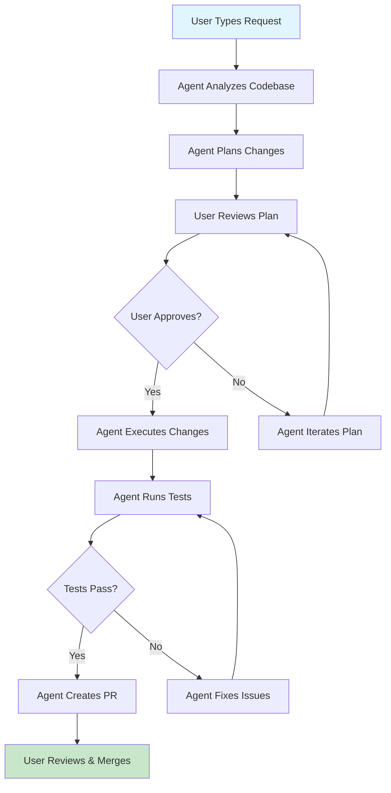

**Key Features:**
- **Codebase Analysis**: Deep understanding of project structure, dependencies, patterns
- **Planning Phase**: Multi-step task breakdown with user approval
- **Autonomous Execution**: Agent makes actual code changes without constant supervision
- **Testing Integration**: Automatic test running and issue fixing
- **PR Creation**: Automated pull request generation with proper descriptions

### SupremeAI Current State
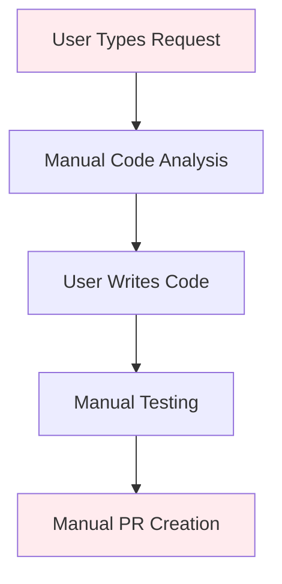

**Missing Capabilities:**
- No autonomous code generation or editing
- No automated planning or task breakdown
- No integrated testing workflow
- No PR automation
- Manual process throughout

---

## 2. Multi-File Code Editing Workflow

### Competitor Implementation (Cursor Agent Mode)
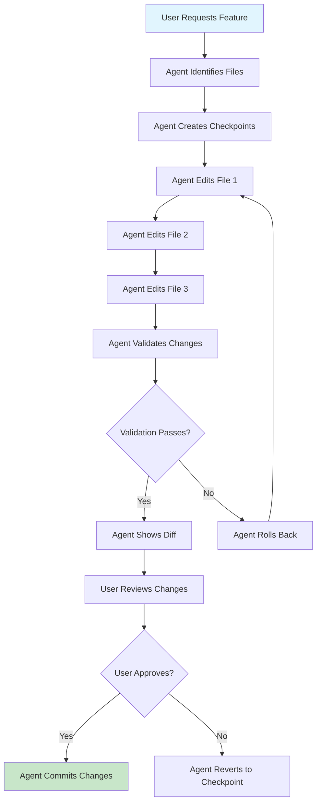

**Key Features:**
- **Multi-File Coordination**: Simultaneous editing across related files
- **Checkpoint System**: Safe rollback capability
- **Validation**: Automated syntax and logic checking
- **Diff Visualization**: Clear view of all changes
- **Atomic Commits**: All-or-nothing change application

### SupremeAI Current State
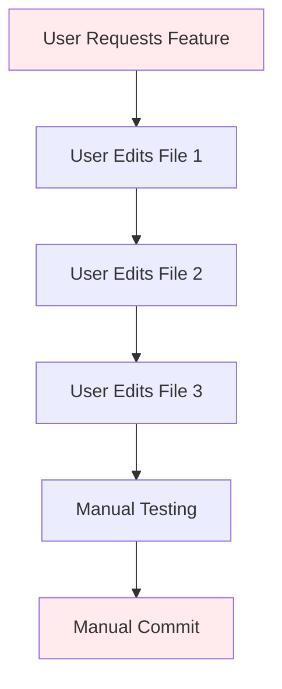

**Missing Capabilities:**
- No multi-file editing coordination
- No checkpoint/rollback system
- No automated validation
- Manual diff management
- No atomic operations

---

## 3. Pull Request Automation Workflow

### Competitor Implementation (GitHub Copilot)
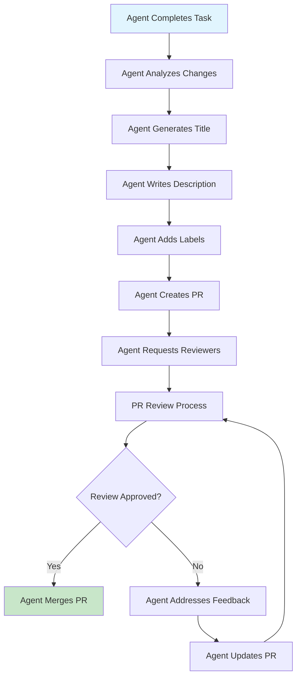

**Key Features:**
- **Automated PR Creation**: Complete PR with title, description, labels
- **Reviewer Assignment**: Intelligent reviewer selection
- **Review Management**: Automated response to feedback
- **Merge Automation**: Automatic merging when approved
- **Status Tracking**: PR progress monitoring

### SupremeAI Current State
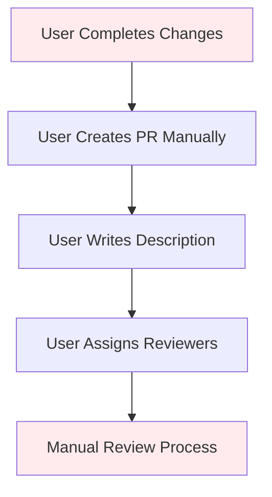

**Missing Capabilities:**
- No PR automation
- Manual PR creation and management
- No automated reviewer assignment
- No merge automation
- No status tracking

---

## 4. Code Review Agent Workflow

### Competitor Implementation (Tabnine Code Review Agent)
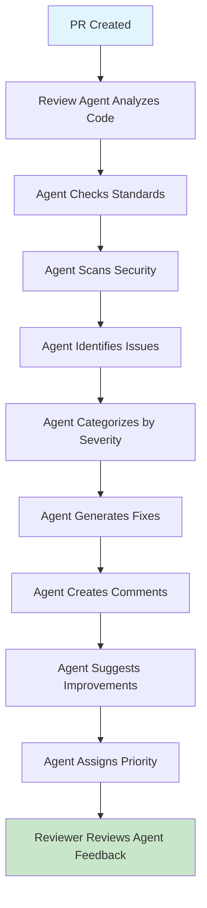

**Key Features:**
- **Automated Analysis**: Code quality, security, standards compliance
- **Severity Classification**: Critical, high, medium, low prioritization
- **Fix Suggestions**: Concrete code improvement recommendations
- **Comment Generation**: Detailed explanations for each issue
- **Priority Assignment**: Intelligent ranking of issues

### SupremeAI Current State
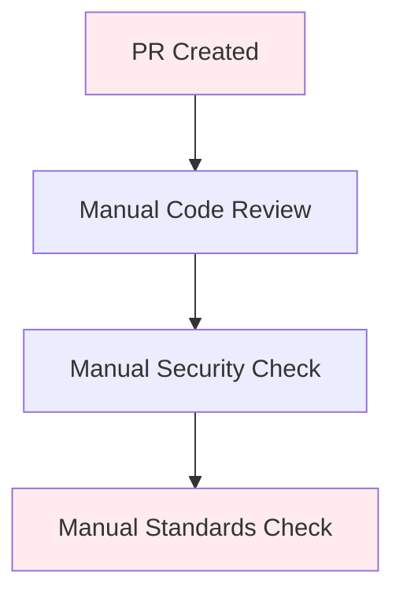

**Missing Capabilities:**
- No automated code review
- Manual security and quality checks
- No AI-assisted review process
- No automated issue detection
- No fix suggestions

---

## 5. Terminal Integration Workflow

### Competitor Implementation (GitHub Copilot CLI)
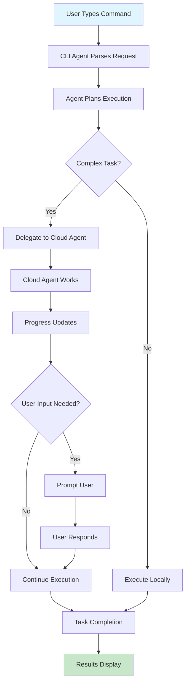

**Key Features:**
- **Natural Language Commands**: Plain English task descriptions
- **Cloud Delegation**: Long-running tasks move to cloud
- **Progress Tracking**: Real-time status updates
- **Interactive Prompts**: Clarification requests when needed
- **Result Presentation**: Clear output formatting

### SupremeAI Current State
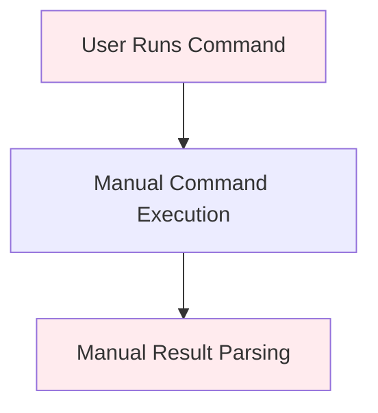

**Missing Capabilities:**
- No AI-powered CLI
- Manual command construction
- No natural language processing
- No progress tracking
- No cloud delegation

---

## 6. Image-to-Code Workflow

### Competitor Implementation (Tabnine/Figma Integration)
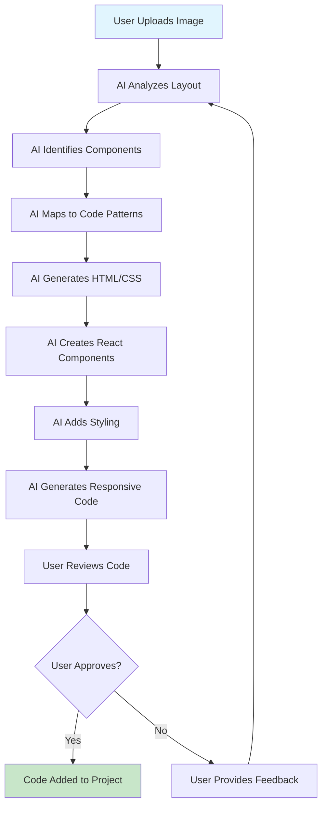

**Key Features:**
- **Layout Analysis**: Understanding of UI structure and hierarchy
- **Component Detection**: Identification of buttons, inputs, navigation
- **Code Generation**: Production-ready HTML/CSS/React code
- **Responsive Design**: Mobile-first, cross-device compatibility
- **Iterative Refinement**: Feedback loop for improvements

### SupremeAI Current State
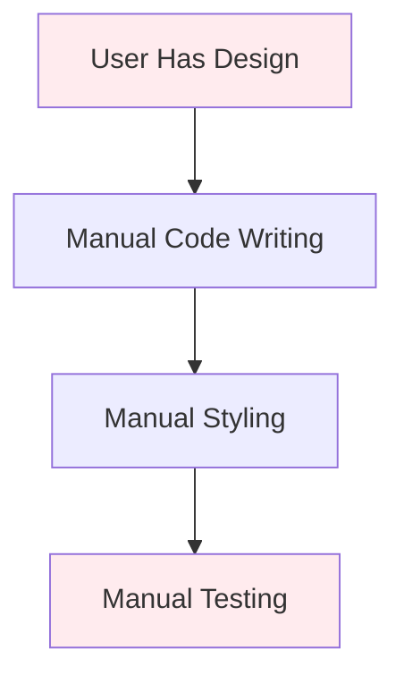

**Missing Capabilities:**
- No image processing
- No UI analysis
- Manual coding process
- No automated code generation from designs
- No responsive code generation

---

## 7. Enterprise Governance Workflow

### Competitor Implementation (Microsoft Agent 365)
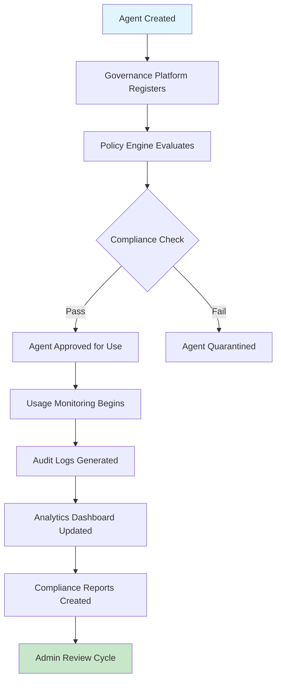

**Key Features:**
- **Agent Registration**: Automatic discovery and registration
- **Policy Enforcement**: Security and compliance rule application
- **Usage Monitoring**: Real-time tracking and alerting
- **Audit Logging**: Comprehensive activity logs
- **Analytics Dashboard**: Usage insights and reporting

### SupremeAI Current State
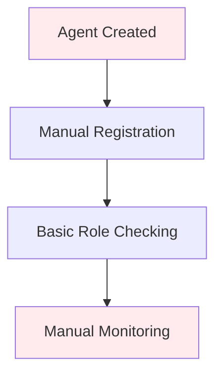

**Missing Capabilities:**
- No enterprise governance platform
- Manual agent management
- Limited audit capabilities
- No compliance automation
- No usage analytics

---

## Summary of Missing Workflows

### Critical Gaps (Must Implement)
1. **Autonomous Coding Agent** - Complete autonomous development workflow
2. **Multi-File Editing** - Coordinated changes across files with safety
3. **PR Automation** - Full pull request lifecycle management
4. **Terminal Integration** - AI-powered command line interface

### High Priority Gaps (Should Implement)
1. **Code Review Agent** - Automated code quality and security analysis
2. **Image-to-Code** - UI design to code generation
3. **Enterprise Governance** - Agent management and compliance platform

### Implementation Priority Matrix

| Workflow | Business Impact | User Demand | Technical Complexity | Timeline |
|----------|----------------|-------------|---------------------|----------|
| Autonomous Agent | Critical | High | High | 3-6 months |
| Multi-File Editing | Critical | High | Medium | 2-4 months |
| PR Automation | High | High | Medium | 2-3 months |
| Terminal CLI | High | Medium | Medium | 2-4 months |
| Code Review Agent | High | High | Medium | 3-5 months |
| Image-to-Code | Medium | Medium | High | 4-6 months |
| Enterprise Governance | Medium | Medium | High | 6-9 months |

### Technical Architecture Recommendations

**Agent Framework:**
- Implement agent orchestration layer similar to Copilot's cloud agent
- Add multi-file editing with transaction-like commits
- Create checkpoint system for safe rollbacks
- Build terminal integration with natural language processing

**Integration Layer:**
- Develop MCP (Model Context Protocol) support for tool integrations
- Create Apps SDK for custom agent capabilities
- Build governance platform for enterprise management
- Implement Work IQ-style contextual understanding

**UI/UX Enhancements:**
- Add agent mode to IDE extensions
- Create unified agent dashboard
- Implement visual diff viewers
- Build collaborative coding interfaces

---

*Workflow Analysis Completed: May 14, 2026*