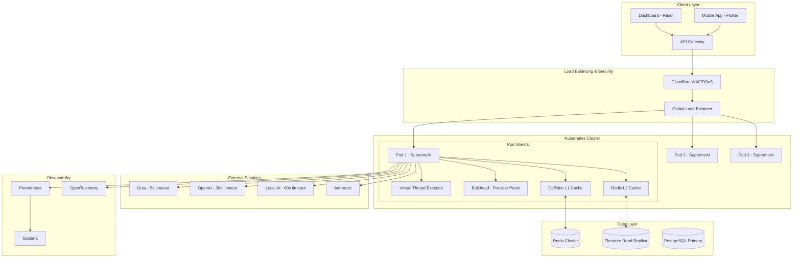

# SupremeAI Performance Optimization Plan

## Overview

This document outlines a comprehensive 10-phase performance optimization plan for the SupremeAI multi-agent system.

## Current State Analysis

### Already Implemented
- Virtual threads configuration (Java 21)
- Basic Redis configuration (Lettuce)
- HikariCP connection pool
- Rate limiting (basic)
- Circuit breaker configuration
- Request batching service
- OkHttp client in AbstractHttpProvider

### Needs Enhancement
- Redis connection pooling optimization
- Multi-tier caching (L1/L2/L3)
- Provider-specific timeouts
- Bulkhead pattern for providers
- Distributed tracing
- Advanced rate limiting with token bucket
- Response compression
- Kubernetes deployment configuration

## Architecture Diagram



## Phase 1: Connection Pooling & Infrastructure Optimization

### 1.1 Redis Connection Pooling
- Optimize Lettuce connection pool settings
- Max connections: 100, Min idle: 10
- Connection timeout: 2000ms
- Enable connection validation

### 1.2 OkHttp Configuration
- Enable HTTP/2 support
- Configure connection pooling (max 100 connections)
- Add connection multiplexing
- Set provider-specific timeouts

### 1.3 HikariCP Optimization
- maxPoolSize=100, minIdle=20
- Connection timeout: 2000ms
- Leak detection threshold: 5000ms

### 1.4 Jackson Afterburner
- Add jackson-module-afterburner dependency
- Enable bytecode generation for faster serialization

### 1.5 JVM Options
- Heap size: -Xms2g -Xmx4g
- GC: G1GC with -XX:MaxGCPauseMillis=200
- Enable ZGC for ultra-low latency (Java 21)

## Phase 2: Multi-Tier Caching Strategy

### 2.1 L1 Caffeine Cache
- Maximum size: 10,000 entries
- TTL: 10 minutes
- Enable statistics

### 2.2 L2 Redis Cache
- TTL: 30 minutes
- Separate cache for AI responses, user sessions, API keys

### 2.3 Cache Warming
- Pre-warm frequently accessed prompts
- Background cache refresh

### 2.4 Cache Invalidation
- Event-driven invalidation
- TTL-based expiration

## Phase 3: Resilience & Fault Tolerance

### 3.1 Bulkhead Pattern
- Separate thread pools per provider
- Provider-specific resource limits

### 3.2 Rate Limiting
- Token bucket algorithm per provider
- API key rate limiting (100 req/min)

### 3.3 Timeout Cascades
- Groq: 5s, OpenAI: 30s, Local: 60s
- Fast-path services: shorter timeouts

### 3.4 Circuit Breaker
- Metrics and half-open state testing
- Automatic failover

### 3.5 Graceful Degradation
- Fallback to simpler models
- Degraded mode responses

### 3.6 Request Hedging
- Send to multiple providers for critical paths
- Take first response

### 3.7 Retry Logic
- Exponential backoff with jitter
- Max 3 retries

### 3.8 Dead Letter Queue
- Failed request storage
- Retry scheduling

## Phase 4: Concurrency & Async Processing

### 4.1 Virtual Thread Executor
- 10k+ concurrent support
- Java 21 virtual threads

### 4.2 Reactive Streams
- Backpressure handling
- Flux/Mono for high-volume

### 4.3 Request Batching
- Group by hash prefix
- Batch API calls

### 4.4 Async Non-Blocking I/O
- All external calls async
- CompletableFuture for parallel execution

## Phase 5: Monitoring & Observability

### 5.1 Prometheus + Grafana
- Real-time metrics
- Custom dashboards

### 5.2 OpenTelemetry
- Distributed tracing
- Request flow analysis

### 5.3 Auto-Scaling
- CPU > 70%
- Response time > 500ms

### 5.4 Health Checks
- Dependency status
- Liveness/readiness probes

### 5.5 SLO Tracking
- p95, p99 latency
- Error rate monitoring

### 5.6 Alerting
- Circuit breaker trips
- High error rates

## Phase 6: Kubernetes & Deployment

### 6.1 Kubernetes Config
- Min 3, max 20 replicas
- Pod anti-affinity

### 6.2 Resource Limits
- CPU: 500m-2000m
- Memory: 1Gi-4Gi

### 6.3 Redis Cluster
- Replication and Sentinel

### 6.4 Blue-Green Deployment
- Traffic splitting
- Rollback capability

### 6.5 HPA
- Horizontal pod autoscaling

## Phase 7: Frontend Optimization

### 7.1 Code Splitting
- Dashboard route splitting
- Dynamic imports

### 7.2 Lazy Loading
- Heavy components (ThreeDashboard, ChatWithAI)
- Intersection Observer

### 7.3 Service Worker
- Offline capability
- Cache strategies

### 7.4 WebSocket Pooling
- Connection reuse
- Heartbeat

### 7.5 Client Caching
- SWR/React Query
- Stale-while-revalidate

### 7.6 Bundle Optimization
- Tree shaking
- Minification

### 7.7 Prefetching
- Navigation prediction
- Resource hints

## Phase 8: Security & Rate Limiting

### 8.1 API Key Rate Limiting
- 100 req/min per key
- Redis-backed counters

### 8.2 IP Rate Limiting
- Token bucket per IP
- Blocklist support

### 8.3 WAF Rules
- SQL injection
- XSS protection

### 8.4 Request Validation
- Input sanitization
- Schema validation

### 8.5 DDoS Protection
- Rate limiting
- Cloudflare integration

### 8.6 CORS
- Strict origin policies
- Preflight caching

### 8.7 Token Caching
- JWT caching
- Refresh optimization

## Phase 9: Testing & Quality Assurance

### 9.1 Load Testing
- k6/JMeter for 10k concurrent
- Scenario testing

### 9.2 Chaos Engineering
- Pod failures
- Network partitions

### 9.3 Performance Benchmarks
- Per endpoint
- Regression detection

### 9.4 Synthetic Monitoring
- Critical user journeys
- Alert on failures

### 9.5 Canary Deployments
- Traffic splitting
- Gradual rollout

### 9.6 CI/CD Integration
- Performance gates
- Automated testing

## Phase 10: Documentation & Operations

### 10.1 Runbook
- Incident response
- Troubleshooting guide

### 10.2 Performance Profiling
- async-profiler
- Flame graphs

### 10.3 Anomaly Detection
- ML-based detection
- Response time anomalies

### 10.4 Predictive Scaling
- Usage patterns
- Pre-scaling

### 10.5 Performance Budgets
- Bundle size limits
- Response time targets

### 10.6 Monitoring Dashboard
- Real-time view
- Key metrics

## Docker Compose for Local Development

```yaml
version: '3.8'
services:
  redis:
    image: redis:7-alpine
    ports:
      - "6379:6379"
    command: redis-server --appendonly yes
    
  prometheus:
    image: prom/prometheus
    ports:
      - "9090:9090"
    volumes:
      - ./prometheus.yml:/etc/prometheus/prometheus.yml
      
  grafana:
    image: grafana/grafana-enterprise
    ports:
      - "3001:3000"
    environment:
      - GF_SECURITY_ADMIN_PASSWORD=admin
```

## Next Steps

1. Review and approve this plan
2. Switch to Code mode for implementation
3. Start with Phase 1: Connection Pooling & Infrastructure