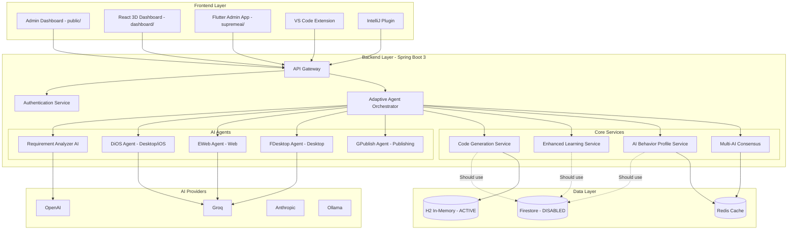

in our powershell boot run failed# SupremeAI Master Plan - Making It Actually Work as Real AI & APK Generator

## Executive Summary

SupremeAI is currently in **critical Alpha state** with a 4.2/10 health score. While the architectural vision is impressive (multi-agent system, AI consensus, self-healing, circuit breakers), the implementation has severe issues:

- **50.6% of main files are empty** (173/342)
- **77.6% of test files are empty** (38/49)  
- **Security completely disabled**
- **No APK generation capability**
- **Reactive/blocking anti-patterns**
- **Compilation errors**

This plan outlines a **10-phase, 70-task roadmap** to transform SupremeAI into a production-ready AI-powered Android/iOS/Web app generator.

---

## Current Architecture Overview



---

## Phase 1: Critical Fixes & Foundation (Week 1)

### 1.1 Fix SecurityConfig.java
**Status:** ❌ Not Started  
**Priority:** CRITICAL  
**Description:** Security is completely disabled. Enable CSRF, restrict CORS, add authentication enforcement.

**Current Code:**
```java
.csrf(AbstractHttpConfigurer::disable)
.cors(cors -> cors.configurationSource(request -> {
    configuration.setAllowedOrigins(java.util.List.of("*"));
    configuration.setAllowCredentials(true);  // DANGEROUS with *
}))
.authorizeHttpRequests(auth -> auth.anyRequest().permitAll());
```

**Target Code:**
```java
.csrf(csrf -> csrf.ignoringRequestMatchers("/api/public/**"))
.cors(cors -> cors.configurationSource(corsConfig()))
.authorizeHttpRequests(auth -> auth
    .requestMatchers("/api/public/**", "/api/auth/**").permitAll()
    .anyRequest().authenticated()
)
```

### 1.2 Fix AccountFarmingEngine Compilation Error
**Status:** ❌ Not Started  
**Priority:** CRITICAL  
**Description:** References `this.apiKeyManager` but field was removed.

**Action:** Remove or properly implement AccountFarmingEngine (ETHICAL CONCERN - violates AI provider ToS)

### 1.3 Fix Resource Leaks
**Status:** ❌ Not Started  
**Priority:** HIGH  
**Files:**
- `MultiAIConsensusService.java:36` - Unbounded `Executors.newCachedThreadPool()`
- `FastPathAIService.java:36` - Executor without lifecycle management

**Solution:**
```java
@PreDestroy
public void shutdown() {
    if (executorService != null) {
        executorService.shutdown();
        try {
            if (!executorService.awaitTermination(60, TimeUnit.SECONDS)) {
                executorService.shutdownNow();
            }
        } catch (InterruptedException e) {
            executorService.shutdownNow();
        }
    }
}
```

### 1.4 Remove/Implement Empty Files
**Status:** ❌ Not Started  
**Priority:** HIGH  
**Count:** 173 empty main files, 38 empty test files (50.6% and 77.6%)

**Action:** Either implement or delete empty files. Priority on:
- Controllers with actual endpoints
- Service implementations
- Repository interfaces

### 1.5 Fix Reactive/Blocking Anti-Pattern
**Status:** ❌ Not Started  
**Priority:** HIGH  
**Issue:** Extensive use of `.block()` in reactive code defeats benefits

**Example Fix:**
```java
// BAD - Blocking in reactive chain
UserLanguagePreference pref = languagePreferenceService
    .getUserLanguagePreference(userId)
    .block();

// GOOD - Proper reactive composition
return languagePreferenceService
    .getUserLanguagePreference(userId)
    .flatMap(pref -> processWithPreference(pref));
```

### 1.6 Enable Firestore
**Status:** ❌ Not Started  
**Priority:** HIGH  
**Current:** `spring.cloud.gcp.firestore.enabled=false`

**Action:**
1. Configure Firestore credentials
2. Remove H2 dependency
3. Update repositories to use Firestore properly

### 1.7 Move Secrets to Environment Variables
**Status:** ❌ Not Started  
**Priority:** HIGH  
**Hardcoded:**
- GitHub App ID
- GitHub Client ID  
- GitHub webhook URL
- JWT secret key

**Solution:** Use Spring Cloud Config or environment variables

### 1.8 Replace Stochastic Logic
**Status:** ❌ Not Started  
**Priority:** MEDIUM  
**Files:**
- `CouncilVotingSystem.java` - Uses `Math.random()` for votes
- `AIFallbackOrchestrator.java` - Simulates latencies

**Solution:** Connect to actual AI providers for real consensus

---

## Phase 2: Android APK Generation Pipeline (Week 2)

### 2.1 Android Project Generator
**Status:** ❌ Not Started  
**Priority:** CRITICAL  
**Description:** Generate complete Android Studio projects

**Components:**
- `AndroidProjectGenerator.java`
- `AndroidManifestGenerator.java`
- `AndroidResourceGenerator.java`
- `AndroidComponentGenerator.java`

**Output Structure:**
```
generated-app/
├── app/
│   ├── src/main/
│   │   ├── AndroidManifest.xml
│   │   ├── java/com/example/app/
│   │   │   ├── MainActivity.java
│   │   │   └── ...
│   │   └── res/
│   │       ├── layout/
│   │       ├── values/
│   │       └── drawable/
│   └── build.gradle
├── build.gradle
└── settings.gradle
```

### 2.2 Gradle Build Automation
**Status:** ❌ Not Started  
**Priority:** CRITICAL  
**Description:** Execute Gradle builds programmatically

**Implementation:**
```java
public BuildResult buildAndroidProject(String projectPath) {
    GradleBuild build = new GradleBuild();
    build.setProjectDir(new File(projectPath));
    build.setTasks("assembleDebug");
    
    BuildLauncher launcher = build.getBuildLauncher();
    ByteArrayOutputStream output = new ByteArrayOutputStream();
    launcher.setStandardOutput(output);
    launcher.run();
    
    return parseBuildResult(output.toString());
}
```

### 2.3 APK Signing Configuration
**Status:** ❌ Not Started  
**Priority:** HIGH  
**Description:** Support debug and release keystores

**Keystore Management:**
```java
public class KeystoreManager {
    public void generateDebugKeystore(String path) { ... }
    public void configureReleaseSigning(String keystorePath, 
                                        String password,
                                        String keyAlias) { ... }
    public boolean verifyApkSignature(String apkPath) { ... }
}
```

### 2.4 APK Builder Service
**Status:** ❌ Not Started  
**Priority:** CRITICAL  
**Description:** End-to-end APK compilation and packaging

**Flow:**
1. Generate Android project
2. Configure build.gradle with dependencies
3. Execute Gradle build
4. Sign APK
5. Zipalign (optimize)
6. Verify APK
7. Store artifact

### 2.5 Android Manifest Generator
**Status:** ❌ Not Started  
**Priority:** HIGH  
**Description:** Dynamic manifest based on app requirements

**Features:**
- Permission management
- Activity declarations
- Service declarations
- Broadcast receivers
- Intent filters
- Metadata configuration

### 2.6 Android Resource Generator
**Status:** ❌ Not Started  
**Priority:** MEDIUM  
**Description:** Generate layouts, drawables, strings, colors

**Templates:**
- Material Design components
- Responsive layouts (ConstraintLayout)
- Theme customization
- Localization strings

### 2.7 Android Component Generator
**Status:** ❌ Not Started  
**Priority:** MEDIUM  
**Components:**
- Activities (with lifecycle)
- Fragments (with ViewModel)
- Services (Foreground/Background)
- BroadcastReceivers
- ContentProviders

### 2.8 Android Dependency Resolver
**Status:** ❌ Not Started  
**Priority:** MEDIUM  
**Description:** Map app decisions to Gradle dependencies

**Examples:**
- Database → Room, Realm
- Networking → Retrofit, OkHttp
- Image Loading → Glide, Coil
- DI → Hilt, Dagger

---

## Phase 3: Multi-Platform Code Generation (Week 3)

### 3.1 Flutter App Generator
**Status:** ❌ Not Started  
**Priority:** HIGH  
**Description:** Generate Flutter projects with Dart

**Output:**
```
generated-flutter-app/
├── lib/
│   ├── main.dart
│   ├── screens/
│   ├── widgets/
│   └── models/
├── pubspec.yaml
└── ...
```

### 3.2 iOS Project Generator
**Status:** ❌ Not Started  
**Priority:** MEDIUM  
**Description:** Generate Xcode projects (Swift/SwiftUI)

### 3.3 React Native Generator
**Status:** ❌ Not Started  
**Priority:** MEDIUM  
**Description:** Generate React Native projects

### 3.4 Web App Generator
**Status:** ❌ Not Started  
**Priority:** MEDIUM  
**Description:** Generate React/Vue/Angular projects

### 3.5 Desktop App Generator
**Status:** ❌ Not Started  
**Priority:** LOW  
**Description:** Generate Electron/JavaFX projects

### 3.6 Cross-Platform Build Automation
**Status:** ❌ Not Started  
**Priority:** MEDIUM  
**Tools:**
- Fastlane (iOS/Android)
- Electron Builder
- Expo (React Native)

---

## Phase 4: Real AI Integration (Week 4)

### 4.1 Real AI Consensus System
**Status:** ❌ Not Started  
**Priority:** CRITICAL  
**Description:** Connect all agents to actual AI providers

**Current:** Uses `Math.random()` for votes  
**Target:** Real API calls to OpenAI, Anthropic, Groq

### 4.2 Code Generation LLM Integration
**Status:** ❌ Not Started  
**Priority:** CRITICAL  
**Description:** Use GPT-4/Claude for actual code generation

**Implementation:**
```java
public String generateCode(String prompt, String language) {
    return openAIClient.generate(
        "Generate " + language + " code for: " + prompt,
        Model.GPT_4,
        new GenerationOptions()
            .withTemperature(0.3)
            .withMaxTokens(4000)
    );
}
```

### 4.3 Requirement Parsing AI
**Status:** ❌ Not Started  
**Priority:** HIGH  
**Description:** Real NLP for requirement analysis

### 4.4 Architecture Decision AI
**Status:** ❌ Not Started  
**Priority:** HIGH  
**Description:** ML-based tech stack recommendations

### 4.5 Code Review AI Agent
**Status:** ❌ Not Started  
**Priority:** MEDIUM  
**Description:** Automated code quality checks

### 4.6 Testing AI Agent
**Status:** ❌ Not Started  
**Priority:** MEDIUM  
**Description:** Generate unit/integration tests

### 4.7 Deployment AI Agent
**Status:** ❌ Not Started  
**Priority:** MEDIUM  
**Description:** Automated CI/CD pipeline generation

---

## Phase 5: Build & Deployment Automation (Week 5)

### 5.1 CI/CD Pipeline Generator
**Status:** ❌ Not Started  
**Priority:** HIGH  
**Platforms:** GitHub Actions, GitLab CI, Jenkins

### 5.2 Cloud Deployment Automation
**Status:** ❌ Not Started  
**Priority:** HIGH  
**Platforms:** AWS, GCP, Azure

### 5.3 Containerization Support
**Status:** ❌ Not Started  
**Priority:** MEDIUM  
**Tools:** Docker, Docker Compose, Kubernetes

### 5.4 Artifact Repository
**Status:** ❌ Not Started  
**Priority:** MEDIUM  
**Description:** Store generated APKs/IPA files

### 5.5 Distribution System
**Status:** ❌ Not Started  
**Priority:** MEDIUM  
**Tools:** Firebase App Distribution, TestFlight, Play Store

### 5.6 Version Management
**Status:** ❌ Not Started  
**Priority:** LOW  
**Description:** Semantic versioning, changelog generation

---

## Phase 6: Quality & Testing (Week 6)

### 6.1 Comprehensive Tests
**Status:** ❌ Not Started  
**Priority:** CRITICAL  
**Target:** Minimum 10% coverage (current: ~0%)

### 6.2 Integration Tests
**Status:** ❌ Not Started  
**Priority:** HIGH  
**Description:** Test APK generation end-to-end

### 6.3 Load Testing
**Status:** ❌ Not Started  
**Priority:** MEDIUM  
**Description:** Test multi-agent system under load

### 6.4 Security Testing
**Status:** ❌ Not Started  
**Priority:** HIGH  
**Types:** SAST, DAST for generated code

### 6.5 Performance Benchmarks
**Status:** ❌ Not Started  
**Priority:** MEDIUM  
**Metrics:** Generation speed, APK size

### 6.6 Monitoring
**Status:** ❌ Not Started  
**Priority:** HIGH  
**Tools:** Prometheus metrics, health checks

### 6.7 Logging Aggregation
**Status:** ❌ Not Started  
**Priority:** MEDIUM  
**Tools:** ELK/Splunk

---

## Phase 7: UI/UX & Dashboard (Week 7)

### 7.1 React 3D Dashboard
**Status:** ❌ Not Started  
**Priority:** HIGH  
**Description:** Complete dashboard implementation

### 7.2 Flutter Admin App
**Status:** ❌ Not Started  
**Priority:** HIGH  
**Description:** Mirror dashboard features

### 7.3 VS Code Extension
**Status:** ❌ Not Started  
**Priority:** MEDIUM  
**Description:** Complete IDE integration

### 7.4 IntelliJ Plugin
**Status:** ✅ Working (v1.2.0)  
**Priority:** LOW  
**Description:** Polish and complete features

### 7.5 Real-Time Progress Tracking
**Status:** ❌ Not Started  
**Priority:** MEDIUM  
**Description:** WebSocket updates for generation

### 7.6 Project Templates Gallery
**Status:** ❌ Not Started  
**Priority:** MEDIUM  
**Description:** Pre-built app templates

### 7.7 Drag-and-Drop UI Builder
**Status:** ❌ Not Started  
**Priority:** LOW  
**Description:** Visual app design

---

## Phase 8: Documentation & Polish (Week 8)

### 8.1 Comprehensive Documentation
**Status:** ❌ Not Started  
**Priority:** HIGH  
**Types:** API docs, user guides, architecture

### 8.2 Video Tutorials
**Status:** ❌ Not Started  
**Priority:** MEDIUM  
**Topics:** Getting started, advanced features

### 8.3 Example Projects
**Status:** ❌ Not Started  
**Priority:** MEDIUM  
**Description:** Sample generated apps

### 8.4 Error Handling
**Status:** ❌ Not Started  
**Priority:** HIGH  
**Description:** Graceful degradation, helpful error messages

### 8.5 User Onboarding
**Status:** ❌ Not Started  
**Priority:** MEDIUM  
**Description:** Interactive tutorial

### 8.6 Admin Guides
**Status:** ❌ Not Started  
**Priority:** MEDIUM  
**Topics:** Deployment, maintenance, troubleshooting

### 8.7 API Documentation
**Status:** ❌ Not Started  
**Priority:** HIGH  
**Format:** OpenAPI/Swagger specs

---

## Phase 9: Production Hardening (Week 9)

### 9.1 Rate Limiting
**Status:** ❌ Not Started  
**Priority:** HIGH  
**Scope:** Per-user, per-IP limits

### 9.2 Caching Layer
**Status:** ❌ Not Started  
**Priority:** MEDIUM  
**Tool:** Redis

### 9.3 Circuit Breakers
**Status:** ❌ Not Started  
**Priority:** HIGH  
**Tool:** Resilience4j

### 9.4 Audit Logging
**Status:** ❌ Not Started  
**Priority:** HIGH  
**Description:** Track all user actions

### 9.5 Backup/Restore
**Status:** ❌ Not Started  
**Priority:** MEDIUM  
**Scope:** Database and artifacts

### 9.6 Disaster Recovery
**Status:** ❌ Not Started  
**Priority:** LOW  
**Scope:** Multi-region deployment

### 9.7 Runbooks
**Status:** ❌ Not Started  
**Priority:** MEDIUM  
**Topics:** Operations, incident response

---

## Phase 10: Final Integration & Testing (Week 10)

### 10.1 End-to-End Testing
**Status:** ❌ Not Started  
**Priority:** CRITICAL  
**Scope:** Full user journey testing

### 10.2 Performance Optimization
**Status:** ❌ Not Started  
**Priority:** HIGH  
**Scope:** Identify and fix bottlenecks

### 10.3 Security Audit
**Status:** ❌ Not Started  
**Priority:** CRITICAL  
**Types:** Penetration testing, code review

### 10.4 Load Testing
**Status:** ❌ Not Started  
**Priority:** HIGH  
**Target:** 1000+ concurrent users

### 10.5 Bug Bash
**Status:** ❌ Not Started  
**Priority:** HIGH  
**Scope:** Fix all critical and high-priority bugs

### 10.6 Production Deployment
**Status:** ❌ Not Started  
**Priority:** CRITICAL  
**Scope:** Deploy to cloud

### 10.7 Monitoring Setup
**Status:** ❌ Not Started  
**Priority:** HIGH  
**Components:** Alerts, dashboards, on-call rotation

### 10.8 Go-Live Checklist
**Status:** ❌ Not Started  
**Priority:** CRITICAL  
**Scope:** Final verification before launch

---

## Success Metrics

| Metric | Current | Target |
|--------|---------|--------|
| Health Score | 4.2/10 | 9.0/10 |
| Test Coverage | ~0% | 10%+ |
| Empty Files | 50.6% | 0% |
| Security Status | Disabled | Enabled |
| APK Generation | ❌ No | ✅ Yes |
| Multi-Platform | ❌ No | ✅ Yes |
| Real AI Integration | ❌ No | ✅ Yes |
| Production Ready | ❌ No | ✅ Yes |

## Risk Assessment

### High Risks
1. **Security vulnerabilities** - Immediate action required
2. **Compilation errors** - Blocks development
3. **Resource leaks** - Can cause crashes
4. **No APK generation** - Core feature missing

### Medium Risks
1. **Empty files** - Indicates incomplete implementation
2. **Reactive anti-patterns** - Performance issues
3. **Hardcoded secrets** - Security risk

### Low Risks
1. **Missing documentation** - Can be added later
2. **Incomplete UI** - Functional but not polished

## Resource Requirements

### Team
- **Backend Developers:** 3-4 (Java/Spring Boot)
- **Android Developers:** 2 (Kotlin/Gradle)
- **Frontend Developers:** 2 (React/TypeScript)
- **DevOps Engineers:** 1-2 (CI/CD, Cloud)
- **QA Engineers:** 2 (Testing, Security)

### Tools & Infrastructure
- **Cloud:** AWS/GCP/Azure
- **CI/CD:** GitHub Actions/GitLab CI
- **Databases:** Firestore, Redis
- **Monitoring:** Prometheus, Grafana
- **Security:** SAST/DAST tools

## Timeline Summary

| Phase | Duration | Key Deliverables |
|-------|----------|------------------|
| 1 - Critical Fixes | 1 week | Security enabled, compilation fixed, resources managed |
| 2 - Android APK | 1 week | Complete APK generation pipeline |
| 3 - Multi-Platform | 1 week | Flutter, iOS, Web, Desktop generators |
| 4 - Real AI | 1 week | Actual AI integration, code generation |
| 5 - Build/Deploy | 1 week | CI/CD, cloud deployment, distribution |
| 6 - Quality | 1 week | Tests, monitoring, security |
| 7 - UI/UX | 1 week | Dashboard, admin apps, extensions |
| 8 - Documentation | 1 week | Docs, tutorials, examples |
| 9 - Hardening | 1 week | Rate limiting, caching, DR |
| 10 - Launch | 1 week | E2E testing, production deployment |

**Total:** 10 weeks to production-ready system

---

## Next Steps

1. **Review and approve this plan** ✅
2. **Prioritize Phase 1 tasks** (Critical fixes)
3. **Assign team members** to each phase
4. **Set up development environment**
5. **Begin implementation** starting with security fixes

**Questions for approval:**
- Are the priorities correct?
- Should any phases be reordered?
- Any additional requirements or constraints?
- Ready to proceed with implementation?

---

*Generated by Kilo Code - Technical Planning Assistant*
*Date: 2026-04-26*
*Version: 1.0*