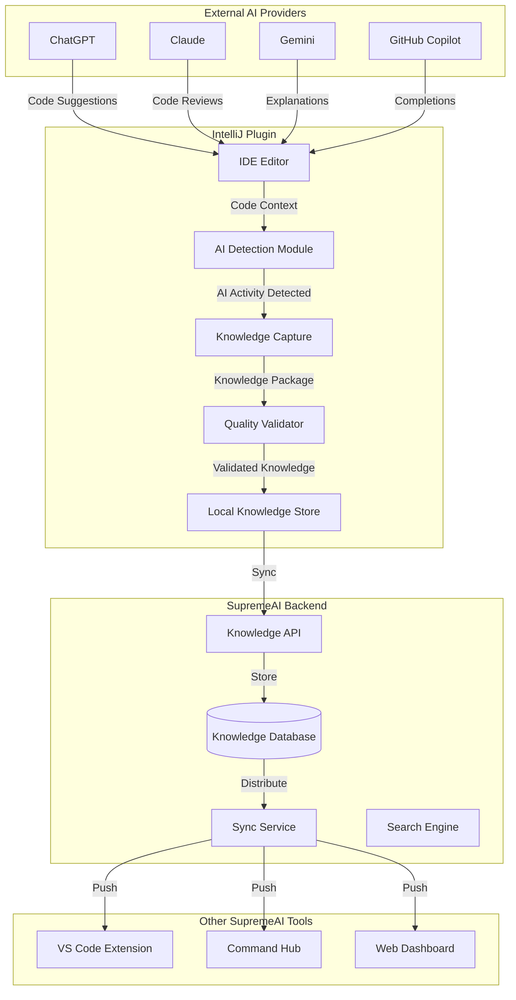

# SupremeAI IntelliJ Plugin - External AI Learning Integration Plan

## Overview

This document outlines the architecture and implementation plan for enabling the SupremeAI IntelliJ Plugin to learn from external AI providers (ChatGPT, Claude, Gemini, etc.) and store that knowledge in a centralized knowledge base accessible across all SupremeAI components.

## Objectives

1. **Capture AI Interactions**: Detect and capture code suggestions, fixes, and explanations from external AI providers
2. **Knowledge Storage**: Store learned knowledge in a structured, searchable format
3. **Quality Validation**: Ensure captured knowledge meets quality and security standards
4. **Cross-Platform Sync**: Share knowledge across VS Code, CLI, and other SupremeAI tools
5. **Collaboration**: Enable team knowledge sharing and collective learning

## Architecture Overview



## Component Design

### 1. External AI Detection Module

**Purpose**: Detect when external AI tools are being used within the IDE

**Implementation**:
```kotlin
class ExternalAIDetector {
    // Monitor editor for AI-generated content
    // Detect patterns from known AI providers
    // Track AI tool usage metrics
}
```

**Detection Methods**:
- **Clipboard Monitoring**: Detect when code is pasted from AI tools
- **Editor Pattern Recognition**: Identify AI-generated code patterns
- **Browser Integration**: Detect when AI tools are open in IDE browser
- **API Hooking**: Intercept AI tool API calls (where permitted)
- **User Attribution**: Allow manual marking of AI-generated code

**Key Features**:
- Real-time detection of AI-generated content
- Provider identification (ChatGPT, Claude, etc.)
- Confidence scoring for detection
- Privacy-preserving detection (no content sent without consent)

### 2. Knowledge Capture System

**Purpose**: Extract and package knowledge from AI interactions

**Data Captured**:
- Original user prompt/question
- AI-generated response/code
- Context (file, line numbers, project structure)
- Metadata (timestamp, provider, confidence)
- User feedback (accepted/rejected/modified)
- Code quality metrics

**Knowledge Package Format**:
```json
{
  "id": "uuid",
  "type": "code_suggestion|bug_fix|explanation|refactoring",
  "provider": "chatgpt|claude|gemini|other",
  "prompt": "user original question",
  "response": "AI generated content",
  "context": {
    "file": "path/to/file.kt",
    "language": "kotlin",
    "framework": "android",
    "project": "my-app"
  },
  "quality": {
    "confidence": 0.85,
    "complexity": "medium",
    "security_score": 0.92
  },
  "feedback": {
    "accepted": true,
    "modified": false,
    "rating": 5
  },
  "timestamp": "2026-05-03T21:00:00Z"
}
```

### 3. Knowledge Validation Engine

**Purpose**: Ensure captured knowledge meets quality and security standards

**Validation Checks**:
- **Security Analysis**: Scan for vulnerabilities, secrets, bad practices
- **Code Quality**: Check for best practices, style compliance
- **Accuracy Verification**: Compare against known patterns
- **License Compliance**: Ensure compatible licenses
- **Performance Impact**: Assess potential performance implications

**Validation Pipeline**:
```
Raw Knowledge → Security Scan → Quality Check → License Verify → Storage
                                      ↓
                                [Reject/Flag/Accept]
```

### 4. Local Knowledge Store

**Purpose**: Cache knowledge locally for offline access and performance

**Storage Options**:
- **SQLite**: Lightweight, embedded database
- **JSON Files**: Simple, portable format
- **IndexedDB**: For web-based components

**Schema Design**:
```sql
CREATE TABLE knowledge_items (
    id TEXT PRIMARY KEY,
    type TEXT,
    provider TEXT,
    prompt TEXT,
    response TEXT,
    context TEXT,
    quality_score REAL,
    tags TEXT[],
    created_at TIMESTAMP,
    synced BOOLEAN DEFAULT FALSE
);

CREATE TABLE knowledge_tags (
    item_id TEXT,
    tag TEXT,
    FOREIGN KEY (item_id) REFERENCES knowledge_items(id)
);
```

### 5. Knowledge Sync Service

**Purpose**: Synchronize knowledge across all SupremeAI tools

**Sync Mechanism**:
- **WebSocket**: Real-time bidirectional sync
- **REST API**: Fallback for initial sync
- **Conflict Resolution**: Last-write-wins with manual override
- **Differential Sync**: Only sync changes, not entire database

**Sync Flow**:
```
Local Change → Queue → Batch → Compress → Encrypt → Send → Acknowledge → Update Local
```

### 6. Knowledge Retrieval API

**Purpose**: Provide fast, relevant knowledge search and retrieval

**Features**:
- Full-text search across prompts and responses
- Semantic search using embeddings
- Filter by type, provider, quality, tags
- Context-aware suggestions
- Personalization based on user patterns

**API Endpoints**:
```
GET /api/knowledge/search?q={query}&type={type}&tags={tags}
GET /api/knowledge/similar?code={code}&limit={n}
GET /api/knowledge/recent?limit={n}
POST /api/knowledge/validate - Validate new knowledge
PUT /api/knowledge/{id}/feedback - Submit feedback
```

## Implementation Phases

### Phase 1: Detection and Capture (Weeks 1-2)

**Tasks**:
- [ ] Implement basic AI detection heuristics
- [ ] Create knowledge package data structures
- [ ] Add manual capture UI ("Mark as AI-generated")
- [ ] Implement clipboard monitoring
- [ ] Create local storage layer

**Deliverables**:
- Working detection for common AI patterns
- Ability to manually mark AI-generated code
- Local knowledge storage operational

### Phase 2: Validation and Quality (Weeks 3-4)

**Tasks**:
- [ ] Implement security scanning
- [ ] Add code quality checks
- [ ] Create validation pipeline
- [ ] Implement quality scoring
- [ ] Add license checking

**Deliverables**:
- Automated validation of captured knowledge
- Quality scores for all knowledge items
- Security flags for risky code

### Phase 3: Sync and Backend Integration (Weeks 5-6)

**Tasks**:
- [ ] Implement WebSocket sync client
- [ ] Create REST API fallback
- [ ] Add conflict resolution logic
- [ ] Implement differential sync
- [ ] Create backend knowledge API

**Deliverables**:
- Real-time sync with backend
- Knowledge available across all SupremeAI tools
- Conflict-free synchronization

### Phase 4: Search and Retrieval (Weeks 7-8)

**Tasks**:
- [ ] Implement full-text search
- [ ] Add semantic search with embeddings
- [ ] Create context-aware suggestions
- [ ] Build retrieval API
- [ ] Add personalization

**Deliverables**:
- Fast, relevant knowledge search
- Context-aware code suggestions
- Personalized knowledge recommendations

### Phase 5: UI and User Experience (Weeks 9-10)

**Tasks**:
- [ ] Create knowledge browser UI
- [ ] Add provider configuration panel
- [ ] Implement feedback mechanisms
- [ ] Create knowledge quality dashboard
- [ ] Add export/import functionality

**Deliverables**:
- User-friendly knowledge management interface
- Easy configuration of AI providers
- Clear feedback and quality indicators

## Security and Privacy

### Data Protection
- **Encryption**: All knowledge encrypted in transit (TLS) and at rest (AES-256)
- **Anonymization**: Remove personally identifiable information before sync
- **Consent**: Explicit user consent before capturing and sharing knowledge
- **Access Control**: Role-based access to knowledge base

### Privacy Controls
- **Opt-in by Default**: Users must explicitly enable knowledge sharing
- **Granular Permissions**: Control what types of knowledge are shared
- **Local-Only Option**: Ability to keep knowledge entirely local
- **Data Deletion**: Easy deletion of personal knowledge data

### Compliance
- **GDPR**: Full compliance with data protection regulations
- **License Tracking**: Ensure all shared code respects original licenses
- **Audit Trail**: Complete history of knowledge capture and usage

## Integration Points

### VS Code Extension
- Share knowledge base format
- Sync via same API
- Unified search interface

### Command Hub CLI
- Import/export knowledge
- Batch operations
- Scriptable knowledge management

### Web Dashboard
- Visualize knowledge network
- Team collaboration features
- Analytics and insights

### Backend Services
- Central knowledge repository
- ML model training data
- Search and recommendation engine

## Quality Metrics

### Knowledge Quality Indicators
- **Accuracy**: Does the code work as intended?
- **Security**: Are there vulnerabilities or bad practices?
- **Performance**: Is the code efficient?
- **Maintainability**: Is it readable and well-structured?
- **Relevance**: Is it applicable to similar contexts?

### Success Metrics
- **Capture Rate**: % of AI usage successfully captured
- **Validation Rate**: % of captured knowledge passing validation
- **Reuse Rate**: % of stored knowledge reused by users
- **Quality Score**: Average quality rating of knowledge
- **User Satisfaction**: User feedback on knowledge usefulness

## Testing Strategy

### Unit Tests
- Detection algorithm accuracy
- Validation logic correctness
- Storage and retrieval operations
- Sync conflict resolution

### Integration Tests
- End-to-end capture → validate → store → sync flow
- Cross-platform knowledge sharing
- Search and retrieval accuracy
- Performance under load

### Security Tests
- Penetration testing of sync API
- Encryption verification
- Access control validation
- Privacy leak detection

## Monitoring and Analytics

### Key Metrics
- Knowledge items captured per day
- Validation pass/fail rates
- Sync success rates
- Search query patterns
- User engagement with knowledge

### Alerts
- High validation failure rate
- Sync failures
- Security scan warnings
- Performance degradation

## Future Enhancements

### Advanced Features
- **Automated Testing**: Generate tests for captured code
- **Code Review**: AI-powered review of captured knowledge
- **Knowledge Graph**: Visualize relationships between knowledge items
- **Predictive Suggestions**: Proactively suggest relevant knowledge
- **Multi-language Support**: Extend beyond Kotlin/Java

### AI Improvements
- **Fine-tuning**: Use captured knowledge to improve AI models
- **Personalization**: Adapt suggestions to individual coding style
- **Context Awareness**: Better understanding of project-specific patterns
- **Collaborative Filtering**: Learn from team preferences

## Rollout Plan

### Beta Testing (Month 1)
- Limited user group
- Feedback collection
- Bug fixes and improvements

### Gradual Rollout (Month 2)
- Enable for 25% of users
- Monitor performance and stability
- Gather usage analytics

### Full Release (Month 3)
- Enable for all users
- Marketing and documentation
- Training materials

## Dependencies

### External Services
- **Knowledge API**: Backend service for sync and storage
- **Search Service**: Elasticsearch or similar for fast search
- **ML Service**: For embeddings and semantic search

### Libraries and Tools
- **SQLite**: Local storage
- **OkHttp**: HTTP client for sync
- **Jackson**: JSON serialization
- **Apache Lucene**: Full-text search
- **TensorFlow Lite**: On-device ML (optional)

## Configuration

### User Settings
```kotlin
data class ExternalAIConfig(
    val enabled: Boolean = false,  // Opt-in required
    val providers: List<AIProvider> = emptyList(),
    val autoCapture: Boolean = true,
    val shareKnowledge: Boolean = false,
    val qualityThreshold: Double = 0.7,
    val syncFrequency: SyncFrequency = SyncFrequency.REAL_TIME
)
```

### Provider Configuration
```kotlin
data class AIProvider(
    val name: String,
    val type: ProviderType,
    val detectionPatterns: List<String>,
    val enabled: Boolean = true
)
```

## Conclusion

This integration will transform the SupremeAI plugin from a passive AI assistant into an active knowledge management system that learns from all AI interactions, creating a valuable, searchable repository of coding knowledge that improves over time and benefits the entire development team.

The phased approach ensures manageable implementation with clear deliverables at each stage, while the focus on security, privacy, and quality ensures the system is trustworthy and compliant with organizational requirements.

---

*Document Version: 1.0.0*  
*Last Updated: 2026-05-03*  
*Next Review: 2026-06-03*